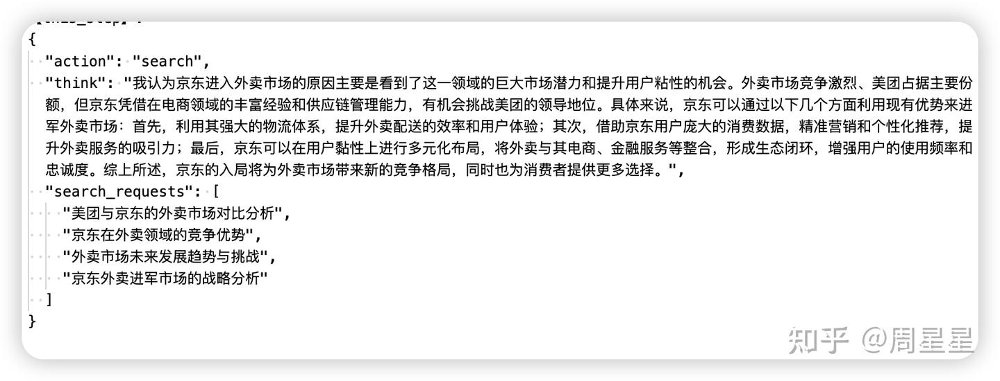

# Deep Research

https://zhuanlan.zhihu.com/p/1892489650469323191

什么是真正的"Deep"？

openai所说的，Deep Research对标行业分析师的角度看，至少应该满足以下要求：

1. **内容篇幅充足**：如果最终输出仅有1-2千字，很难让用户满意。想想市面上的专业分析报告，哪个不是成千上万字？内容过少往往意味着分析不够全面深入。
2. **描述具体且有洞察力**：比如分析"人工智能对就业市场的影响"时，浅层表达是"AI将替代一些工作岗位"，而深度表达是"AI将重塑金融行业的职业结构，替代初级分析师的数据处理工作，同时创造数据伦理专家和AI-人类协作经理等新岗位，预计到2026年净就业影响为正增长12%"。
3. **引用权威且适当的资料**：专业分析报告通常会引用大量权威资料佐证观点。如果你的Deep Research缺乏引用或引用了不可靠来源，将很难让用户信服。

## Search-O1（webthinker前身）

Search-o1 实现了**动态的、多步骤**的检索机制：

1. 模型在推理过程中可以识别自身知识的不足点
2. 当遇到知识不确定的情况时，模型会自动生成搜索查询，格式为 <|begin_search_query|>搜索词<|end_search_query|>
3. 系统检测到这一标记后，暂停模型推理，执行网络搜索
4. 搜索结果被包装在 <|begin_search_result|>检索到的内容<|end_search_result|> 标记中返回给模型
5. 模型继续推理，并可以根据需要多次重复这一过程。

### Reason-in-Documents

大模型总结有用的信息：检索出来的内容可能很杂乱和很长，而现在的大模型处理长文本性能会下降，因此，把检索到的内容进行精炼，再放入到原有推理链中，从而缓解检索文档中存在冗余信息和LLM 处理长文档的局限性。


## Search-R1【与search-o1不同的是强化学习设计 和 没有Reason-in-Documents模块】

将强化学习框架和检索增强场景想结合。**核心思想：将搜索引擎建模为强化学习环境的一部分，使LLM能通过试错自主学习，打破现有的 RAG 和工具使用方法在灵活性和可扩展性方面存在局限性**

搜索即环境交互：将搜索 API 调用转化为马尔可夫决策过程的状态转移
结构化文本生成：通过特殊标记实现程序化控制
轻量化奖励设计：仅用最终答案正确性作为奖励信号，避免复杂过程监督

例子：三个特殊token。

`

```
<think>xxxx</think>
<search>xxx</search>【当检测到模型生成这个特殊token时进行检索，不会被学习】
<information>xxx</information>【检索到的信息，直接放入其中，没有总结】

...

<answer>xxxx</answer>
```

`

### 奖励模型

规则奖励，精准字符匹配（没有设计格式奖励，作者说模型对格式遵循地很好了）

### QA

Q1：**SEARCH-R1 如何解决多轮交互的问题？** SEARCH-R1 的核心创新在于它允许 LLM 在**推理过程中自主决定**何时以及如何进行搜索。通过引入 和 等特殊 token，LLM 可以在生成文本的过程中，显式地发出搜索请求。系统会根据这些 token 提取查询语句，调用搜索引擎，并将检索结果以 和 的形式插入回 LLM 的上下文。

这样，LLM 就可以根据实时检索到的信息，动态调整其推理路径和搜索策略，实现真正意义上的多轮交互。

Q2：检索 Token 掩码（retrieved Token masking）的作用是什么？为什么它可以提高训练的稳定性？ 在强化学习中，模型的目标是通过调整策略来最大化奖励。如果没有检索 token 掩码，模型可能会尝试直接修改检索到的文本，以获得更高的奖励。这会导致以下问题：

信息污染：模型可能会改变检索到的信息，使其与事实不符，从而损害模型的知识来源。 训练不稳定：模型可能会过度关注检索到的文本，而忽略了自身推理能力的提升。 检索 token 掩码通过阻止模型修改检索到的 token，强制模型专注于如何更好地利用这些信息。这可以避免信息污染，并促使模型学习更有效的推理和搜索策略，从而提高训练的稳定性。

Q3：为什么文章选择使用基于结果的奖励函数，而不是基于过程的奖励函数？ 基于过程的奖励函数需要对模型的中间推理步骤进行评估，这通常需要人工标注或复杂的规则。这不仅增加了成本和复杂性，而且也容易引入人为偏见。

基于结果的奖励函数只关注最终答案的正确性，避免了对中间步骤的评估，更加简单和通用。文章的实验结果表明，即使只使用简单的基于结果的奖励函数，SEARCH-R1 也能有效地学习到复杂的推理和搜索策略。

Q4：为什么要用强化学习 + 搜索而不是监督学习 + 搜索？ 技术细节：

多轮搜索的决策树复杂度呈指数增长（3 轮搜索可能有 106 种路径），监督学习难以覆盖所有情况 强化学习的试错机制能自主发现最优搜索策略，如论文表 5 案例中模型自动进行验证性检索 就像教小孩骑自行车，监督学习相当于在训练轮上反复练习固定动作，而强化学习允许他自主探索平衡点，通过摔倒（负奖励）和前进（正奖励）来学习更灵活的操控。


## R1-searcher

两阶段基于阶段的强化学习方法。先确保模型掌握正确的检索行为规范，再专注于提升答案质量，实现了检索能力与信息整合能力的阶梯式提升。


### 第一阶段(检索学习训练)

**检索奖励 (Retrieval Reward)**:

- 0.5分：当模型至少执行一次检索操作
- 0分：未进行任何检索

**格式奖励 (Format Reward)**:

- 0.5分：完全符合规定的输出格式标准
- 0分：格式不符合要求

### 第二阶段（集成检索结果训练）

设计答案奖励+格式奖励。

- 使用F1分数作为答案奖励：`Ranswer = 2 * IN / (PN + RN)`

- - 其中：

  - - PN: 预测答案的词数
    - RN: 参考答案的词数
    - IN: 预测答案与参考答案的交集词数

## Jina【search + visit + reflect + answer 四大工具】

https://zhuanlan.zhihu.com/p/1898295379990132543

https://jina.ai/news/a-practical-guide-to-implementing-deepsearch-deepresearch/

### search

当系统选择Search动作时，它不仅仅是用原始问题进行直接搜索，而是让大模型生成多个相关的search query（搜索查询），以获取全面的信息【没有返回全文。返回的是摘要】。**Jina不会在第一轮搜索后就停止search 这一步。而是根据初步搜索结果，对 search query 进行改写，以进一步细化搜索问题。**（可以把他理解成一个子agent）search query改写 的目的也是通过迭代搜索的策略，更细粒度地找到更详尽的信息。



如上图jina会搜索多个query，拿到结果之后继续生成新的query，prompt如下。


### READ

当有Search结果后，模型可以选择Visit(阅读)动作，进一步深入分析搜索结果中的部分url链接，以便获取更准确的信息。jina设计了多种启发式方法来告诉模型应该去查看哪些url。

1. 频率因子（freq_boost）：根据URL出现频率加权，多次出现的URL获得更高权重。比如，某个 URL 在不同的search query中返回多次，它比只在一个查询中出现的URL得分更高。
2. 域名因子（hostname_boost）：根据 URL 的hostname出现频率加权，频繁出现的hostname会获得更高的加权。
3. 路径因子（path_boost）：根据 URL 的路径部分（域名后的部分）出现频率进行加权，路径越常见的 URL 会获得更高的加权。
4. 语义重排序因子（jina_rerank_boost）：调用 jina 的 rerank API，背后是专门针对query 和 passage语义排序训练过的 embedding 模型，这个因子通过评估搜索内容与当前问题的相关性，进一步优化URL的排序。

通过这四个因子，模型为每个候选阅读的URL赋予了权重，然后用 llm 参考这些权重，根据当前的上下文选择最合适的 url 进行阅读。

### Answer

文章生成之后，还会进行check，如果写得不好，会用一个prompt分析不好的原因并重新进行loop


### Reflect

Reflect阶段是实现"Deep"的关键环节。在这一阶段，系统会维护一个gaps问题列表，并不断识别出知识的缺口，从而生成子问题。
**Reflect问题**：是对原始问题的深入分析与分解，目的是产生可以独立研究的子问题。每一个子问题都与原问题相关，且待解决后将成为进一步回答原始问题的上下文知识。
**Search查询**：是为了解决当前子问题而查询搜索引擎使用的查询语句。Search查询本身不需要被解答，它的目的是获取有用的信息来帮助回答当前的问题。


### 知识管理（核心）

jina把所有资料都放在system prompt里面，输入到prompt中。

以上下文的形式保存起来，输入到prompt中。因为LLM 都有很大的上下文窗口，我们选择不使用向量数据库。

独立设置Memory进行知识存储，并利用R1输出Memory操作来进行工具调用过程中的知识更新

```
# Status: IN_PROGRESS
# Memory: 
# <nuz-032>Potential warm May destinations: Malaga (Spain), Crete (Greece), Algarve (Portugal)</nuz-032>
# <xwj-969>URL to scrape for Crete hotel details: <https://www.tripadvisor.com/HotelsList-Crete-Beachfront-Cheap-Hotels-zfp13280541.html></xwj-969>
# <vsc-583>URL to scrape for flight details: <https://www.expedia.com/lp/flights/fra/her/frankfurt-to-heraklion></vsc-583>

'''R1生成的结果，对记忆进行更新'''
r1_output = {
	"memory_updates": [
	  {"operation": "add", "content": "Round-trip flight from Berlin to Tenerife in May 2025 ranges from €59.99 to €200 round-trip as per the Skyscanner and Iberia sources."},
	  {"operation": "delete", "id": "nuz-032"},
	  ...
	]
}
```


### embedding

https://jina.ai/zh-CN/news/late-chunking-in-long-context-embedding-models/

朴素的RAG需要将文档分割成较小的文本块（比如在 512 个 token 以内）。这些文本块通常存储在向量数据库中，其向量表示由文本嵌入模型生成。在运行时，同样的嵌入模型将查询编码为向量表示，然后用于识别相关的存储文本块。**但是这个过程可能会破坏远距离上下文依赖关系**。

在下图中，一篇维基百科文章被分成句子块。你可以看到像"its"和"the city"这样的短语都指代"Berlin"，而"Berlin"只在第一句中出现。这使得嵌入模型更难将这些引用与正确的实体联系起来，从而产生较低质量的向量表示。


jina提出的Late Chunking(迟分)是一种先通读全文再分块的新方法，如下图。


上面图片可能还是不好理解，左右两边最大区分在于何时以及如何为这些chunk生成最终的嵌入向量。

**步骤 1: 全文嵌入 (Full Document Embedding - Token Level)**

首先，将 **整个文档** 输入到嵌入模型（如 [LateChunkingEmbedder](https://zhida.zhihu.com/search?content_id=258622752&content_type=Article&match_order=1&q=LateChunkingEmbedder&zhida_source=entity) 中的 self.model，这通常是一个 Transformer encoder 如 BERT），得到model_outputs.last_hidden_state 的维度会是 (batch_size, sequence_length, hidden_size)。

**步骤 2: 获取分块边界 (Chunk Boundary Acquisition)**

- 使用 self.chunker.chunk(...) 方法获取分块的边界。这个方法可以采用多种策略，包括的语义切分 (chunk_semantically)。RAG语义切分通常有基于embedding的，BERT next sentence的方法。
- 这个方法返回的是一系列 (start_token_index, end_token_index) 元组，这些索引对应于步骤 1 中全文 token 化后的 token 序列。annotations = [self.chunker.chunk(text=document, ...)]

**步骤 3: "后期"池化 (Late Pooling)**

- self.output_embs = [chunked_pooling](https://zhida.zhihu.com/search?content_id=258622752&content_type=Article&match_order=1&q=chunked_pooling&zhida_source=entity)(model_outputs, annotations, ...)

- 这是核心的 "late" 部分。chunked_pooling 函数会：

- - 接收步骤 1 中得到的 **所有 token 的嵌入**。

  - 接收步骤 2 中定义的 **各个分块的 token 索引范围** (annotations)。

  - 对于每一个分块的 (start_token_index, end_token_index)：

  - - 它会从 model_outputs (所有 token 的嵌入) 中 **提取出属于该分块的那些 token 的嵌入**。
    - 然后对这些提取出来的 token 嵌入执行池化操作（例如平均池化、最大池化或 [CLS] token 池化，具体取决于 chunked_pooling 的实现）来为这个分块生成一个单一的向量。

**为什么叫 "Late-Chunking"？**

 因为对块内 token 嵌入的池化 (pooling) 操作，从而形成块的最终表征，是发生在该模型（如BERT）对整个文档进行一次完整的前向传播，获得所有 token 的上下文嵌入 *之后*（"late"）。


### 其他

#### DeepSearch vs DeepResearch

虽然很多人经常将 DeepSearch 和 DeepResearch 混为一谈，但在我们看来，它们解决的是完全不同的问题。DeepSearch 作为一个原子构建块，是 DeepResearch 所依赖的核心组件。另一方面，DeepResearch 专注于制作高质量、可读性强的长篇研究报告，这涉及一系列不同的要求：通过图表和表格来整合有效的可视化内容，用适当的章节标题来组织内容，确保子章节之间的逻辑流畅，在整个文档中保持术语一致性，消除章节之间的冗余，制作连接前后内容的流畅过渡。这些元素与核心搜索功能基本无关。

#### prompt细节

使用XML效果好

#### 串行搜索

当search时，利用FIFO（先进先出）机制，新的query先搜索，然后将search res应用到后面的query中。我的理解是：生成了3个query，一个一个search，后面的query可以根据search res进行更改。*但我们的chatbot方案是并行搜索*

#### 查询改写

query改写非常重要，一个好的query能找到好的素材，进而完成好的报告。

#### 爬取网页内容

除了完整的网页内容外，我们还会聚合搜索引擎返回的其他信息（URL 摘要等等）作为代理后续推理的额外知识。embedding的使用：利用embedding检索出最相关的切分后的网页文本。
知识连贯：我们不能接受像 [1-2, 6-7, 9, 14, 17, ...] 这样组合散落句子的片段。更有用的知识片段应该遵循像 [3-15, 17-24, ...] 这样的模式 —— 始终保持文本连续。


#### 评价

JINA使用的是多维度打分（few shot），但是我们实验下来这种方法很差，还是对比评价效果更好，V2 和 V1比，同时还可以加入真实答案作为标准。


## Webthinker

https://zhuanlan.zhihu.com/p/1903981050780192911

### Webthinker流程


如图，WebThinker有两种模式。

1. **问题解决模式 (Problem-Solving Mode)**：为LRM配备"深度网页探索器"，使其能够深入探索网络以解决复杂问题。
2. **报告生成模式 (Report Generation Mode)**：进一步赋予LRM（large reasoning model）写作、检查和编辑能力，使其能够在思考和搜索的同时，迭代式地撰写全面的研究报告。

### Deep Web Explorer

- 模型可以自主决定搜索查询，并通过点击链接、按钮等交互元素在网页间导航，深入挖掘信息。

- 持续探索直至收集到足够信息，返回精炼总结。

### Autonomous Think-Search-and-Draft

- 模型可以实时写作、修改报告内容，而不是在所有搜索完成后一次性生成。(写草稿)
- 配备专门的工具集（写作、检查当前报告、编辑内容），确保报告的连贯性并能适应新发现。

### RL-based training strategies

通过迭代式的**在线直接偏好优化（DPO）**训练，提升LRM对研究工具（包括搜索、导航、报告撰写工具）的利用效率。
构建偏好数据集，优先选择能得出正确答案/高质量报告且工具使用更高效的推理路径。

首先明确一下符号含义，I：任务指令	 q：用户问题	R：推理轨迹   。DPO的正负例按照下面规则选：

1.  准确性。如果某个轨迹得到的最后答案更加准确，那么这条轨迹显然是正例 $R_w $, 否则是负例 $R_l$。
2.  工具调用效率。如果两条轨迹都能得到正确答案，那么选调用工具最少的。
3.  思考简洁性。如果准确性，调用效率也一样，选思考过程短的。

有这个数据集之后训模型，然后重新得到轨迹，再做新的DPO数据集，再训练模型。


## WebSailor

WebSailor 提出构建一个完整的后训练流程（Post-training Pipeline），包括任务构造 → 推理轨迹 → 冷启动 → 强化学习。

#### SailorFog-QA合成任务

根据初始任务不确定性，降低不确定性难度这两个标准，把任务划分了三个level。Level 3 是 [WebSailor](https://zhida.zhihu.com/search?content_id=260377532&content_type=Article&match_order=1&q=WebSailor&zhida_source=entity) 的核心研究对象（初始不确定性高 + 不确定性难以缩小）

WebSailor 使用随机游走构建复杂图谱：

- 步骤 1：种子实体选择。从 [Wikidata](https://zhida.zhihu.com/search?content_id=260377532&content_type=Article&match_order=1&q=Wikidata&zhida_source=entity) 的 [SPARQL](https://zhida.zhihu.com/search?content_id=260377532&content_type=Article&match_order=1&q=SPARQL&zhida_source=entity) 服务中选取模糊实体（如 “与人工智能伦理相关的争议事件”，而非明确的 “某一具体事件”），确保任务起点就具有不确定性，避免简单推理。

- 步骤 2：信息收集与实体提取。通过模拟网页浏览，从互联网上收集该模糊实体的非结构化文本（如新闻、论坛讨论、学术摘要），并从**中提取相关实体**（如 “某争议事件的参与方”“相关政策”）及实体间关系（如 “影响”“对立”“合作”），**作为知识图谱的初始节点（实体）和边（关系）**。
- **步骤 3：迭代扩展图谱（核心步骤）**。采用概率性节点选择：随机挑选图谱中已有的节点，为其关联新的、不同的实体（而非按固定逻辑扩展）。这一随机过程会避免形成 Level 2 的线性链条，转而生成密集互联、关系重叠的复杂结构（如 A 与 B 相关，B 与 C 相关，A 与 C 也直接相关，且存在多个间接路径）。

#### 高不确定性问题的生成逻辑：子图采样 + 信息混淆

**1、子图采样：构建复杂实体关联**

基于前文构建的密集互联知识图谱（Level 3 任务的结构基础），随机采样具有多样化拓扑结构的子图—— 每个子图包含一组相互关联的实体及关系（如 “A 影响 B，B 与 C 合作，A 与 C 存在竞争”）。这些子图的拓扑结构不固定（避免线性链条），天然蕴含复杂的推理需求（如多步演绎、对比分析、组合判断）。

**2、信息混淆：人为放大初始不确定性**

为避免问题沦为 “简单查找题”，通过刻意模糊关键信息增加初始不确定性。

1. **时间模糊：将精确日期改为模糊表述**（如 “2010 年”→“21 世纪初”，“450 年”→“5 世纪中叶左右”）；
2. 名称部分掩盖：隐藏完整名称，仅保留线索（如 “某机构由首字母为‘F’的人创立”，“某南美知名首都”）；
3. 定量属性定性化：将具体数值改为模糊描述（如 “市场份额 1%”→“市场份额低于 1%”，“身高 180cm”→“身材高大”）。


#### Trajectory ReConstruct

第一阶段做拒绝采样微调，保留高质量、高复杂度样本。（长度小于32k，调用工具超过5次）。第二阶段DUPO（类似dapo的动态采样+：复制批次内的有效样本 ）

## kimi-researcher【Agent + RL】

利用RL方法，训练了一个端到端的单Agent模型，完成自主search和reasoning。

#### 工具

主要利用三个工具：a)并行、实时、内部的 **search tool;** b) 用于交互式 Web 任务的基于文本的 **browser tool**; c)用于自动执行代码的 **coding tool**

#### 数据集

1. 数学和代码推理：Kimi-Researcher 学习使用工具集来解决此类问题，而不仅仅是单纯地运用思路链。
2. hard 搜索：Agent必须在上下文约束内迭代搜索、综合和推理才能得出有效答案的场景。

#### RL的奖励

1. 格式奖励：如果在推理的路径中包含无效工具调用或上下文/迭代超过最大限制，模型将受到惩罚。

2. 结果正确性奖励：对于没有格式错误的推理路径，奖励基于模型的答案与基本事实之间的比较。

3. 为了鼓励模型发现更短、更有效的探索路径，路径奖励 reward = r * t^(T-i)，其中 0 < t < 1，T是步骤的数量


## 纳米AI搜索

一个plan Agent完成TODO list的规划，以及每个TODO使用什么Agent 子Agent可以执行相应的tool以及Agent间通信（如让plan Agent更新TODO list后续的规划）

优点：

1. workflow（将人的先验给予模型）往Agent走的中间体。
2. 便于输出长文

缺点：

1. 依赖plan Agent，人不可能一开始就拆出了要分几个子章节，然后每个章节独立搜索。
2. 人不可能是一直在搜索，也可以是边搜索，边总结，边反思，边回溯【调度tool的规划不是死的】。