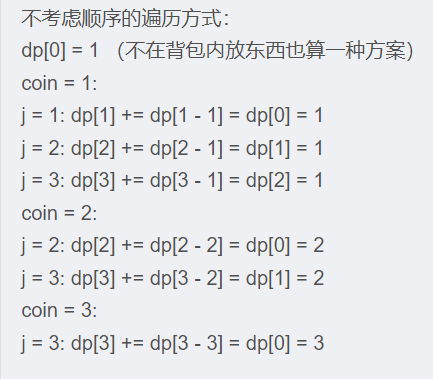

```{=org}
#+STARTUP: overview
```
```{=org}
#+TAGS:  动态规划(dp)
```
# 加速技巧

## 输入输出

    std::ios::sync_with_stdio(false);
    cin.tie(NULL);
    template <typename T>
    // 所有整数类型快读
    inline void read(T &x){
        x=0;
        int f=1;
        char ch=getchar();
        while(ch<'0'||ch>'9'){
            if(ch=='-') f=-1;
            ch=getchar();
        }
        while(ch>='0'&&ch<='9'){
            x=x*10+ch-'0';
            ch=getchar();
        }
        x=f*x;
        return;
    }
    
    // 字符串类型快读（不含空格）
    inline string readString()
    {
        string str;
        char s = getchar();
        //处理多余回车或空格
              while (s == ' ' || s == '\n' || s == '\r')
              {
                  s = getchar();
              }
        //不断读入直到遇到回车或空格
              while (s != ' ' && s != '\n' && s != '\r')
              {
                  str += s;
                  s = getchar();
              }
        return str;
    }

## 编译优化

    std::ios::sync_with_stdio(false);
    cin.tie(NULL);

## 复杂度控制

---------- ------------------
  数据范围   复杂度控制
  1000       O(n^2^),O(nlogn)
  10^4^      $O(n\sqrt{n})$
  10^5^      O(n),O(nlogn)
  10^6^      O(n)
---------- ------------------

主定理:
主定理适用于求解如下递归式算法的时间复杂度：$T(n)=a*T(\frac{n}{b})+ O(n^d)$
$$
T(n)=
\begin{cases}
O(n^d) & \mathrm{if~}d>\log_ba \\
O(n^d\log n) & \mathrm{if~}d=\log_ba \\
O(n^{\log_ba}) & \mathrm{if~}d<\log_ba & 
\end{cases}
$$

直观上来看，如果分解后的子问题归并的复杂度大于分解的复杂度，那么最后的渐进复杂度由归并那一项主导；如果子问题归并的复杂度小于分解的复杂度，那么由分解那一项主导；否则由两者共同决定。

# 动态规划

## 线性动态规划

### 最长上升子序列LIS []{#LIS}

朴素的想法是dp\[i\]作为前i个元素的最长子序列，这样无法建立状态转移方程。考虑dp\[i\]代表以num\[i\]结尾的LIS，可以建立方程（动态规划方程
第 i 个状态 有时是前面所有状态转移过来的(
线性组合)，而不是两三项（就像爬楼梯一样只有两项） :
$dp(x)=\begin{cases}max( dp(x-j) ) + 1 , j=1,2,...x& \text{if num[x] is bigger than num[x-j]} \\1&\text{num[x] is smaller than any previous element}\end{cases}$

    for(auto i=0;i<nums.size();++i){
          dp[i]=1;
          for(auto j=0;j<i;++j){
              if(nums[i]>nums[j]){
                  dp[i]=max(dp[j]+1,dp[i]);
              }
          }
          maxlen=max(dp[i],maxlen);
    }

1.  **进阶一 记录字典序最小的LIS**

    假设两个位置的LIS相等，那么后面位置的元素肯定更小（否则可以构成一个新的更长的LIS），所以得到最长长度之后逆向遍历可以求得字典序最小的LIS。

        vector<int> record;
        for(int i=nums.size()-1,j=maxlen;j>0;--i){ //逆向遍历保证字典序是最小的
            if(dp[i]==j){
                 record.insert(record.begin(),nums[i]);
                 --j;
            }
        }

2.  **进阶二 求出最长递增子序列（LIS）的个数**

    方法： 设cnt\[i\]
    代表第i个元素结尾的最长递增子序列的个数。在更新最长子序列的长度时做如下判断：

    -   dp\[i\] \< dp\[j\]+1.
        因为以第i个元素结尾的LIS要被直接更新（即换成加上第j个元素前面的序列），那么个数也同样需要更新，即cnt\[i\]=cnt\[j\]。
    -   dp\[i\] = dp\[j\]+1.
        以第i个元素结尾的LIS长度恰好要比以第j个元素结尾的LIS长度多一，这说明以第j个元素结尾的序列再加上第i个元素，刚好也可以是最长的(这几个LCS是平行的)，所以以第i个元素结尾的LIS个数应该要增加，而不是更新，即
        cnt\[i\]+=cnt\[j\]。
    -   dp\[i\] \> dp\[j\]+1.
        即使以第i个元素结尾的LIS再加上第i个元素也构不成新的LIS。故无需更新。

        for (int i = 0; i < n; ++i) {
            dp[i] = 1;
            cnt[i] = 1;
            for(int j=0; j<i; ++j){
                if(nums[i]>nums[j]){
                    if(dp[i]==dp[j]+1){
                        cnt[i]+=cnt[j];
                    }
                    else if(dp[i]< dp[j]+1){
                        cnt[i]=cnt[j];
                        dp[i]+=1;
                        }
                    }
                }
                maxLen=max(maxLen,dp[i]);
            }
            for(int  i=0;i<n;++i){
                if(dp[i]==maxLen) ans+=cnt[i];
            }
    
3. **进阶三 贪心优化** [[单调栈]{.smallcaps}]{.tag tag-name="单调栈"}

   只利用动态规划时间复杂度是 $O(n^2)$的，可以利用贪心思想来优化代码，使复杂度为 

   \$O(nlog n)\$ 。它的原理是让序列增长的尽可能慢。算法过程如下：

   -   初始化vec数组，vec里存放的元素是递增的，且容量大小等于LIS的长度。
   -   如果num\[i\] 比vec最后一个元素都大，那么num \[i\]加入vec数组
   -   否则找到第一个比num\[i\]大的元素，把它的值替换成num\[i\]

   <!-- -->

       int maxLen=0;
       vector<int> vec;
       for(auto i=1;i<nums.size();++i){
          if(vec.empty() || nums[i]>vec.back()){
              vec.emplace_back(nums[i]);
          }
          // 如果是单调非递减，换成upper_bound即可
          int pos = lower_bound(vec.begin(),vec.end(),nums[i]) - vec.begin();
          vec[pos] = nums[i];
       }
       maxLen=vec.size(); //vec 最后存放的不是LIS，但长度是和LIS一样的

   解释，这个可以从卡牌接龙的角度来看（[hiepit](https://leetcode.com/problems/longest-increasing-subsequence/discuss/1326308/C++Python-DP-Binary-Search-BIT-Solutions-Picture-explain-O(NlogN))），卡牌接龙的规则如下：

   -   游戏开始，第一张卡牌组成只包含一张卡的新堆。
   -   对于后序每张卡牌，尽量把它放在最左边的卡堆，要求卡牌堆顶的牌要大于它；如果不存在这样的堆，那么把它放到最右边的一个新的堆。

   

   可以看到，最后堆的数量就是LIS的长度，对应着贪心过程。我们用现存的元素去替换一个比它大的元素，这不会改变LIS的长度，同时这个元素有可能扩展成LIS。

4.  进阶四 dilworth定理

    根据dilworth定理，不下降子序列最小个数等于最大上升子序列的长度，因此有些问题可以转为LIS问题。
    例如[洛谷P1233木棍加工](https://www.luogu.com.cn/problem/P1233)和[洛谷P1020导弹拦截](https://www.luogu.com.cn/problem/P1020)。

### 最长公共子序列LCS

朴素做法是用二维dp来建立状态转移方程。设dp\[i\]\[j\]代表s1前i-1个字符串，s2前j-1个字符串的LCS（避免初始化的麻烦）。
$dp(i,j)=\begin{cases}max( dp(i-1,j), dp(i,j-1) ) & \text{if s1[i]!=s2[j]} \\ dp(i-1,j-1)+1 &\text{s1[i]==s2[j]}\end{cases}$

    int LCS(string s1, string s2) {
        // write code here
        int dp[s1.size()+1][s2.size()+1];
        memset(dp,0,sizeof(dp));
        for(int i=1;i<=s1.size();++i){
            for(int j=1;j<=s2.size();++j){
                if(s1[i-1]==s2[j-1]) dp[i][j]=dp[i-1][j-1]+1;
                else{
                    dp[i][j]=max(dp[i-1][j],dp[i][j-1]);
                }
            }
        }
        return dp[s1.size()][s2.size()];
    }

后续可以用滚动数组优成一维的，如果是子数组，dp\[i\]\[j\]代表s1以s1\[i-1\]结尾，s2以s2\[j-1\]结尾的公共子串。

    int findLength(vector<int>& nums1, vector<int>& nums2) {
        int ans=0,end=-1;
        int n=nums1.size(),m=nums2.size();
        int dp[n+1][m+1];
        memset(dp,0,sizeof(dp));
        for(int i=1;i<=n;++i){
            for(int j=1;j<=m;++j){
                if(nums1[i-1]==nums2[j-1]){
                    dp[i][j]=dp[i-1][j-1]+1;
                    if(dp[i][j]>ans){
                        ans=dp[i][j];
                        end=i;
                    }
                }
            }
        }
        return ans;
    }

1.  进阶一 记录路径

    和走迷宫一样，只记录s1\[i-1\]==s2\[j-1\]的字符，然后根据dp的值去回溯路径。

        string res = "";
        for(int i = s1.size(), j = s2.size(); dp[i][j] >= 1;) {
            if(s1[i-1] == s2[j-1]) {
                res += s1[i-1];
                i--;j--;
                }
            else if(dp[i-1][j] >= dp[i][j-1]) i--;
            else j--;
        }
        reverse(res.begin(), res.end());

2.  进阶二 转为LIS

    给出 1,2,...,n的两个排列 P~1和~ P~2求它们的最长公共子序列~。
    

        int cnt=0;
        for (int i = 0; i < n; ++i)
        {
            map[s1[i]] = ++cnt;
        }
        for (int i = 0; i < n; ++i)
        {
            s2[i] = map[s2[i]];
        }
        for (int i = 0; i < n; ++i)
          {
              if (dp.empty() || t[i] > dp.back())
              {
                  dp.emplace_back(t[i]);
              }
              else
              {
                  int pos = lower_bound(dp.begin(), dp.end(), t[i]) - dp.begin();
                  dp[pos] = t[i];
              }
          }

### 回文子串

1.  回文子串数量

    给定一个字符串s，统计并返回这个字符串中回文子串的数目。设dp\[i\]\[j\]代表区间\[i,j\]是否是回文子串，那么可以得到状态转移方程。
    $dp(i,j)=\begin{cases} dp[i+1][j-1] & \text{if s[i]==s[j]} \\ false &\text{s[i]!=s[j]} \\ true &\text{s[i]==s[j] and i-j<=1 } \end{cases}$
    这个状态转移方程很特别dp(i,j)可能依赖于未来的状态dp(i+1,j)，因此我们在遍历i的时候需要逆序遍历，保证i+1的状态已经计算出来。

        int countSubstrings(string s) {
            int n=s.size();
            int ans=0;
            bool dp[n+1][n+1];
            memset(dp,false,sizeof(dp));
            for(int i=n;i>=1;--i){
                for(int j=i;j<=n;++j){
                   if(s[i-1]==s[j-1]){
                       if(j-i<=1) dp[i][j]=true;
                       else dp[i][j]=dp[i+1][j-1];
                       if(dp[i][j]) ++ans;
                   }
                }
            }
            return ans;
        }

2.  最长回文串长度 [[Manacher]{.smallcaps}]{.tag tag-name="Manacher"}

    求最长回文串的长度可以用dp来做，记录所有回文串的最小长度，另一种可以降低空间复杂度的做法是中心扩散法，即先确定中心的位置，之后确定回文串的左右边界，这样不需要遍历所有的。

        int getLongestPalindrome(string A) { //中心扩散法
            // write code here
            if(A=="") return 0;
            int ans=0,ALen=A.length();
            if(ALen==1) return 1;
            for(int i=0;i<ALen;){
                if(ALen-i<(ans>>1)) break; //后面即使是回文也不可能是最长的了
                int left=i,right=i;
                while(right<ALen-1&&A[right]==A[right+1]) ++right; //有可能中心是偶数
                i=right+1; //下次跳过这个中心点
                while(right<ALen-1&&left>0&&A[left-1]==A[right+1]){ //左右扩散
                    ++right;
                    --left;
                }
                if(right-left+1>ans){
                    // 如果有需要还可以记录起始位置start=left；
                    ans=right-left+1;
                }
            }
            return ans;
        }

3.  最长回文子序列

    最长回文子序列,[让字符串成为回文串的最少插入次数](https://leetcode.cn/problems/minimum-insertion-steps-to-make-a-string-palindrome/)都可以直接转为LCS。

4.  回文串最小切割次数

### 编辑距离

s1变成s2只有三种方法，替换，添加，删除。建立状态转移方程
dp\[i\]\[j\]=min(min(dp\[i-1\]\[j-1\],dp\[i\]\[j-1\]),dp\[i-1\]\[j\])+1

dp\[i\]\[j\]代表s1前i个字符变成s2的前j个字符的编辑距离。

    // 动态规划解法
    memset(dp,0,sizeof(dp));
    rep(i, 1, len1+1){
        rep(j, 1, len2+1){
            dp[i][0]=i; //全部删掉
            dp[0][j]=j; //全部添加
            if(s1[i-1]==s2[j-1]) {
                dp[i][j]=dp[i-1][j-1];
            }
            else{
                dp[i][j]=min(min(dp[i-1][j-1],dp[i][j-1]),dp[i-1][j])+1;
                /*
                  dp[i][j]=min(dp[i][j],dp[i-1][j-1]+1); //替换
                  dp[i][j]=min(dp[i][j],dp[i][j-1]+1); //添加
                  dp[i][j]=min(dp[i][j],dp[i-1][j]+1); // 删除
                */
            }
        }
    }
    
    //记忆化搜索解法
    int dp[1005][1005]={0};
    int dfs(string s1,string s2, int pos1, int pos2){
        if(pos1==0) return pos2; //全部添加
        if(pos2==0) return pos1; //全部删除
        if(dp[pos1][pos2]) return dp[pos1][pos2];
        if(s1[pos1-1]==s2[pos2-1]) return dfs(s1,s2,pos1-1,pos2-1);
        int add=dfs(s1,s2,pos1,pos2-1);
        int del=dfs(s1,s2,pos1-1,pos2);
        int rep=dfs(s1,s2,pos1-1,pos2-1);
        return dp[pos1][pos2]=min(min(add,del),rep)+1;
    }

### 滚动数组优化

假设dp\[i\]\[j\]依赖于dp\[i-1\]\[j\],dp\[i-1\]\[j\],dp\[i\]\[j-1\]中的某几项，可以按时间来滚动计算每个时刻的dp\[i\]，把二维的状态优化成一维的。


dp\[i\]\[j\]如果依赖黄色和绿色位置的状态，那么可以从后往前更新一维dp。如果依赖这三个色块，采用简单的滚动更新会发现dp\[i-1\]\[j-1\],dp\[i\]\[j-1\]降维到一维的状态是重叠的，并且这个依赖关系使得我们没办法从后往更新，因此需要引入一个变量来记录当前状态。

例如求由0,1组成的矩形中最大的由1组成的正方形的面积。设dp\[i\]\[j\]表示以matrix\[i\]\[j\]作为右下角的正方形边长，可以发现如果matrix\[i\]\[j\]要构成更大的正方形，需要看dp\[i-1\]\[j\],dp\[i\]\[j-1\],dp\[i-1\]\[j-1\]的最小值。

    int solve(vector<vector<char> >& matrix) {
        // write code here
        if(matrix.size()==0) return 0;
        int last=0,cur=0,ans=0,col=matrix[0].size(),row=matrix.size();
        vector<int> dp(col+1,0);
        for(int i=1;i<=row;++i){
            last=0; // 左上角的状态
            for(int j=1;j<=col;++j){
                cur=dp[j]; // 当前的状态
                if(matrix[i-1][j-1]=='1'){
                    //dp[j-1] 是左边的状态， dp[j]是当前位置前一时刻的状态
                    dp[j]=min(min(last,dp[j-1]),dp[j])+1;
                    ans=max(dp[j],ans);
                    last=cur;
                }
                else dp[j]=0;
            }
        }
        return ans*ans;
    }

如果dp\[i\]\[j\]只依赖黄色和绿色色块，那么不需要用新的变量记录之前的dp\[i\]\[j-1\]，逆序遍历更新即可。

### kadane算法 []{#kadane}

kadane算法最早用来解决最大连续子数组和问题。设dp\[i\]表示以num\[i\]结尾的最大连续子数组和，正常情况下我们希望累加多个正数得到最大和，但是也不能抛弃当前是负数的情况，因为后面还是可能出现正数，但是如果前面所有元素加起来都是负数，那就没必要加上前面的元素。可以得到状态转移方程

    if(dp[i-1]<0) dp[i]=nums[i];
    else dp[i]=dp[i-1]+nums[i];
    ans=max(ans,dp[i]);

可以合并这两种情况，得到它的等价方程为
dp\[i\]=max(dp\[i-1\]+nums\[i\],nums\[i\])，发现可以利用滚动优化。

    for(int i=0;i<nums.size();++i){
        maxCur=max(nums[i],maxCur+nums[i]);
        ans=max(ans,maxCur);
    }

再加上记录路径的功能。

    vector<int> FindGreatestSumOfSubArray(vector<int>& array) {
        // write code here
        int ans=array[0],curMax=array[0];
        int begin=0,end=0;
        for(int i=1;i<array.size();++i){
            if(curMax<0){
                begin=i;
                curMax=array[i];
            }
            else{
                curMax=curMax+array[i];
            }
            if(ans<=curMax){
                ans=curMax;
                end=i;
            }
            //curMax=max(curMax+array[i],array[i]);
            //ans=max(ans,curMax);
        }
        if(end<begin) begin=end;
        return vector<int>({array.begin()+begin,array.begin()+end+1});
    }

用这个算法可以解决[leetode最大升序子数组](https://leetcode.cn/problems/maximum-ascending-subarray-sum/)
。

1.  进阶一 考虑对称问题

    考虑问题[乘积最大子数组](https://leetcode-cn.com/problems/maximum-product-subarray/)，直接用kadane算法得到
    dp\[i\]=max(dp\[i-1\]\*nums\[i\],nums\[i\]),但这个方程是错误的，原因在于如果nums\[i\]是负数那么计算dp时会抛弃掉这个元素，而后面有可能出现一个负数这样使得乘积最大。我们考虑它的一个对称问题，dpmin表示以nums\[i\]结尾的乘积最小子数组。如果当前元素是正数，以当前元素结尾的乘积最大子数组dpmax\[i\]=dpmax\[i-1\]\*nums\[i\],如它是负数，那么dpmax\[i\]=dpmin\[i-1\]\*nums\[i\],但也有可能不用之前的元素乘积，当前nums\[i\]是最大的（比如说前面乘积是负的）。然后同时更新dpmax,dpmin，最后找到最大的值。状态转移方程如下：

    ``` example
    dp_max[i]=max(max(dp_max[i-1]*nums[i],dp_min[i-1]*nums[i]),nums[i]);
    dp_min[i]=min(min(dp_max[i-1]*nums[i],dp_min[i-1]*nums[i]),nums[i]);
    ```

    可以利用滚动数组更新元素。

        for(int i=1;i<n;++i){
            int premax=dp_max;
            dp_max=max(max(premax*nums[i],dp_min*nums[i]),nums[i]);
            dp_min=min(min(premax*nums[i],dp_min*nums[i]),nums[i]);
            ans=max(ans,dp_max);
        }

### 背包问题

背包问题难点在于for循环的顺序（先遍历物品还是容量），以及dp数组的初始化。

1.  01背包

    设dp\[i\]\[j\]代表前i个1背包，容量为j能获得最大的价值。显然初始化的时候有dp\[i\]\[0\]=0(因为容量为0)，dp\[0\]\[weight\[j\]\]=value\[0\](因为只能选第0个物品)。01背包使用二维dp的时候遍历顺序不影响结果,但是为了方便最好先遍历物品再遍历容量，转移方程为dp\[i\]\[j\]
    = max(dp\[i-1\]\[j\],
    dp\[i-1\]\[j-weight\[i\]\]+value\[i\])，代码如下。

        // 先全部初始化为0
        vector<vector<int>> dp(weight.size(), vector<int>(bagweight + 1, 0));
    
        // 初始化
        for (int j = weight[0]; j <= bagweight; j++) {
            dp[0][j] = value[0];
        }
    
        // weight数组的大小 就是物品个数
        for(int i = 1; i < weight.size(); i++) { // 遍历物品
            for(int j = 0; j <= bagweight; j++) { // 遍历背包容量
                if (j < weight[i]) dp[i][j] = dp[i - 1][j];
                else dp[i][j] = max(dp[i - 1][j], dp[i - 1][j - weight[i]] + value[i]);
    
            }
        }

    利用滚动数组优化成一维空间：dp\[j\] = max(dp\[j\], dp\[j -
    weight\[i\]\] + value\[i\])。
    dp\[j\]表示：容量为j的背包，所背的物品价值可以最大为dp\[j\]，那么dp\[0\]就应该是0，因为背包容量为0所背的物品的最大价值就是0。dp\[j\]依赖于之前的状态，因此在第二重循环遍历容量时需要逆序，注意遍历背包容量时可以从第i个物品的重量开始，可以避免判断j -
    weight\[i\]是否大于0。

        vector<int> dp(bagWeight + 1, 0);
        for(int i = 0; i < weight.size(); i++) { // 遍历物品
            for(int j = bagWeight; j >= weight[i]; j--) { // 遍历背包容量
                dp[j] = max(dp[j], dp[j - weight[i]] + value[i]);
            }
        }

    下面讨论两重循环的顺序问题，假设先遍历背包容量，再遍历物品，伪代码如下：

        for j=bagWeight...
            for i=0...weight.size()
            dp[j]=max(dp[j],dp[j-weight[i]]);
        return dp[bagWeight];

    可以发现对于每个容量大小j，都只会更新一次（例如第一重循环遍历完bagWeight之后就再也不更新了），而最后我们返回的是dp\[bagWeight\]，后面的更新是没有意义的。其次，尽管第二重循环会遍历每一个物品，但实际上dp\[j\]只会选一个最大价值的物品，明显是不合理的。因此，对于优化后的一维dp，只能先遍历物品，再遍历背包。

2.  完全背包

    0-1背包是每一件物品只能选取一次
    ，在解决0-1背包问题的时候我们需要找到dp\[i-1\]\[j-weight\[i\]最大价值。因为我们当前物品重量等于weight\[i\]，背包总容量等于j，我们就需要找到j-weight\[i\]容量时第i-1件物品的时候最大价值然后加上我们这件物品的价值。而完全背包每件物品可以无限使用，dp\[i\]\[j-weight\[i\]\]+value\[i\]就是在求存放当前物品的最大价值。转移方程为
    dp\[i\]\[j\] = max(dp\[i-1\]\[j\],
    dp\[i\]\[j-weight\[i\]\]+value\[i\])。这就导致了我们在第二重循环的时候必须从前往后遍历，同样可以利用滚动数组优化成一维。

        vector<int> dp(bagWeight + 1, 0); //初始化为0即可
        for(int i = 0; i < weight.size(); i++) { // 遍历物品
            for(int j = weight[i]; j <= bagWeight; j++) { // 遍历背包容量
                dp[j] = max(dp[j], dp[j - weight[i]] + value[i]);
            }
        }

3.  背包问题转换

    1.  分割等和子集

        给定一个只包含正整数的非空数组nums，判断是否可以将这个数组分割成两个子集，使得两个子集的元素和相等。可以把这个问题转换为背包容量为sum/2的01背包问题。物品的价值等于物品的体积，最后判断背包是否正好装满。

            bool canPartition(vector<int>& nums) {
                int n=nums.size();
                int sum=0;
                for(int i=0;i<nums.size();++i){
                    sum+=nums[i];
                }
                if(sum&1) return false;
                int target=sum/2;
                vector<int> dp(sum,0);
                for(int i=0;i<n;++i){
                    for(int j=target;j>=nums[i];--j){
                        dp[j]=max(dp[j],dp[j-nums[i]]+nums[i]);
                    }
                }
                if(dp[target]==target) return true;
                return false;
            }

    2.  完全平方数

        用最少的完全平方数组成n，相当于一个容量为n的完全背包，用最少物品装满。设dp\[j\]为凑足容量n的背包所需要的最少元素个数，dp\[j\]=min(dp\[j-nums\[i\]\]+1,dp\[j\])

            int numSquares(int n) {
                vector<int> dp(n+1,0x3f3f3f3f);
                dp[0]=0;
                for(int i=1;i*i<=n;++i){
                    for(int j=i*i;j<=n;++j){
                    dp[j]=min(dp[j],dp[j-i*i]+1);
                    }
                }
                if(dp[n]==0x3f3f3f3f) return -1;
                return dp[n];
            }

    3.  目标和：每个数只能用一次 [[存在性]{.smallcaps}]{.tag
        tag-name="存在性"}

        给定一个整数数组nums和一个整数target，请你返回该数组能构成多少种不同的表达式等于target。将数组里每个整数前面可以添加\"+\"或者\"-\"符号，组成一个表达式。对数组里所有元素分成两类，正的（和为x）和负的（和为y），如果能凑成target，那么
        x+y=target，同时我们知道x-y=sum(nums)，因此问题相当于找数组里能否凑出(sum(nums)+target)/2的组合，可以用回溯法[目标和](#目标和)解决。仔细分析可以发现目标和也可以转为01背包问题，之后用动态规划解决。

            bool canPartition(vector<int>& nums) {
                int n=nums.size();
                int sum=0;
                for(int i=0;i<nums.size();++i){
                    sum+=nums[i];
                }
                if(sum&1) return false;
                int target=sum/2;
                vector<int> dp(sum,0);
                for(int i=0;i<n;++i){
                    for(int j=target;j>=nums[i];--j){
                        dp[j]=max(dp[j],dp[j-nums[i]]+nums[i]);
                    }
                }
                if(dp[target]==target) return true;
                return false;
            }

    4.  目标和：每个数可以多次使用 [[组合数]{.smallcaps}]{.tag
        tag-name="组合数"}

        考虑nums=\[1,2,3\],target=3，如果先遍历物品，再遍历背包容量，那么含义是先只用1去凑target，然后考虑用1，2去凑，最后考虑用1，2，3去凑，顺序是固定的。

        

            int change(int amount, vector<int>& coins) {
                int n=coins.size();
                vector<int> dp(amount+1,0);
                //考虑第1种硬币，凑出价值为0的硬币方案数为1,即不选硬币
                dp[0]=1;
                for(int i=0;i<n;++i){
                    for(int j=coins[i];j<=amount;++j){
                        dp[j]=dp[j]+dp[j-coins[i]];
                    }
                }
                return dp[amount];
            }

    5.  目标和：考虑不同顺序 [[排列数]{.smallcaps}]{.tag
        tag-name="排列数"}

        考虑nums=\[1,2,3\],target=3，如果先遍历背包容量，再遍历物品,在计算dp\[3\]时，考虑组合最后一个物品是1，2，3，凑出dp\[3-i\]的组合数，计算dp\[2\]时，考虑虑组合最后一个物品是1，2，3，凑出dp\[2-i\]的组合数。因此排列顺序会被考虑到。

        

            //计算有多少种组合可以使得和为target
            int combinationSum4(vector<int>& nums, int target) {
                int n=nums.size();
                //中间计算会有溢出
                vector<unsigned int> dp(target+1,0);
                dp[0]=1;
                for(int i=0;i<=target;++i){
                    for(int j=0;j<nums.size();++j){
                        //防止溢出
                        if(i>=nums[j] ) dp[i]= dp[i]+dp[i-nums[j]];
                    }
                }
                return (int)dp[target];
            }

    6.  一和零 [[组合数]{.smallcaps}]{.tag tag-name="组合数"}

        本题也是用01背包来求组合数，特殊之处在于使用的01背包的容量需要用两个维度来刻画。设dp\[i\]\[j\]表示最多有i个0和j个1的strs的最大子集的大小为dp\[i\]\[j\]，之后做法和01背包完全一样。

            int findMaxForm(vector<string>& strs, int m, int n) {
                vector<vector<int> > dp(m+1,vector<int>(n+1,0));
                for(int i=0;i<strs.size();++i){
                    string str=strs[i];
                    int zeroNum=0,oneNum=0;
                    for (char c : str) {
                     if (c == '0') zeroNum++;
                     else oneNum++;
                    }
                    for(int j=m;j>=zeroNum;--j){
                        for(int k=n;k>=oneNum;--k){
                            dp[j][k]=max(dp[j][k],dp[j-zeroNum][k-oneNum]+1);
                        }
                    }
                }
                return dp[m][n];
            }

    7.  单词拆分

        

        使用深度优先搜索可以解决，但是很容易构造出例子s=\"\"aaaaaaaaaaab\"，wordDict=\[\"a\",\"aa\",\"aaa\",\"aaab\"\]卡掉搜索。因此需要使用记忆化来加速。

            int mem[305];
            bool dfs(string s, vector<string>& dic, int pos){
                if(pos>s.size()-1) {
                  return true;
                }
                if(mem[pos]!=-1) return mem[pos];
                for(auto word: dic){
                    if(s.substr(pos,word.size()) == word){
                        if(dfs(s,dic,pos+word.size())) {
                            return mem[pos]=1;
                        }
                    }
                }
                return mem[pos]=0;
            }

        因为单词可以重复使用，可以想到用完全背包来做。dp\[i\]代表字符串长度为i是否可以拆分为一个或多个在字典中出现的单词。如果确定dp\[j\]
        是true，且 \[j, i\]
        这个区间的子串出现在字典里，那么dp\[i\]一定是true。为了使后面的推导有意义，dp\[0\]=true。本题需要先遍历容量，再遍历物品。考虑这样一个例子s
        = \"applepenapple\", wordDict = \[\"apple\",
        \"pen\"\]，如果先遍历物品，遍历完\"apple\"这个单词只能确定dp\[4\]=true，之后遍历到\"pen\"这个单词的时候，计算dp\[s.size()-1\]发现apple已经在前面选过了，最后dp\[s.size()-1\]=false（当然也可以再去字典里全找一遍）。所以本题先遍历容量，再遍历背包会更方便。

            bool wordBreak(string s, vector<string>& wordDict) {
                int n=s.size();
                  vector<bool>  dp(n+1,false);
                  dp[0]=true;
                  for(int i=1;i<=n;++i){
                      for(auto word:wordDict){
                          int m=word.size();
                          if(i>=m&&s.substr(i-m,m)==word&&dp[i-m]==true) dp[i]=true;
                      }
                  }
                  return dp[n];
            }

### 买卖股票

下面的分析来源于leetcode题解[股票问题系列通解](https://leetcode-cn.com/circle/article/qiAgHn/)。
假设dp\[i\]\[k\]\[{0,1}\]代表第i天，还可以交易k次，手里剩/不剩股票可以获得的最大收益。


之后的问题就是对这个方程不断优化。

1.  只允许买卖一次 [[kadane]{.smallcaps}]{.tag tag-name="kadane"}

    只允许买卖一次，即k=1，代入状态方程。

        dp[i][1][0] = max(dp[i-1][1][0], dp[i-1][1][1] + prices[i])
        dp[i][1][1] = max(dp[i-1][1][1], dp[i-1][0][0] - prices[i])
                    = max(dp[i-1][1][1], -prices[i])

    解释：k=0的base case，即不允许股票交易，所以
    dp\[i-1\]\[0\]\[0\]=0。转移方程于k无关，故可以去掉第二维，之后再用滚动数组优化第一维，最后得到：

        int dp_i_0=0,dp_i_1=-0x3f3f3f3f;
            for(int i=0;i<prices.size();++i){
                // 第i天没有持有可能是昨天就没有，或者今天卖掉了
                dp_i_0=max(dp_i_0,dp_i_1+prices[i]);
                // 第i天持有可能是昨天持有，或者是今天刚买了一份
                // 既然是今天刚买的，因为只能卖买一次，所以之前不可能有利润
                // 即这一天的利润就是股票价格的负数
                dp_i_1=max(dp_i_1,-prices[i]);
            }
            return dp_i_0;

    可以看到dp~i1的更新取决于之前price~\[i\]的最小值，也就是说在当天之前的最低点买入是单天收益的最大值。因此可以用一种非常直观的方式表达这一点。

        int gain=0,minPrice=0x3f3f3f3f;
        for(int i=0;i<prices.size();++i){
           gain=max(gain,prices[i]-minPrice);
           minPrice=min(minPrice,prices[i]);
        }

    另外，这题也可以用[kadane](#kadane)算法来做，技巧是把子数组设为相邻的价格之差（这种做法是最不直观的），解释如下：
    

        int maxCur = 0, maxSoFar = 0;
        for(int i = 1; i < prices.length; i++) {
            maxCur = Math.max(0, maxCur += prices[i] - prices[i-1]);
            maxSoFar = Math.max(maxCur, maxSoFar);
        }
        return maxSoFar;

2.  可以进行任意次买卖

    假设可以在每一天，可以决定是否购买和/或出售股票，那么认为可以交易的次数是不受限的，将$k=+\infty$
    代入状态方程，如果k为正无穷，那么就可以认为k和k-1是一样的。

        dp[i][k][0] = max(dp[i-1][k][0], dp[i-1][k][1] + prices[i])
        dp[i][k][1] = max(dp[i-1][k][1], dp[i-1][k-1][0] - prices[i])
                    = max(dp[i-1][k][1], dp[i-1][k][0] - prices[i])

    同样可以去掉k，之后用滚动数组优化。

        int dp_i_0=0,dp_i_1=-0x3f3f3f3f;
            for(int i=0;i<prices.size();++i){
                int tmp=dp_i_0;
                // 第i天没有持有可能是昨天就没有，或者今天卖掉了
                dp_i_0=max(dp_i_0,dp_i_1+prices[i]);
                // 第i天持有可能是昨天持有，或者是今天刚买了一份
                dp_i_1=max(dp_i_1,tmp-prices[i]);
            }
            return dp_i_0;

3.  允许任意次买卖但有冷却

    假设情况是卖出股票之后，第二天无法买入股票，这里也是允许无穷次交易，但是卖出股票之后有一天的冷却，因此转移方程需要一点改变。

        dp[i][k][0] = max(dp[i-1][k][0], dp[i-1][k][1] + prices[i])
        dp[i][k][1] = max(dp[i-1][k][1], dp[i-2][k-1][0] - prices[i])
                    = max(dp[i-1][k][1], dp[i-2][k][0] - prices[i])

    去掉之后用滚动数组的思想优化，得到如下方程。

        int dp_i_0=0,dp_i_1=-0x3f3f3f3f;
        int tmp_pre=0; // i-2时刻
        for(int i=0;i<prices.size();++i){
            int tmp=dp_i_0;
            dp_i_0=max(dp_i_0,dp_i_1+prices[i]);
            dp_i_1=max(dp_i_1,tmp_pre-prices[i]);
            tmp_pre=tmp;
        }
        return dp_i_0;

4.  只允许两次买卖

    和之前一样的思路，只不过得到以下状态方程之后无法把k去掉，也不能直接应用滚动数组去优化。

        dp[i][k][0] = max(dp[i-1][k][0], dp[i-1][k][1] + prices[i])
        dp[i][k][1] = max(dp[i-1][k][1], dp[i-1][k-1][0] - prices[i])

    因为k比较小，所以可以尝试把k的取值都代进去。

    ``` example
    dp[i][2][0] = max(dp[i-1][2][0], dp[i-1][2][1] + prices[i])
    dp[i][2][1] = max(dp[i-1][2][1], dp[i-1][1][0] - prices[i])
    dp[i][1][0] = max(dp[i-1][1][0], dp[i-1][1][1] + prices[i])
    dp[i][1][1] = max(dp[i-1][1][1], -prices[i])
    ```

    之后发现可以按照之前的思路去优化。

        int dp_i10 = 0, dp_i11 = -0x3f3f3f3f;
        int dp_i20 = 0, dp_i21 = -0x3f3f3f3f;
        for(int i=0;i<prices.size();++i){
            dp_i20 = max(dp_i20, dp_i21 + prices[i]);
            dp_i21 = max(dp_i21, dp_i10 - prices[i]);
            dp_i10 = max(dp_i10, dp_i11 + prices[i]);
            dp_i11 = max(dp_i11, -prices[i]);
          }
        return dp_i20;

5.  给定次数进行交易

    这种情况是最普遍的，指定k的值，然后问能获得的最大收益是多。一次交易由买入和卖出构成，至少需要两天，如果k超过一半的天数，那么可以认为$k=+\infty$
    ，和之前情况一样，那么重点分析剩下的情况，优化的时候主要第二层循环反向遍历。

        int n=prices.size();
        int dp[k+1][2];
        for (int j = 0; j <= k; i++) {
                dp[j][0] = 0;
                dp[j][1] = -0x3f3f3f3f;
        }
        for (int i = 1; i <= n; i++){  //第几天
            for (int j = k; j > 0; j--) { //允许交易次数
            dp[j][0] = max(dp[j][0], dp[j][1] + prices[i-1]);
            dp[j][1] = max(dp[j][1], dp[j-1][0] - prices[i-1]);
            }
        }
        return dp[k][0];

### n个骰子的点数

假设已知n-1个骰子每个数字的概率分布，设dp\[n\]\[x\]代表再加入第n个骰子，总的点数为x的概率分布。假设第n个骰子掷出的是1，那么前n-1个骰子总的点数必须是x-1，第n个骰子掷出的是2，那么前n-1个骰子总的点数必须是x-2，以此类推，每种情况的概率都是相等的，可以得到状态转移方程
$dp[n][x]= \sum_{i=1}^6 dp[n-1][x-i] * \frac{1}{6}$
。另外，n个骰子掷出的数字总数范围是\[n,6\*n\]，总共5\*n+1个数字。

    vector<double> dicesProbability(int n) {
        vector<vector<double> > dp(n+1,vector<double>(6*n+1,0));
        for(int i=1;i<=6;++i){
            dp[1][i]=1.0/6;
        }
        for(int i = 2;i <= n; i++){
            for(int j = i;j <= i*6;j++){
                for(int k = 1;k <= 6;k++){
                    if(j-k > 0)
                        dp[i][j] += dp[i-1][j-k]/6;
                    else
                        break;
                }
            }
        }
        vector<double> ans(5*n+1,0);
        for(int i = 0;i <= 5*n;i++){
            ans[i] = dp[n][n+i];
        }
        return ans;
    }

### 约瑟夫环

设f(n,m)代表n个人，报第m个编号出列的最终编号。举个例子，假设人数编号为1-9，报到第3个人的时候出列，从1开始。第一次3出列，之后把剩下的人重新排列成4,5,6,7,8,9,1,2，发现可以用编号1-8的人情况来表达。即f(9,3)=(f(8,3)+3)%9。

    int lastRemaining(int n, int m) {
        int p=0;
        for(int i=1;i<=n;i++)
        {
            p=(p+m)%i;
        }
        return p+1;
    }

## 树形动态规划

树形 DP，即在树上进行的
DP，由于树固有的递归性质，树形DP一般都是用递归来完成。

### 打家劫舍

树可以用多叉链表来表示，也可以用数组来表示。如果是多叉链表的形式，为了使用记忆化搜索，需要用map来完成结点的映射，例如[leetcode打家劫舍](https://leetcode-cn.com/problems/house-robber-iii/)。

    // f代表选根节点，g代表不选根节点
    unordered_map <TreeNode*, int> f, g;
    void dfs(TreeNode* node) {
        if (node==nullptr) {
            return;
        }
        dfs(node->left);
        dfs(node->right);
        f[node] = node->val + g[node->left] + g[node->right];
        g[node] = max(f[node->left], g[node->left]) + max(f[node->right], g[node->right]);
    }
    
    int rob(TreeNode* root) {
        dfs(root);
        return max(f[root], g[root]);
    }

如果用数组来表示，需要注意用辅助数组来判断节点是否为根节点,如例题[洛谷-没有上司的舞会](https://www.luogu.com.cn/problem/P1352)

    // boss[i]存储的是第i个boss的所有职员
    vector<int> boss[6005];
    int f[6005][2];
    int happy[6005];
    bool isroot[6005];
    
    // x=1代表选root
    int dfs(int root,int x){
        if(f[root][x]) return f[root][x];
        f[root][0]=0;
        f[root][1]=happy[root];
        rep(i, 0, boss[root].size()){
            f[root][0]+=max(dfs(boss[root][i],1),dfs(boss[root][i],0));
            f[root][1]+=dfs(boss[root][i],0);
        }
        return f[root][x];
    }
    //部分代码
    int main(){
      rep(i, 1, n){
          cin>>x>>y;
          boss[y].push_back(x);
          isroot[x]=false;
      }
      // 寻找整棵树的根节点,即最顶层的boss
      int root=0;
      rep(i, 1, n+1){
          if(isroot[i]){
              root=i;
              break;
          }
      }
      //cout<<"root is "<<root;
      dfs(root,0);
    }

## 区间动态规划

区间动态规划是线性动态规划的拓展，它给出的问题通常是求一段区间内能获得的最大/最小价值。这个结果可以是两部分区间合并得到的，并受到区间划分点的影响。公式为
$f(i,j)=\max\{f(i,k)+f(k+1,j)+cost\}$,
cost为将两个区间合并的代价，从公式可以看出我们需要枚举区间中的所有划分点。

### 涂色

    int dp[55][55]={0};
    string s;
    
    int dfs(int x, int y){
        if(x==y) return 1;
        if(dp[x][y]) return dp[x][y];
        if(s[x]==s[y]) return dp[x][y]=min(dfs(x+1,y),dfs(x,y-1));
        else{
            int res=INF;
            rep(k, x, y){
                res=min(res,dfs(x,k)+dfs(k+1,y));
            }
            dp[x][y]=res;
        }
        return dp[x][y];
    }

### 扔鸡蛋

题目来源[leetcode扔鸡蛋](https://leetcode.cn/problems/super-egg-drop/)。假设dp\[K\]\[N\]代表K个鸡蛋，N层楼需要试的最少次数。
$dp(K, N)=\min _{0<=i<=N}\{\max \{dp(K-1, i-1), dp(K, N-i)\}+1\}$

    // k个鸡蛋，n层楼最少需要试几次
    int dp[105][10005]={0};
    int dfs(int k,int n){
        //0层楼，不需要试
        if(n==0) return 0;
        //只有一个鸡蛋，只能一层一层去试
        if(k==1) return n;
        if(dp[k][n]) return dp[k][n];
        int res=0x3f3f3f3f;
        for(int i=1;i<=n;++i){
            res=min(res,max(dfs(k-1,i-1),dfs(k,n-i))+1);
        }
        return dp[k][n]=res;
    }

1.  进阶一：二分优化

    仔细分析公式，可以发现，dp(K-1,i-1)随着i增大而增大，dp(K,N-i)随着i增大而减小。minmax的这种形式相当于求一个极值，可以用二分来做。

    ```{=org}
    #+caption: 二分优化
    ```
    ```{=org}
    #+ATTR_ORG: :width 600
    ```
    {width="600px"}

        int dfs(int k,int n){
            //0层楼，不需要试
            if(n==0) return 0;
            //只有一个鸡蛋，只能一层一层去试
            if(k==1) return n;
            if(dp[k][n]) return dp[k][n];
            int res=0x3f3f3f3f;
            int left=1,right=n;
            while(left<=right){
                int mid=(left+right)/2;
                int broken=dfs(k-1,mid-1); //单调递增
                int not_broken=dfs(k,n-mid); //单调递减
                if (broken > not_broken){
                    right=mid-1;
                    //取最大中的最小值
                    res=min(res,broken+1);
                }
                else{
                    left=mid+1;
                    res=min(res,not_broken+1);
                }
            }
            return dp[k][n]=res;
        }

2.  进阶二：问题转换

    反过来想这个问题：如果我们可以做t次操作，而且有k个鸡蛋，那么我们能找到答案的最高的n是多少？我们设
    f(t,k) 为在上述条件下的
    n。如果我们求出了所有的f(t,k)，那么只需要找出最小的满足f(t,k)≥n
    的t。

        class Solution {
        public:
            // T次操作，K个鸡蛋能确定最高的楼层
            int calcF(int T,int K)
            {
                if (T == 1 || K == 1) return T + 1;
                return calcF(K - 1, T - 1) + calcF(K, T - 1);
            }
        
            int superEggDrop(int K, int N)
            {
                int T = 1;
                while (calcF(K, T) < N + 1) T++;
                return T;
            }
        };

## 数位动态规划

数位DP用来解决一类特定问题，这种问题比较好辨认，一般要求统计满足一定条件的数的数量。如果我们要求1-23456以内符合某些条件的数，我们只需要知道形如0????，1????
或2???? ，且小于等于原数的符合条件的数的数量即可。并且可以发现，在计算
12??? 和 22???
符合条件的数的数量是一样的，所以他们可以当作同样的状态，因此可以用动态规划来做。用记忆化搜索来做数位dp会很方便，模板如下。

    //pos搜到的位置
    //pre前一位数
    //st当前状态
    //lead判断是否有前导0
    //limit判断是否有最高位限制
    //通常用数组记忆化，因为c++中map不能直接用pair作为key
      ll dfs(int pos,int pre,int st,……,int lead,int limit)//记搜
      {
          if(!pos) return st;//剪枝
          if((dp[pos][pre][st]……[……]!=-1&&(!limit)&&(!lead))) return dp[pos][pre][st]……[……];//记录当前值
          ll ret=0;//暂时记录当前方案数
          int res=limit?a[pos]:9;//res当前位能取到的最大值
          for(int i=0;i<=res;i++)
          {
              //有前导0并且当前位也是前导0
              if((!i)&&lead) ret+=dfs(……,……,……,i==res&&limit);
              //有前导0但当前位不是前导0，当前位就是最高位
              else if(i&&lead) ret+=dfs(……,……,……,i==res&&limit);
              else if(根据题意而定的判断) ret+=dfs(……,……,……,i==res&&limit);
          }
          if(!limit&&!lead) dp[pos][pre][st]……[……]=ret;//当前状态方案数记录
          return ret;
      }
      ll part(ll x)//把数按位拆分
      {
          len=0;
          while(x) a[++len]=x%10,x=x/10;
          memset(dp,-1,sizeof(dp));//初始化-1（因为有可能某些情况下的方案数是0）
          return dfs(len,……,……,……);//进入记搜,一般初始都传limit=1,lead=1
      }

代码中我们发现如果当前位有限制那么没法重复利用缓存，比如pos=3的时候，124???和102??的方案数是不一样的（虽然前面1的个数都只有一个），因此没办法利用之前的结果。

### 1出现的次数

加入n=12345，仔细分析可以发现120???和105???的答案是一样的（遍历到位置3,1总共出现了1次），113???和121??的答案是一样的（遍历到位置3,1总共出现了2次）。因此可以添加一个状态st表示1出现的次数。

    int dp[35][25];
    int a[35];
    // st代表1出现的次数
    int dfs(int pos,int st, int limit){
        if(!pos) return st;
        if(dp[pos][st]!=-1 && !limit) return dp[pos][st];
        int up=limit?a[pos]:9;
        int res=0;
        for(int i=0;i<=up;++i){
            res+=dfs(pos-1,st+(i==1),i==up&&limit);
        }
        if(!limit) dp[pos][st]=res;
        return res;
    }
    int part(int n){
        int len=0;
        while(n){
            a[++len]=n%10;
            n/=10;
        }
        memset(dp,-1,sizeof(dp));
        return dfs(len,0,1);
    }

### 统计特殊整数

题目来源[leetcode统计特殊整数](https://leetcode.cn/problems/count-special-integers/)。如果一个正整数每一个数位都是互不相同的，我们称它是特殊整数
，求\[1,n\]特殊整数个数

    int a[20],tot=0;
    int mem[15][1024];
    int dfs(int limits, int pos, int mask, int lead){
         if(!pos) return 1;
         if(!limits&&mem[pos][mask]&&!lead) return mem[pos][mask];
         int up=limits?a[pos]:9;
         int res=0;
         for(int i=0;i<=up;++i){
             // 这个数被用过
             if(mask&(1<<i)) continue;
             // 当前0是前导，不算用过
             if(lead&&i==0) res+=dfs(limits&&(i==up),pos-1,mask,1);
             else res+=dfs(limits&&(i==up),pos-1,mask^(1<<i),0);
         }
         if(!limits&&!lead) mem[pos][mask]=res;
         return res;
     }
     int parts(int n){
         while(n){
             a[++tot]=n%10;
             n/=10;
         }
         return dfs(1,tot,0,1);
     }

# 数据结构

## 链表

链表可以看作是一颗单孩子树，和二叉树很像链表的一些操作都是用递归来完成。单向链表定义如下：

    typedef struct Node
    {
        int val;
        Node *next;
        Node(int _val) : val(_val), next(nullptr){};
    } Node;

如果会对链表的头结点做修改，那么最好设立一个dummy节点来操作链表。

### 相交链表

长链表走完了换短链表走，短链表走完换长链表，如果有相交节点一定会相遇，时间复杂度O(m+n)。
相当于把两个列表按不同顺序拼起来，原理如下： A -\> a1 a2 c1 c2 c3 B -\>
b1 b2 b3 c1 c2 c3 C1 -\> a1 a2 c1 c2 c3 b1 b2 b3 c1 c2 c3 C2 -\> b1 b2
b3 c1 c2 c3 a1 a2 c1 c2 c3

    ListNode *getIntersectionNode(ListNode *headA, ListNode *headB) {
        if (headA == nullptr || headB == nullptr) {
            return nullptr;
        }
        ListNode *pA = headA, *pB = headB;
        while (pA != pB) {
            pA = pA == nullptr ? headB : pA->next;
            pB = pB == nullptr ? headA : pB->next;
        }
        return pA;
    }

### 反转链表

利用递归实现链表的反转。

    Node *Reverse(Node *head)
    {
        if ((head == nullptr) || head->next == nullptr)
            return head;
        Node *last = Reverse(head->next);
        head->next->next = head;
        head->next = nullptr;
        return last;
    }
    
    Node *successor = nullptr;
      //反转以head为起点的n个节点
    Node *ReverseN(Node *head, int n)
    {
        if (n == 1)
        {
              successor = head->next; //记录最后一个节点的后继
              return head;
        }
          Node *last = ReverseN(head->next, n - 1);
          head->next->next = head;
          head->next = successor; //和之前不一样，这里head不是最后一个节点
          return last;
    }
    
    // 反转链表某个区间
    Node *ReverseBetween(Node *head, int m, int n)
    {
        if (m == 1)
            return ReverseN(head, n);
        // 注意是n-1,这样最后得到的就是需要反转链表的长度
        head->next = ReverseBetween(head->next, m - 1, n - 1);
        return head;
    }

非递归反转链表：

    ListNode* reverseList(ListNode* head){
        ListNode* prev = nullptr;
        ListNode* curr = head;
        while (curr != nullptr) {
            ListNode* nextTemp = curr->next;
            curr->next = prev;
            prev = curr;
            curr = nextTemp;
        }
        return prev;
    }

K个一组反转链表,最简单的可以利用栈来实现链表反转，首先将链表入栈，出栈的顺序就是反转的顺序，空间复杂度为O(k)。下面做法可以实现O(1)的复杂度。

    ListNode* reverseKGroup(ListNode* head, int k) {
        ListNode* dummy=new ListNode(-1);
        dummy->next=head;
        ListNode *pre=dummy,*start=dummy,*end=dummy;
        while(end){
            start=pre->next;
            int tmp=0;
            while(end&&tmp<k){
                end=end->next;
                ++tmp;
            }
            if(end==nullptr) break;
            ListNode* nxt=end->next;
            end->next=nullptr;  //断开链表方便反转
            pre->next=reverseList(start);
            start->next=nxt;
            pre=start;
            end=pre;
        }
        return dummy->next;
    }

### 链表加一

    ListNode* dfs(ListNode* head){
        if((head->next)==nullptr){
            head->val+=1;
            return head;
        }
        ListNode* nxt=dfs(head->next);
        if(nxt!=nullptr && nxt->val>9){
            nxt->val=0;
            head->val+=1;
        }
        return head;
    }

### 链表合并 [[分治法]{.smallcaps}]{.tag tag-name="分治法"} {#链表合并}

k组链表有序合并，使用分治法，时间复杂度为 \$O(kn × log  k)\$。
[]{#链表归并} 

    ListNode* mergeTwoLists(ListNode* list1, ListNode* list2) {
        if(!list1 || !list2) return list1 ? list1 : list2;
        ListNode* dummy=new ListNode(-1);
        ListNode* tail = dummy;
        while(list1 && list2){
            if(list1->val < list2->val ) {
                tail->next=list1;
                list1=list1->next;
            }
            else{
                tail->next=list2;
                list2=list2->next;
              }
              tail=tail->next;
          }
        if(list1) tail->next=list1;
        else if(list2) tail->next = list2;
        return dummy->next;
    }
    
    //先把区间分成两部分，这两部分都归并成有序链表，再把这两个链表合并
    ListNode* merge(vector <ListNode*> &lists, int l, int r) {
        if(l==r) return lists[l];
        // 防止lists为空
        if(l>r) return nullptr;
        int mid=(l+r)/2;
        return mergeTwoLists(merge(lists,l,mid),merge(lists,mid+1,r));
    }

### 链表成环 [[Floyd判圈]{.smallcaps}]{.tag tag-name="Floyd判圈"} [[快慢指针]{.smallcaps}]{.tag tag-name="快慢指针"} {#链表成环}


如图所示，设立快慢指针在头节点，当节点相遇时，快指针在圈子里面走了n圈，而慢指针刚到相遇的位置。再考虑到快指针走过的结点数量是满指针的两倍，所以有x+n\*(y+z)+y=2\*(x+y),化简得
x=(n-1)(y+z)+z。如果n=1，那么x=2，此时设置一个指针从头节点出发，另一个指针从相遇节点出发，最终在环的入口节点相遇。如果n\>1,意味着x比z多了n-1个环的距离，用快慢指针仍可以得到入口节点，相遇时快指针多走了（n-1）个环。

    ListNode *detectCycle(ListNode *head) {
        if(head==nullptr) return head;
        ListNode* fast=head, *slow=head;
        while(fast&&fast->next){
            fast=fast->next->next;
            slow=slow->next;
            //会相交，那么head到入口节点的距离和相遇点到入口点的距离只相差了n个环长
            if(slow==fast){
                ListNode* p1=head;
                ListNode* p2=slow;
                while(p1!=p2){
                    p1=p1->next;
                    p2=p2->next;
                }
                return p1;
            }
        }
        return nullptr;
    }

### 删除排序链表中重复的元素

    ListNode* deleteDuplicates(ListNode* head) {
        ListNode* dummy=new ListNode(-1);
        dummy->next=head;
        ListNode* cur=dummy;
        while(cur->next&&cur->next->next){
            ListNode* tmp=cur->next;
            int x=tmp->val;
            //移动到最后一个重复元素节点
            while(tmp->next&&tmp->next->val==x) tmp=tmp->next;
            if(cur->next==tmp){ //下一个节点是独一无二的
                cur=cur->next;
            }
            else{
                cur->next=tmp->next;
            }
        }
        return dummy->next;
    }

### LRU

为了能以O(1)的速度删除缓存中的某个元素，需要用hashmap储存每个节点的地址。

    class LRUCache {
    public:
        int capacity;
        list<pair<int,int> > cache;
        unordered_map<int, list<pair<int,int> >::iterator > umap;
        LRUCache(int capacity) {
            this->capacity=capacity;
        }
    
        int get(int key) {
            if(umap.count(key)==0) return -1;
            else{
                auto node=make_pair((*umap[key]).first,(*umap[key]).second);
                cache.erase(umap[key]);
                cache.push_front(node);
                umap[key]=cache.begin();
                return node.second;
            }
        }
    
        void put(int key, int value) {
            if(umap.count(key)){
                cache.erase(umap[key]);
            }
            auto p=make_pair(key,value);
            cache.push_front(p);
            umap[key]=cache.begin();
            if(cache.size()>capacity){
                umap.erase(cache.back().first);
                cache.pop_back();
            }
        }
    };

## 二叉树/树

### 建立二叉树

1.  普通二叉树

    已知前序和中序，或者中序和后序都可以递归建立二叉树。在找二叉树的根节点可以用map优化查找。

        unordered_map<int, int> umap;
        TreeNode* PreInorder(vector<int>pre,vector<int> vin,int s1, int e1, int s2, int e2){
            if(s1>e1 || s2> e2) return nullptr;
        //         int i=s2;
        //         //中序序列中找根节点
        //         for(;i<=e2;++i){
        //             if(vin[i]==pre[s1]) break;
        //         }
            int i=umap[pre[s1]];
            int cnt=i-s2;
            TreeNode* root=new TreeNode(pre[s1]);
            root->left=PreInorder(pre,vin,s1+1,s1+cnt,s2,i-1);
            root->right=PreInorder(pre, vin, s1+cnt+1, e1, i+1, e2);
            return root;
        }
        TreeNode* reConstructBinaryTree(vector<int> pre,vector<int> vin) {
            for(int i=0;i<vin.size();++i){
                umap[vin[i]]=i;
            }
            TreeNode* root=PreInorder(pre, vin, 0, pre.size()-1, 0, vin.size()-1);
            return root;
        }

    或者给出二叉树的层次遍历，可以根据下标的值建立二叉树。

        TreeNode *construct_binary_tree(const vector<int> &vec)
        {
            vector<TreeNode *> nodes;
            TreeNode *root = nullptr;
            for (auto value : vec)
            {
                if (value != -1)
                {
                    nodes.push_back(new TreeNode(value));
                }
                else
                {
                    nodes.push_back(nullptr);
                }
            }
            for (int i = 0; i * 2 + 2 < vec.size(); ++i)
            {
                if (nodes[i] != nullptr)
                {
                    nodes[i]->left = nodes[2 * i + 1];
                    nodes[i]->right = nodes[2 * i + 2];
                }
            }
            return nodes[0];
        }

2.  二叉搜索树

    可以从一颗空树开始，把每个元素按照二叉搜索树的特点依次插入二叉树。

        TreeNode* InsertNode(TreeNode* root, const int val)
        {
            if (root == NULL)
            {
                root = new TreeNode(val);    //根节点为空，插入，返回。
                return root;
            }
            else
            {
                if (val <= root->data)  //小于等于根节点，递归插入左子树
                {
                    root->lchild = InsertNode(root->lchild, val);
                }
                else   //大于根节点，递归插入右子树
                {
                    root->rchild = InsertNode(root->rchild, val);
                }
            }
            return root;
        }

    题目来源[不同的二叉搜索树](https://leetcode.cn/problems/unique-binary-search-trees-ii/)，给定一个升序列表返回所有可能的二叉搜索树。解法：定义搜索函数dfs(nums,left,right)为利用nums可以构造的所有二叉搜索树。遍历每个元素，使它成为树根节点，假设第i个节点是根节点，那么根据定义dfs(nusm,left,i-1)得到一个左子树集合，dfs(nums,i+1,right)得到右子树集合，从两个集合选取元素i的左右子树，把得到的树添加到结果中。

        vector<TreeNode*> dfs(vector<int> nums, int left, int right){
            if(left>right) return {nullptr};
            vector<TreeNode*> ans;
            for(int i=left;i<=right;++i){
                vector<TreeNode*> leftTrees=dfs(nums,left,i-1);
                vector<TreeNode*> rightTrees=dfs(nums,i+1,right);
                for(auto leftNode:leftTrees){
                    for(auto rightNode:rightTrees){
                        TreeNode* root=new TreeNode(nums[i]);
                        root->left=leftNode;
                        root->right=rightNode;
                        ans.emplace_back(root);
                    }
                }
            }
            return ans;
        }

### 删除二叉搜索树中的节点

分为两种情况：一.待删除节点没有左/右孩子，那么用右/左孩子代替该删除节点。二.待删除节点有左右孩子。通常来说这种情况是找到左孩子中的最大节点，然后用这个节点代替待删除节点，这样仍然保持二叉搜索树的特性。这种做法相当于是待删除节点的右孩子挂在待删除节点左孩子下的最大节点的下面，之后用左孩子代替该节点。

    TreeNode* deleteNode(TreeNode* root, int key) {
       if (root == nullptr) return nullptr;
        if (root->val < key) root->right = deleteNode(root->right, key);
        else if (root->val > key) root->left = deleteNode(root->left, key);
        else {
            if (root->left == nullptr) return root->right;
            if (root->right == nullptr) return root->left;
            TreeNode* t = root->left;
            //找到左孩子下的最大节点
            while (t->right != nullptr) t = t->right;
            //将待删除节点的右孩子挂到左子树的最大节点下
            t->right = root->right;
            return root->left;
        }
        return root;
    }

### 寻找重复子树

先序顺序序列化二叉树的所有子树。

    string dfs(TreeNode* root){
        if(root==nullptr) return "";
        string res=to_string(root->val)+","+dfs(root->left)+ ","+ dfs(root->right);
        if(umap[res]==1) ans.emplace_back(root);
        ++umap[res];
        return res;
    }

### 二叉树的非递归遍历

1.  先序遍历

        vector<int> preorderTraversal(TreeNode* root) {
            // write code here
            vector<int> ans;
            if(root==nullptr) return ans;
            stack<TreeNode*> s;
            s.push(root);
            while(!s.empty()){
                TreeNode* node=s.top();
                s.pop();
                ans.push_back(node->val);
                // 先放右孩子
                if(node->right) s.push(node->right);
                if(node->left) s.push(node->left);
            }
            return ans;
        }

2.  中序遍历

        vector<int> inorderTraversal(TreeNode* root) {
            // write code here
            stack<TreeNode*> st;
            vector<int> ans;
            while(root!=nullptr||!st.empty()){
                while(root!=nullptr){
                    st.push(root);
                    root=root->left;
                }
                if(!st.empty()){
                    root = st.top();
                    ans.push_back(root->val);
                    st.pop();
                    root = root->right;
                }
            }
            return ans;
        }

3.  统一迭代遍历

    二叉树的三种深度优先遍历写法很不一致，比较难记忆，这里提供一种统一的风格，可以应对前中后序。
    这中写法相当于是在每颗子树的根节点后面用null指针做个标记，代表还没有处理过。

        vector<int> inorderTraversal(TreeNode* root) {
            vector<int> result;
            stack<TreeNode*> st;
            if (root != NULL) st.push(root);
            while (!st.empty()) {
                TreeNode* node = st.top();
                //标记节点
                if (node != NULL) {
                    st.pop(); // 将该节点弹出，避免重复操作，下面再将右中左节点添加到栈中
                    if (node->right) st.push(node->right);  // 添加右节点（空节点不入栈）
                    // 下面两行的放在push(node->right)，push(node->left)中间就是中序
                    st.push(node);                          // 添加中节点
                    st.push(NULL); // 中节点访问过，但是还没有处理，加入空节点做为标记。
                    if (node->left) st.push(node->left);    // 添加左节点（空节点不入栈）
                //这里才是真正访问元素
                } else { // 只有遇到空节点的时候，才将下一个节点放进结果集
                    st.pop();           // 将空节点弹出
                    node = st.top();    // 重新取出栈中元素
                    st.pop();
                    result.push_back(node->val); // 加入到结果集
                }
            }
            return result;
        }

4.  层次遍历

    二叉树的层次遍历通常都是用借助队列用非递归形式完成的,通用代码如下。

         vector<vector<int>> levelOrder(TreeNode* root) {
            queue<TreeNode*> que;
            if (root != NULL) que.push(root);
            vector<vector<int>> result;
            while (!que.empty()) {
                int size = que.size();
                vector<int> vec;
                // 这里一定要使用固定大小size，不要使用que.size()，因为que.size是不断变化的
                for (int i = 0; i < size; i++) {
                    TreeNode* node = que.front();
                    que.pop();
                    vec.push_back(node->val);
                    if (node->left) que.push(node->left);
                    if (node->right) que.push(node->right);
                }
                result.push_back(vec);
            }
            return result;
        }

    需要注意的是怎么用递归形式的写法做层次遍历。

        //遍历完之后data的大小就是二叉树的深度
        vector<vector<int>> data;
        void dfs(TreeNode* root,int level){
            if(root==nullptr) return;
            if(data.size()<=level){
                vector<int> tmp={root->val};
                data.emplace_back(tmp);
            }
            else{
                data[level].emplace_back(root->val);
            }
            dfs(root->left,level+1);
            dfs(root->right,level+1);
            return;
        }

### 二叉树的深度/宽度

    int getMaxDepth(TreeNode* root){
        if(root==nullptr) return 0;
        else return max(run(root->left),run(root->right))+1;
    }
    
    // 最小深度要注意只有一个子节点的情况
    int getMinDepth(TreeNode* root){
        if(root==nullptr) return 0;
        if(root->left==nullptr) return getMinDepth(root->right)+1;
        else if(root->right==nullptr) return getMinDepth(root->left)+1;
        else return min(getMinDepth(root->left),getMinDepth(root->right))+1;
    }

### 完全二叉树节点个数

    int dfs(TreeNode* root)
    {
        if(!root)return 0;
        TreeNode*l=root->left,*r=root->right;//判断以root为根节点是否为满二叉树
        int cntl=1,cntr=1;
        //完全二叉树最左边孩子的深度和最右边孩子的深度是一样的
        while(l)l=l->left,cntl++;
        while(r)r=r->right,cntr++;
        if(cntl==cntr)return (int)pow(2,cntl)-1;//如果是，则返回公式
        return dfs(root->left)+ dfs(root->right)+1;  //如果不是，就向下递归，递归出口为if(!root)return 0
    }
    int countNodes(TreeNode* root) {
        return dfs(root);
    }

### 特殊二叉树判断

1.  判断二叉搜索树

    二叉搜索树的中序遍历是递增的，利用这个性质可以判断一颗树是否为二叉搜索树（需要利用pre指针保存上一次访问的节点）。

        TreeNode* pre=nullptr;
        bool dfs(TreeNode* root){
            if(root==nullptr) return true;
            if(!dfs(root->left)) return false;
            if(pre!=nullptr){
                if(root->val<=pre->val) return false;
            }
            pre=root;
            if(!dfs(root->right)) return false;
            return true;
        }

2.  判断平衡二叉树

    朴素的想法是深度优先遍历每一个节点，然后计算左右子树深度从而判断整颗树是否平衡，这样会重复计算节点的深度，一个解决方法是记忆化子树深度。下面解法来自剑指offer，增加一个引用变量记录树的深度，同时利用后序遍历的特点自底向上计算子树的深度。

        bool dfs(TreeNode* pRoot,int &dep){
            if(pRoot==nullptr) {
                dep=0;
                return true;
            }
            int left,right;
            if(dfs(pRoot->left,left) && dfs(pRoot->right,right)){
                int diff=left-right;
                if(diff<=1 && diff>=-1){
                    dep=1+max(left,right);
                    return true;
                }
            }
            return false;
        }
        bool IsBalanced_Solution(TreeNode* pRoot) {
            int dep=0;
            return dfs(pRoot,dep);
        }

3.  判断完全二叉树

    常见的解法是bfs，这里介绍dfs的做法。对一颗二叉树的节点k编号，节点左孩子编号是2k，右孩子节点编号2k+1，完全二叉树的一个特点是最后一个节点的序号一定等于二叉树所有节点总数，利用这个性质可以用dfs来完成判断。

        //cnt是节点总数，maxnum是最大节点编号（最后一层最右边的那个节点）
        int cnt=0,maxnum=0;
        void dfs(TreeNode* root,int k){
            if(root==nullptr) return;
            ++cnt;
            maxnum=max(maxnum,k);
            dfs(root->left,2*k);
            dfs(root->right,2*k+1);
            return;
        }

### 二叉树中的路径和

1.  路径和为某一个值

    该题路径定义不需要从根节点开始，也不需要在叶子节点结束，但是一定是从父亲节点往下到孩子节点。

    ```{=org}
    #+caption: 二叉树路径和
    ```
    ```{=org}
    #+ATTR_ORG: :width 300
    ```
    {width="300px"}

    很容易想到这样一种做法，但是这样会统计到不连续的路径和为sum的结果（比如上图
    1,5跳过2）。

        void dfs(root,sum){
           if(root==nullptr) return;
           if(root->val==sum) ++ans;
           if(root->left){
               dfs(root->left,sum);
               dfs(root->left,sum-root->val);
           }
           //  ... root->right
        }

    改进方法是使用一个变量代表之前有没有用到父节点的值(树形dp)，时间复杂度是
    $O(n^2)$

        int dfs(TreeNode* root, int sum, int isContainRoot){
            if(root==nullptr) return 0;
            int cnt=0;
            if(root->val==sum) {
                ++cnt;
            }
            if(!isContainRoot){
                cnt+=dfs(root->left,sum,false);
                cnt+=dfs(root->right,sum,false);
            }
    
            // 包含了根节点的值，为了保证路径的完整性isContainRoot就不能变成false
            cnt+=dfs(root->left,sum-root->val,true);
            cnt+=dfs(root->right,sum-root->val,true);
            return cnt;
        }

    或者使用前缀和加哈希表做记忆化搜索，这样时间复杂度为O(n)。思路：计算从根节点出发的所有路径的前缀和并存入hash表，这样可以很快得到路径中某一段连续节点和为目标值，需要注意的是因为连续的一段和（不能跨子树），所以计算完当前节点的路径和之后需要用回溯法清除缓存。

        unordered_map<int,int> umap;
        //从当前节点出发，节点值之和等于targetSum的路径数目
        int dfs(TreeNode* root, int curSum, int& targetSum){
            if(root==nullptr) return 0;
            curSum+=root->val;
            int res=0;
            if(umap.count(curSum-targetSum)){
                res+=umap[curSum-targetSum];
            }
            ++umap[curSum];
            res+=dfs(root->left,curSum,targetSum);
            res+=dfs(root->right,curSum,targetSum);
            --umap[curSum];
            return res;
        }

2.  路径和最大

    

    使得路径和最大，最大值可能只包含根结点，也可能是要经过左右子树。可以设计递归函数求当前节点对父节点能产生的最大增益（从最大左子树增益+根，最大右子树增益+根），在递归过程中求解路径最大和。

        //dfs返回的是以该节点为终点的最大路径和
        //意味着要么是从左子树过来的，要么是从右子树过来的，要么只保留根节点
        //但是最后答案ans是要和经过左右子树的路径和做比较的，这个过程在递归中完成
        int dfs(TreeNode* root){
            if(root==nullptr) return 0;
            //小于0就没必要选了
            int leftGain=max(0,dfs(root->left));
            int rightGain=max(0,dfs(root->right));
            int res=max(leftGain,rightGain)+root->val;
            ans=max(ans,leftGain+rightGain+root->val);
            return res;
        }

### 二叉树展成链表

关键在于使用中序遍历的时候使用pre全局变量指针来保存上一次访问的节点。

    //pre用来记录中序遍历中前一个节点
    //root保存的是中序遍历的第一个节点，即链表的开头
    TreeNode* pre=nullptr,*root=nullptr;
    TreeNode* Convert(TreeNode* pRootOfTree) {
        if(pRootOfTree==nullptr) return nullptr;
        Convert(pRootOfTree->left); //左
        if(root==nullptr){ //记录最左侧的节点
            root=pRootOfTree;
        }
        if(pre!=nullptr){ //根
            pRootOfTree->left=pre;
            pre->right=pRootOfTree;
        }
        pre=pRootOfTree;
        Convert(pRootOfTree->right); //右
        return root;
    }

### 找众数

一颗普通树找中位数的思路很简单：遍历所有节点，之后用map存储每个值出现的次数，之后map转vector，然后排序。对于二叉排序树，众数的出现一定是中序遍历时相邻的数，利用这一点可以找到众数。值得注意的一点是如何只通过遍历一次二叉树找出所有众数，需要利用一些技巧，代码如下。

    int maxcnt=0;
    TreeNode* pre=nullptr;
    vector<int> ans;
    
    void dfs(TreeNode* root,int& cnt){
        if(root==nullptr) {return;}
        dfs(root->left,cnt);
        if(pre!=nullptr && pre->val==root->val) {
            ++cnt;
        }
        else if(pre!=nullptr && pre->val!=root->val){
            cnt=1;
        }
        if(cnt>maxcnt){ //找到新的出现更多次的数
            maxcnt=cnt;
            ans.clear();
            ans.push_back(root->val);
        }
        else if(cnt==maxcnt){ //同样是众数
            ans.push_back(root->val);
        }
        pre=root;
        dfs(root->right,cnt);
    }

### 中序找下一个节点

可以分为三种情况去找下一个节点。

    TreeLinkNode* GetNext(TreeLinkNode* pNode) {
        // 有右孩子
        if(pNode->right!=nullptr){
            TreeLinkNode* node=pNode->right;
            while(node->left) node=node->left;
            return node;
        }
        // 是父节点的左孩子
        if(pNode->next && pNode->next->left==pNode) return pNode->next;
        // 一直找父节点，该节点是父节点的左孩子（因为右孩子肯定已经遍历过了）
        while(pNode->next  && pNode->next->right==pNode) pNode=pNode->next;
        if(pNode->next && pNode->next->left==pNode) return pNode->next;
        else return nullptr;
    }

### 树的直径

1.  二叉树的直径

    不带权值的二叉数的直径和判断平衡二叉树的代码很像。

        int ans=0;
        int dfs(TreeNode* root){
            if(root==nullptr) return 0;
            int left=dfs(root->left);
            int right=dfs(root->right);
            ans=max(ans,left+right+1);
            return max(left,right)+1;
        }

2.  多叉树的直径 [[图]{.smallcaps}]{.tag tag-name="图"}

    带权值的多叉树的相当于是一个无向图，问题可以转换为带权路径图的两个节点的最远距离。
    在一个连通无向无环图中，以任意结点出发所能到达的最远结点一定是该图直径的端点之一，利用这个性质可以求得图的直径。

        //node 存储最远的节点
        int node=-1,ans=-1;
        
        // f是上一个节点
        void dfs(int root, int f=-1, int d=0){
            if(d>ans){
                ans=d;
                node=root;
            }
            for(int i=head[root];i!=-1;i=edge[i].next){
                int v=edge[i].to,w=edge[i].w;
                if(v!=f){ //避免循环走
                    dfs(v,root,d+w);
                }
            }
        }
        
        void solve(){
            // 先从根节点出发走到直径的一个端点，再从这个端点走到最远的端点
            dfs(1);
            dfs(node);
            return ans;
        }

### 最低公共祖先LCA

1.  进阶一 二叉搜索树的LCA

    利用二叉树的特点，可以很方便的写出非递归和递归实现代码。

        // 非递归找LCA
        TreeNode* lowestCommonAncestor(TreeNode* root, TreeNode* p, TreeNode* q) {
            while((root->val-p->val) * (root->val-q->val) > 0){
                root = p->val < root->val ? root->left : root->right;
            }
            return root;
        }
    
        //递归形式
        TreeNode* lowestCommonAncestor(TreeNode* root, TreeNode* p, TreeNode* q) {
            // 同侧
            if((root->val-p->val)*(root->val-q->val)>0){
                if(root->val>p->val) return lowestCommonAncestor(root->left,p,q);
                else return lowestCommonAncestor(root->right,p,q);
            }
            else return root;
        }

2.  进阶二 普通二叉树的LCA

    后序遍历查找两个节点，向上回溯的过程可以找到最低的祖先

        TreeNode* lowestCommonAncestor(TreeNode* root, TreeNode* p, TreeNode* q) {
            if(root==nullptr||root==p||root==q) return root;
            TreeNode* lf=lowestCommonAncestor(root->left,p,q);
            TreeNode* rf=lowestCommonAncestor(root->right,p,q);
            if(lf&&rf) return root;
            else if(!lf&&rf) return rf;
            else if(lf&&!rf) return lf;
            else return nullptr;
        }

### 循环右移二叉树

    TreeNode* cyclicShiftTree(TreeNode* root, int k) {
        // write code here
        if (!root) return root;
        // 用vector充当que，方便遍历元素
        vector<TreeNode*> q;
        q.push_back(root);
        while (!q.empty()) {
            int size = q.size();
            vector<TreeNode*> vec;
            for (auto node : q) {
                vec.emplace_back(node->left);
                vec.emplace_back(node->right);
            }
            //化简移位次数
            int true_k = k % vec.size();
            //循环右移
            reverse(vec.begin(), vec.end());
            reverse(vec.begin(), vec.begin() + true_k);
            reverse(vec.begin() + true_k, vec.end());
            for (int i = 0; i < size; ++i) {
                q[i]->left = vec[2 * i];
                q[i]->right = vec[2 * i + 1];
            }
            q.clear();
            for (auto node : vec) {
                if (node != nullptr) q.emplace_back(node);
            }
        }
        return root;
    }

### 二叉树中所有距离为K的结点 [[二叉树转图]{.smallcaps}]{.tag tag-name="二叉树转图"} {#二叉树中所有距离为k的结点}

题目来源[leetcode](https://leetcode.cn/problems/all-nodes-distance-k-in-binary-tree/)。二叉树可以看作是一个简单的有向图，因为按题意需要从目标节点往上找，所以这道题的关键在于如何把二叉树转为无向图，之后以用无向图的遍历方法来做。一种比较麻烦的是遍历所有节点，然后按传统建树的方式来建图。下面提供一直tricky的方式，给每个节点添加一个父节点，使得二叉树能转为图。

    vector<int> ans;
    //结点的值唯一，因此可以用结点值来映射父节点
    unordered_map<int, TreeNode*> parents;
    
    void dfs(TreeNode* root){
        if(root==nullptr) return;
        if(root->left) {
            parents[root->left->val]=root;
            dfs(root->left);
        }
        if(root->right){
            parents[root->right->val]=root;
            dfs(root->right);
        }
        return;
    }
    
    //结点可以往上遍历，为防止又走回来添加from指针
    void graph_travel(TreeNode* root,TreeNode* from, int depth, int k){
        if(root==nullptr) return;
        if(depth==k){
            ans.emplace_back(root->val);
            return;
        }
        if(root->left!=from) graph_travel(root->left,root,depth+1,k);
        if(root->right!=from) graph_travel(root->right,root,depth+1,k);
        if(parents[root->val]!=from) graph_travel(parents[root->val],root,depth+1,k);
        return;
    }

### 不同的二叉搜索树

给你一个整数n，生成所有节点值从1到n互不相同的不同二叉搜索树。

    vector<TreeNode*> dfs(vector<int> nums, int left, int right){
        if(left>right) return {nullptr};
        vector<TreeNode*> ans;
        for(int i=left;i<=right;++i){
            vector<TreeNode*> leftTrees=dfs(nums,left,i-1);
            vector<TreeNode*> rightTrees=dfs(nums,i+1,right);
            for(auto leftNode:leftTrees){
                for(auto rightNode:rightTrees){
                    TreeNode* root=new TreeNode(nums[i]);
                    root->left=leftNode;
                    root->right=rightNode;
                    ans.emplace_back(root);
                }
            }
        }
        return ans;
    }

## 哈希表

### 判断两个数组是否相等

两个数组相等即所有元素数量相同。可以扫描两个数组得到两个哈希表，然后判断哈希表是否相同。但问题是c++中无法用==来判断两个哈希表是否相同，有两种解决方法。

-   用vector来做哈希映射
    c++中可以用==判断两个vector是否相等，因此可以利用vector来存储
    \<元素-\>元素出现次数\>的映射。这种做法缺点是如果元素很大，那么vector存储效率很低，为了解决这一点需要对原数组离散化处理。

-   单哈希表 实际上用单哈希表可以解决这类问题。代码如下：

        for(int i=0;i<arr1.size();++i){
            ++umap[arr2[i]];
            if(umap[arr2[i]]==0) umap.erase(arr2[i]);
            --umap[arr1[i]];
            if(umap[arr1[i]]==0) umap.erase(arr1[i]);
        }
        return umap.size()==0;

### 最长连续序列

从起点开始枚举所有的连续序列，并且只枚举最小的起点，达到O(n)的复杂度。

    unordered_set<int> hash;
    for(auto x : nums) hash.insert(x);    //放入hash表中
    int res = 0;
    for(auto x : hash)
    {
        if(!hash.count(x-1))
        {
            int y = x;   //以当前数x向后枚举
            while(hash.count(y + 1)) y++;
            res = max(res, y - x + 1);  //更新答案
        }
    }
    return res;

## 并查集

    int find(int u){
        if(parent[u]!=u) {
            parent[u]=find(parent[u]);
        }
        return parent[u];
    }
    void union(int u, int v){
        int rootu=find(u),rootv=find(v);
        if(rootu!=rootv) parent[rootu]=rootv;
    }

## 栈和队列

### 用栈实现队列 [[双栈]{.smallcaps}]{.tag tag-name="双栈"} {#用栈实现队列}

借助栈的先进后出规则模拟实现队列的先进先出。 1、当插入时，直接插入
stack1 2、当弹出时，当 stack2 不为空，弹出 stack2 栈顶元素，如果 stack2
为空，将 stack1 中的全部数逐个出栈入栈 stack2，再弹出 stack2 栈顶元素

    void push(int node) {
        stack1.push(node);
    }
    
    int pop() {
        if(stack2.empty()){
            while(stack1.size()>1){
                int x=stack1.top();
                stack1.pop();
                stack2.push(x);
            }
            int x=stack1.top();
            stack1.pop();
            return x;
        }
        else{
            int x=stack2.top();
            stack2.pop();
            return x;
        }
    }

### min栈 [[双栈]{.smallcaps}]{.tag tag-name="双栈"} {#min栈}

如果只用一个变量来记录最小值，那么在出栈的时候有可能丢失最小值的记录。考虑用一个辅助栈来记录每个位置的最小值，如果入栈元素大于辅助栈顶元素，那么辅助栈顶元素再次入栈，否则当前元素入栈。

    vector<int> vec1;
    vector<int> vec2;
    void push(int value) {
        vec1.emplace_back(value);
        if(vec2.empty() || vec2.back()>=value){
            vec2.emplace_back(value);
        }
        if(vec2.back()<value){
            vec2.emplace_back(vec2.back());
        }
        return;
    }
    void pop(){
        vec1.pop_back();
        vec2.pop_back();
    }

### 栈的压入，弹出

判断出栈序列是否合法。

    bool IsPopOrder(vector<int> pushV,vector<int> popV) {
        stack<int> st;
        int index=0;
        for(auto v: pushV){
            st.push(v);
            while(!st.empty() && st.top()==popV[index]){
                st.pop();
                ++index;
            }
        }
        return st.empty();
    }

### 最长有效括号

利用栈把所有不合法的括号标记成1,最长有效括号等于连续0的个数。

    int longestValidParentheses(string s) {
        int n=s.size();
        int ans=0;
        stack<int> st;
        vector<int> marks(n,0);
        for(int i=0;i<n;++i){
            if(s[i]=='('){
                st.push(i);
            }
            else{
                // 栈中没有与之匹配的(，标记
                if(st.empty()) marks[i]=1;
                else st.pop();
            }
        }
        //处理多余的(
        while(!st.empty()){
            marks[st.top()]=1;
            st.pop();
        }
        int len=0;
        for(int i=0;i<n;++i){
            if(marks[i]){
                len=0;
                continue;
            }
            len++;
            ans=max(len,ans);
        }
        return ans;
    }

## 单调栈/队列

单调栈:O(n)找一个数组中的所有数左(右)边第一个比它大(小)的位置。单调队列:一段区间在数组上移动,需要维护这个区间里最大(小)值,即一遍遍历可以找出区间长度在数组上移动的每一个位置的最大(小)值情况。

### 每日温度(模板)

    vector<int> temperatures(vector<int>& dailyTemperatures) {
        // write code here
        stack<int> s;
        int n=dailyTemperatures.size();
        int record[n];
        memset(record,0,sizeof(record));
        for(int i=0;i<dailyTemperatures.size();++i){
            while(!s.empty()&&dailyTemperatures[i]>dailyTemperatures[s.top()]){
                int index=s.top();
                record[index]=i-index;
                s.pop();
            }
            s.push(i);
        }
        return vector<int>({record,record+n});
    }

### 移除k位数字 [[贪心]{.smallcaps}]{.tag tag-name="贪心"} {#移除k位数字}

让我们从一个简单的例子开始。给定一个数字序列，例如425，如果要求我们只删除一个数字，那么从左到右，我们有
4、2和5三个选择。我们将每一个数字和它的左邻居进行比较。从2开始，2小于它的左邻居4。假设我们保留数字4，那么所有可能的组合都是以数字4（即42，45）开头的。相反，如果移掉4，留下2，我们得到的是以2开头的组合（即25），这明显小于任何留下数字4的组合。因此我们应该移掉数字4。如果不移掉数字4，则之后无论移掉什么数字，都不会得到最小数。基于此，我们得到删除第一个数字的贪心策略：给定一个数字序列$D_{0} D_{1} D_{2} D_{3} \ldots D_{n-1} \text { ， }$
，找出第一个位置i使得\$D~i~\<D~i-1~\$（单调栈实现），并删去\$D~i-1~\$，如果不存在则删除最后一个数字。为了实现上的方便，删除过程可以改为选取n-k位数字的过程，具体算法代码如下：

    string removeKdigits(string num, int k) {
        vector<char> st;
        for(auto ch:num){
            while(k&&!st.empty()&& st.back()>ch){
                st.pop_back();
                k-=1;
            }
            st.push_back(ch);
        }
        //继续删除
        for (; k > 0; --k) {
            st.pop_back();
        }
        string ans="";
        bool flag=true;
        for(auto ch:st){
            if(flag&&ch=='0') continue;
            flag=false;
            ans+=ch;
        }
        if(ans.empty()) return "0";
        else return ans;
    }

### 去除重复字母

和移除k位数字一样的解法，但是多了一个限制，每个字母必须且只能出现一次。因此要用两个标记数组，一个数组标记当前字母是否在栈中出现（只能出现一次），另一个数组标记后面是否还有该字母，如果没有则不能弹出栈中该元素。

    string removeDuplicateLetters(string s) {
        vector<char> st;
        int nums[26]={0}, exists[26]={0};
        //统计所有字符出现次数
        for(auto ch: s){
            ++nums[ch-'a'];
        }
        for(auto ch:s){
            //后面的元素少一个
            --nums[ch-'a'];
            if(exists[ch-'a']) continue;
            while(!st.empty()&&st.back()>ch){
                //如果后面还有这个元素才能删
                if(nums[st.back()-'a']>0){
                    exists[st.back()-'a']=0;
                    st.pop_back();
                }
                //避免死循环
                else break;
            }
            st.emplace_back(ch);
            exists[ch-'a']=1;
        }
        string ans="";
        for(auto ch:st){
            ans+=ch;
        }
        return ans;
    }

### 柱状图中最大的矩形


一种很容易想到的暴力解法是，枚举矩形可能的高和宽，计算可以形成的最大的矩形面积。因此第一重循环枚举每个矩形的高度，第二重循环枚举矩形的宽，方法是向左右两边遍历，直到找到低于当前矩形的高度。

    for (int mid = 0; mid < n; ++mid) {
        // 枚举高
        int height = heights[mid];
        int left = mid, right = mid;
        // 确定左右边界
        while (left - 1 >= 0 && heights[left - 1] >= height) {
            --left;
        }
        while (right + 1 < n && heights[right + 1] >= height) {
            ++right;
        }
        // 计算面积
        ans = max(ans, (right - left + 1) * height);
    }

我们发现向左/右查找的过程可以优化，假设两个位置x1\<x2,x1上的柱子高度大于x2,那么x1肯定不可能成为矩形左边的宽，这启发了我们可以用单调栈来保存左边的柱子高度（实际上是保存的序号）,因为栈里的元素都是单调递增的，因此左边低于当前矩形高度的位置可以直接获得。

    int largestRectangleArea(vector<int>& heights) {
        stack<int> s;
        //考虑[2,1,2]这种情况，最大面积为3
        //最后栈中还剩元素的时候，元素全部出栈时，s.top依然能取到元素
        s.push(-1);
        int max_res=0;
        for(int i=0;i<heights.size();++i)
        {
            while(s.top()!=-1&&heights[i]<=heights[s.top()])
            {
                int index=s.top();
                s.pop();
                //栈里的元素是递增的，所以算右边的面积就够了
                max_res=max(max_res,heights[index]*(i-s.top()-1));
            }
            s.push(i);
        }
        while(s.top()!=-1)
        {
            int index=s.top();
            s.pop();
            max_res=max(max_res,heights[index]*(int(heights.size())-s.top()-1));
        }
        return max_res;
    }

1.  进阶一 求最大矩形面积

    i

    和求柱状图最大面积解法一样，遍历每一层更新height数组即可。

### 滑动窗口的最值

如果当前元素比之前的都大，那么显然之前的元素都不可能成为窗口最大值，因此想到维护一个单调递减的双向队列,队头元素就是窗口最大。

    vector<int> maxInWindows(const vector<int>& nums, int size) {
        vector<int> ans;
        if(nums.size()==0 || size<1 || nums.size()<size) return ans;
        int n=nums.size();
        // 单调队列存的是最大值的下标
        deque<int> dq;
        for(int i=0;i<n;++i){
            while(!dq.empty() && nums[dq.back()] < nums[i]){
                dq.pop_back();
            }
            //为了方便，存的是索引
            dq.push_back(i);
            // 之前窗口元素都淘汰
            if(dq.front() + size <=i){
                dq.pop_front();
            }
            // 到了第一个窗口的边界
            if(i+1>=size){
                ans.emplace_back(nums[dq.front()]);
            }
        }
        return ans;
    }

## 堆

### k路归并

k路有序列表归并最常见的做法有两种，分治和堆。关于分治的做法可以参考前面k组[*链表合并*]{.spurious-link
target="链表合并"}的代码，时间复杂度为$kn \log k$
，这里介绍利用小根堆的做法，堆插入和删除的复杂度为\$O(log 
k)\$，总共节点数量为kn，因此时间复杂度都是一样的。分治法会有 $\log k$
的栈开销，而建队的空间复杂度为O(k)。

    ListNode* mergeKLists(vector<ListNode*>& lists) {
        auto cmp=[](const ListNode* p1, const ListNode* p2){
            return p1->val>p2->val;
        };
        priority_queue<ListNode*,vector<ListNode*>,decltype(cmp)> pq(cmp);
        ListNode* dummy=new ListNode(-1);
        ListNode* tail=dummy;
        //先把所有头节点入队列
        for(auto head:lists){
            if(head) pq.push(head);
        }
        while(!pq.empty()){
            ListNode* top=pq.top();
            pq.pop();
            tail->next=top;
            tail=tail->next;
            if(top->next) pq.push(top->next);
        }
        return dummy->next;
    }

1.  和最小的 k 个数对

    题目来源[剑指offer061](https://leetcode.cn/problems/qn8gGX/)，给定两个有序数组，找到和最小的k个数对。假设两个数组为\[1,7,16,1\],\[2,9,10,15\]，依次排列出所有数对，可以把问题转为k路归并求解(Thanks
    to
    [Nevsanev](https://leetcode.com/problems/find-k-pairs-with-smallest-sums/discuss/84551/simple-Java-O(KlogK)-solution-with-explanation/232946))。

    

        vector<vector<int>> kSmallestPairs(vector<int>& nums1, vector<int>& nums2, int k) {
            int cnt=0;
            vector<vector<int>> ans;
            priority_queue<tuple<int,int,int>,vector<tuple<int,int,int> >, greater<tuple<int,int,int> > >pq;
            for(int i=0;i<nums1.size();++i){
                pq.push(make_tuple(nums1[i]+nums2[0],i,0));
            }
            while(!pq.empty()&&cnt<k){
                auto top=pq.top();
                pq.pop();
                int x=get<1>(top),y=get<2>(top);
                ans.push_back({nums1[x],nums2[y]});
                ++cnt;
                if(y+1<nums2.size()){
                    pq.push(make_tuple(nums1[x]+nums2[y+1],x,y+1));
                }
            }
            return ans;
        }

### 对顶堆

1.  数据流中的中位数

    构造一个大根堆，一个小根堆。大根堆里存放的数全部都要小于小根堆里存放的数，并且大根堆的元素数量要比小根堆多一个或者相等。

        priority_queue<int,vector<int> > pqmax; // 大顶堆
        priority_queue<int, vector<int>, greater<int> >pqmin; // 小顶堆
        
        void Insert(int num) {
            //先尝试往大根堆里放
            pqmax.push(num);
            pqmin.push(pqmax.top());
            pqmax.pop();
            //之后调整使得两个堆的元素个数差不超过1
            if(pqmax.size()<pqmin.size()){
                pqmax.push(pqmin.top());
                pqmin.pop();
            }
        }

## 树状数组

```{=org}
#+caption: 树状数组
```
```{=org}
#+ATTR_ORG: :width 600
```
{width="600px"}

从上图也可以看出，元素是从位置1开始存。树状数组应用很灵活，一定要想清楚用它来维护的前缀和的原数组是什么。

### 单点更新，区间查询

    int lowbit(int x){
          return x&(-x);
      }
    
    //单点更新
    void update(int i,int delta){
        while(i<n){
            c[i]+=delta;
            i+=lowbit(i);
        }
    }
    
    //区间查询
    int query(int i){
        int sum=0;
        for(;i>0;i-=lowbit(i)){
            sum+=c[i];
        }
        return sum;
    }

### 区间更新，单点查询

区间更新可以遍历每一点做单点更新，这样太慢，考虑建立差分数组c。当某个区间\[x,y\]值改变了，区间内的差值是不变的，只有c\[x\]和c\[y+1\]。更新代码和之前都一样，只不过c建立的是差分数组的和。每次更新区间\[x,y\]调用update(x,delta),
update(y+1,delta)。

$$ a_i= \sum_1^i c_i $$

### 区间更新，区间查询

$$ \sum_i^m a_i = \sum_m \sum_{k=1}^m c_i = \sum_{i=1}^m c_i *(m-i+1) = (m+1)\sum_{i=1}^m c_i -  \sum_{i=1}^m i*c_i $$

从公式知道，可以构造两个树状数组，$c_i$ 和 $i*c_i$ 来完成区间查询。

    void updata(int i,int delta){
          int x=i;
          while(i <= n){
              c1[x] += delta;
              c2[x] += delta*i;
              i += lowbit(i);
          }
      }
    
    int query(int i){
        int res = 0, x = i;
        while(i > 0){
            res += (x+1) * c1[i] - c2[i];
            i -= lowbit(i);
        }
        return res;
    }
    
    int query_range(int i,int j){
        return query(j)-query(i-1);
    }

### 离散化

树状数组中通常都需要配合离散化技巧来降低空间复杂度，原数组经过离散化之后各个元素之间的相对大小保持不变。可以用排序加哈希表进行离散化。

    sort(a,a+n);
    //unique只是把重复元素放到了末尾，需要使用erase真正去掉
    a.erase(unique(a.begin(),a.end()),a.end());
    //离散化
    for(int i=0;i<a.size();++i) umap[a[i]]=i+1;

### 逆序对

树状数组维护的是每个数出现的次数的前缀和。例如\[7,5,5,4\]离散化之后变为\[1,2,2,3\]，遍历数组，
1出现一次，1前面的次数和为0,c\[1\]=1;
2出现一次，2前面的次数和为1,更新c\[2\]=1。

## 字典树

字典树模板如下。

    typedef struct Trie{
        int trie[1000005][26];
        int exists[1000005]={0};
        int cnt[1000005]={0};
        int tot=0;
        //字典树插入一个单词
        void insert(string word){
            int u=0;
            for(int i=0;i<word.size();++i){
                int ch=word[i]-'a';
                if(trie[u][ch]==0){
                    trie[u][ch]=++tot;
                }
                u=trie[u][ch];
                cnt[u]+=1;
            }
            exists[u]+=1;
        }
        bool find(string word){
            int u=0;
            for(int i=0;i<word.size();++i){
                int ch=word[i]-'a';
                if(!trie[u][ch]||(i>0&&cnt[u]<=0)) return false;
                u=trie[u][ch];
            }
            return exists[u]>0&&cnt[u]>0;
        }
        void erase(string word){
            int u=0;
            for(int i=0;i<word.size();++i){
                int ch=word[i]-'a';
                u=trie[u][ch];
                cnt[u]-=1;
            }
            return;
        }
        // 查找前缀数量
        int prefix(string pre){
            int u=0;
            for(int i=0;i<pre.size();++i){
                int ch=pre[i]-'a';
                u=trie[u][ch];
                if(cnt[u]<=0) break;
            }
            return cnt[u];
        }
    }Trie;

## 图

### 链式前向星表示

关于建图：图的表示通常是领接矩阵或者领接表，但是对于边数较少的稀疏图来说链式前向星是一种很高效的数据结构。通常无向图都是按边的指向顺序建立，但有时反向建边效果更好（例如求其它所有点到给定终点的最短路径）。下面是链式前向星建图的代码。

    int tot;
    
    typedef struct edge{
          int to;
          ll w;
          int next;
      }Edge;
    
      Edge edge[10000];
      // head[i]存储的是编号为i的节点连接的边
      // 可能有多条边，用的是头插法，故存的是最近插入的一条
      int head[10000];
    
      //统计每个节点的入度数，因为图可能不是联通的
      int indegree[10000];
      // 为了防止环
      int vis[10005]={0};
    
      void initedge(){
          tot=0;
          memset(head,-1,sizeof(head));
      }
    
      // 如果是无向图需要再添加一条反向边
      void add(int u,int v, int w){
          edge[tot].to=v;
          edge[tot].w=w;
          //后两行代码实现头插法
          edge[tot].next=head[u]; // 存储这条边的下一条边
          head[u]=tot++;  // 这个节点更新最近的一条边
          ++indegree[v];
          return ;
      }
    
      // 给出一条边i，它的反向边为i^1
      inline int get_reverse_edge(int i){
          assert(i>=0);
          return i^1;
      }

### 邻接表表示

c++中邻接表用stl中的vector表示，向量中存的是临边。

    // 最常见的是用vector加结构体的形式建图，例如用自定义的结构体或者pair。
    typedef struct edge{
        int to,w;
    }edge;
    vector<edge> graph[maxn];
    
    // vector+pair
    vector< vector<pair<int,int> > > graph[maxn];
    
    // map+vector
    unordered_map<int,vector<pair<int,int> > > graph;

### 图的遍历

1.  链式前向星

    深度优先遍历模板

        // 递归实现图的深度优先遍历
        void dfs(int u) {//dfs的辅助函数，用于递归遍历最深处的点
            vis[u] = true;  //此点为遍历到，设置为已遍历
            for(int i = head[u]; i!=-1; i=edges[i].next) {//遍历所有此点的出边
                int k= edges[i].to;
                if(!vis[k]) {   //如果下一个点未被遍历到
                    dfs(k);    //递归地调用，以此点为起点向下寻找未被遍历到的点
                }
            }
            vis[u]=false;
        }

    广度优先遍历模板

        void bfs(int root) {
            queue<int> q;
            q.push(root);
            while (!q.empty()) {
                int top = q.front();
                vis[top]=1;
                cout<<top<<' ';
                q.pop();
                for (int i = head[t], i != -1, i = edge[i].next) {
                    if(!vis[edge[i].to]){
                         q.push(edge[i].to);
                    }
                }
            }
        }

2.  邻接表

    深度优先遍历模板

        void dfs(vector<vector<edge>>& graph,int v)//dfs 邻接表
        {
            visit[v]=true;
            cout<<v<<' ';
            for(auto e: graph[v])//遍历点 v 的邻接表
                if(!visit[e])  dfs(graph,e);
        }

### 拓扑排序

利用拓扑排序可以判断图是否有环。具体做法是按图的拓扑顺序，利用广度优先遍历访问图的每一个节点，如果能访问到所有节点，说明图不存在环，否则图中存在环。

    vector<int> topo(vector<int> graph[], vector<int>& indegree){
        queue<int> q;
        vector<int> ans;
        for(int i=0;i<indegree.size();++i){
            if(!indegree[i]) q.push(i);
        }
        if(q.empty()) return ans;
        while(!q.empty()){
            int top=q.front();
            q.pop();
            ans.emplace_back(top);
            for(int i=0;i<graph[top].size();++i){
                if(--indegree[graph[top][i]]==0){
                    q.push(graph[top][i]);
                }
            }
        }
        if(ans.size()==indegree.size()) return ans;
        return {};
    }

### 最小生成树

采用克鲁斯卡尔算法，逐渐添加边去联通整个图。

    int parent[5005];
    
    int find(int u)
    {
        return parent[u] == u ? u : parent[u] = find(parent[u]);
    }
    
    typedef struct Edge
    {
        /* data */
        int from, to, w;
        Edge(int _from, int _to, int _w) : from(_from), to(_to), w(_w) {}
        bool operator<(const Edge &e) { return w < e.w; }
    } Edge;
    
    vector<Edge> edges;
    
    int main()
    {
        int N, M;
        int a, b, w;
        int ans = 0;
        cin >> N >> M;
        // 出初始化每个点的父节点
        for (int i = 1; i <= N; ++i)
        {
            parent[i] = i;
        }
        while (M--)
        {
            cin >> a >> b >> w;
            edges.push_back(Edge(a, b, w));
        }
        sort(edges.begin(), edges.end());
        for (int i = 0; i < edges.size(); ++i)
        {
            int u = find(edges[i].from), v = find(edges[i].to);
            if (u != v)
            {
                parent[u] = v;
                ans += edges[i].w;
            }
        }
        // 图不联通
        for (int i = 1; i <= N; ++i)
        {
            int u = find(i), v = find(N);
            if (u != v)
            {
                cout << "orz";
                return 0;
            }
        }
        cout << ans;
        return 0;
    }

### 最短路径算法

1.  单源最短路径

    对于带正权值的有权图的单源求最短路径问题，可以采用Dijisktra算法。Dijkstra算法基于贪心思想实现的，假设源点为s，需要引入两个点集，一个是以求出最短路径的点集U，另外一个是未求出最短路径的点集V。之后算法流程如下：

    -   初始时设置s到自己的距离为0（这样保证自己到自己最近），然后记录到其他点的距离
    -   从V里面找到首先路径最短的顶点k
        这个点k的路径已经找到是最短的，所以把k添加进点集U，同时从V中删除。之后进行边的松弛操作，所谓的松弛操作就是，以k为中转点遍历和k相邻的点x，如果s-\>k-\>x要比s-\>x更近，那更新s-\>x的距离。

    按上述算法实现的代码如下，用vis数组来区分点集U，V。

         void Diji(int s){
            vector<bool> vis(n+1,false);
            vector<ll> dis(n+1,INF);
            dis[s]=0;
            for(int i=1;i<=n;++i){
                int k=0,minPath=INF;
                for(int j=1;j<=n;++j){
                    if(!vis[j]&&dis[j]<minPath){
                        k=j;
                        minPath=dis[j];
                    }
                }
                //每次更新一个点的最短路径
                vis[k]=true;
                for(int u=heads[k];u!=-1;u=edges[u].next){
                    int x=edges[u].to, w=edges[u].w;
                    //边的松弛
                    if(dis[k]+w<dis[x]){
                        dis[x]=dis[k]+w;
                    }
                }
            }
        }

    可以看到每次都要以O(n)的速度寻找离起点最近的中转点，这个过程可以用小根堆来优化到O(logn)。

        void Diji(int s){
            vector<bool> vis(n+1,false);
            vector<ll> dis(n+1,INF);
            priority_queue<pair<int,int>,vector<pair<int,int> >, greater<pair<int,int> > >pq;
            dis[s]=0;
            pq.push(make_pair(0,s));
            while(!pq.empty()){
                int k=pq.top().second;
                pq.pop();
                if(vis[k]) continue;
                //每次更新一个点的最短路径
                vis[k]=true;
                for(int u=heads[k];u!=-1;u=edges[u].next){
                    int x=edges[u].to, w=edges[u].w;
                    //边的松弛
                    if(dis[k]+w<dis[x]){
                        dis[x]=dis[k]+w;
                        if(!vis[x]){
                            pq.push(make_pair(dis[x],x));
                        }
                    }
                }
            }
        }

2.  多源最短路径

    如果要求带正权值的图中所有点之间的最短路径，可以采用Floyd算法。关于使用这个算法有两点需要注意的，第一是图是用邻接矩阵的形式给出，第二是中间节点的遍历是在最外层循环。

### 二分图判定

二分图是一类特殊的图，即将图分成两部分，每部分的节点都互不相联。判定可以用染色法：每条边链接的两个节点颜色必须不同才能二分。对每个节点遍历，如果相邻的节点未染色那么染成和它不一样的颜色，如果两个节点颜色相同那么说明图是不可二分的。

    //0代表没访问过，1代表红色，2代表蓝色
    int color[105]={0};
    bool bfs(vector<vector<int>>& graph){
        int n=graph.size();
        if(n==0) return true;
        queue<int> q;
        for(int i=0;i<n;++i){ //可能有多个子图
            if(!color[i]){
                color[i]=1;
                q.push(i);
            }
            while(!q.empty()){
                int top=q.front();
                q.pop();
                for(auto j:graph[top]){
                    if(!color[j]){
                        q.push(j);
                        color[j]=3-color[top];
                    }
                    else if(color[j]==color[top]) return false;
                }
            }
        }
        return true;
    }

# 字符串/数组

## 双指针

双指针又可以看成是一个滑动窗口，下面是双指针的一个模板。

    int left=0,right=0,sum=0,ans=0;
    while(right<arr.size()){
        //增加当前右边指针的数字/字符的求和/计数
        sum+ = arr[right];
        //区间内的元素不符合题意，需要一直移动左指针
        while(left,right区间不符合题意){
            //需要从counter中减少left位置的计数
            sum-= arr[left];
            ++left;
        }
        //这个时候找到了符合题意的一段区间，更新答案
        ans = max(ans,right-left+1);
        ++right;
    }

### 长度最小的连续子数组

双指针非常经典的题目。给定一个数组nums和一个正整数target,找出满足和大于等于target的长度最短的连续子数组并返回其长度。通常的解法是使用双指针，时间复杂度是O(n)。或者连续子数组和可以用前缀数组来实现，考虑到前缀数组的单调递增性，使用二分来完成查找，时间复杂度为O(nlogn)(比双指针慢)，或者牺牲空间复杂度，用哈希表查找。

    int minSubArrayLen(int target, vector<int>& nums) {
        int left=0,right=0;
        int sum=0,ans=0x3f3f3f3f;
        while(right<nums.size()){
            if(sum<target) sum+=nums[right];
            while(left<=right&&sum>=target){
                ans=min(ans,right-left+1);
                sum-=nums[left];
                ++left;
            }
            ++right;
        }
        if(ans==0x3f3f3f3f) return 0;
        return ans;
    }

如果元素有负数，可以用前缀和数组加单调队列来做。考虑两种情况：

-   如果找到了前缀和满足p\[j\]-p\[i\]\>=k
    i之前的元素不需要保留，因为即使满足和大于k的条件，也不是最短的子数组，因此队头元素出队。
-   当前前缀和p\[i\]小于队尾位置的前缀和
    队尾元素出队，因为如果后面找到了p\[j\]-p\[i\]\>=k的元素j，那么也会选择i-j区间，不考虑i之间的元素。

<!-- -->

    int shortestSubarray(vector<int>& nums, int k) {
       int n = nums.size();
        vector<long long> p(n + 1);
        for (int i = 1; i <= n; ++i) {
            p[i] = p[i - 1] + nums[i - 1];
        }
        deque<int> q;
        q.push_back(0);
        int ans=0x3f3f3f3f;
        for(int i=1;i<=n;++i){
            while(!q.empty()&&p[i]<=p[q.back()]){
                q.pop_back();
            }
            while(!q.empty()&&p[i]-p[q.front()]>=k){
                ans=min(ans,i-q.front());
                q.pop_front();
            }
            q.push_back(i);
        }
        return ans==0x3f3f3f3f?-1:ans;
    }

### 最大连续1的个数

统计滑动窗口记录0的数量，如果大于给定的限制，那么左指针右移，直到满足0的数量不大于k。

    int longestOnes(vector<int>& nums, int k) {
        int n = nums.size();
           int ans = 0, numZero=0;
           int left=0,right=0;
           while(right<n){
               if(nums[right]==0){
                   ++numZero;
               }
               while(left<=right && numZero>k){
                   if(nums[left]==0) --numZero;
                   ++left;
               }
               ans = max(ans, right - left + 1);
               ++right;
           }
           return ans;
       }

### 无重复字符的最长子串

    int lengthOfLongestSubstring(string s) {
        unordered_map<char,int> umap;
        int ans=0;
        int left=0,right=0;
        while(right<s.size()){
            ++umap[s[right]];
            while(left<right&&umap[s[right]]>1){
                --umap[s[left]];
                ++left;
            }
            ++right;
            ans=max(ans,right-left);
        }
        return ans;
    }

### 最小覆盖子串

最小覆盖子串和最长无重复子数组的解法类似，都是利用哈希表和双指针遍历求解。为了方便，哈希表只记录目标串各个字符出现的次数。

    // 返回false说明没有完全覆盖，true说明覆盖了
    bool check(unordered_map<char, int>& uomap){
            for(auto kv:uomap){
                if(kv.second>0) return false;
            }
            return true;
        }
    string minWindow(string S, string T) {
            // write code here
        if(S.empty()||T.empty()) return "";
        unordered_map<char, int> Map; //记录目标串各个字符出现的次数
        for(auto ch:T){
            Map[ch]+=1;
        }
        int start=0,left=0,right=0,minLen=0x3f3f3f3f;
        while(right<S.length()){
            // 下面操作必须放在前面，遍历完最后一个字符可能才刚好满足覆盖要求
            if(Map.count(S[right])!=0) --Map[S[right]];
            while(left<S.length()&&check(Map)){
                if(right-left<minLen){
                    minLen=right-left;
                    start=left;
    //                     cout<<start<<' '<<minLen;
                }
                if(Map.count(S[left])!=0) ++Map[S[left]];
                ++left;
            }
            ++right;
        }
        if(minLen==0x3f3f3f3f) return "";
        return S.substr(start,minLen);
    }

### 三数之和

遍历所有中心点，双指针的第一个指针设为中心点后一个位置，第二个指针设为末尾。

    vector<vector<int> > threeSum(vector<int> &num) {
        vector<vector<int> > ans;
        sort(num.begin(),num.end());
        for(int i=0;i<num.size();++i){  //遍历所有的a
            // 不能写num[i]==num[i+1]
            // 注意 [-1 -1 2] ,[0,0,0,0]这两种情况
            if(i>0&&num[i]==num[i-1]) continue;
            int left=i+1,right=num.size()-1;
            while(left<right){
                if(num[i]+num[left]+num[right]==0){
                    ans.emplace_back(vector<int>{num[i],num[left],num[right]});
                    while(left<right&&num[left]==num[left+1]) ++left;
                    while(left<right&&num[right]==num[right-1]) --right;
                    --right;
                    ++left;
                }
                else if(num[i]+num[left]+num[right]>0){
                    --right;
                }
                else{
                    ++left;
                }
            }
        }
        return ans;
    }

### 接雨水问题


如图所示，橙色线代表从左往右柱子的最大高度，绿色线代表从右往左柱子的最大高度，蓝色部分为接到的水。蓝色部分面积=橙色线与x轴围成的面积+绿色线与x轴围成的面积-大矩形面积-柱子面积。直接用公式计算，代码如下：

    int trap(vector<int>& height) {
        int leftMax=0,rightMax=0;
        int n=height.size();
        long long ans=0;
        for(int i=0;i<height.size();++i){
            leftMax=max(leftMax,height[i]);
            rightMax=max(rightMax,height[n-i-1]);
            ans=ans+leftMax+rightMax-height[i];
        }
        return (int)(ans-leftMax*n);
    }

从图中也可以看出一个柱子里能装多少水等于蓝线，绿线的最小值-柱子的高度，即一根柱子接雨水的量和左右两边最高柱子的最小值有关。那么我们可以用双指针来做。假设左指针指向的柱子最大高度小于右指针指向的柱子最大高度，因为右边至少有一根柱子比它左边最高的柱子还要高，那么左指针可以接雨水的量就只取决于它左边最高的柱子（包括它自己），因此我们可以直接计算出左指针位置的柱子可以接到的雨水。左指针指向的柱子高度大于右指针指向的柱子高度的分析同理。

    int trap(vector<int>& height) {
        int n = height.size();
        int left=0,right=n-1;
        int ans=0;
        int leftMax=0,rightMax=0;
        while(left<right){
            leftMax=max(height[left],leftMax);
            rightMax=max(height[right],rightMax);
            if(leftMax<rightMax){
                ans+=leftMax-height[left++];
            }
            else{
                ans+=rightMax-height[right--];
            }
        }
        return ans;
    }

### 丑数

丑数的三指针做法。给定一段丑数序列，每个元素都可以乘2，3，5得到可能的下一个丑数，例如当前数乘2是最小的丑数，那么需要乘2的元素指针加一，而当前元素仍可以乘3或5得到下一个丑数。

    int nthUglyNumber(int n) {
        int p1=0,p2=0,p3=0;
        vector<int> dp(n,0);
        dp[0]=1;
        for(int i=1;i<n;++i){
            dp[i]=min(min(dp[p1]*2,dp[p2]*3),dp[p3]*5);
            if(dp[i]==dp[p1]*2) ++p1;
            if(dp[i]==dp[p2]*3) ++p2;
            if(dp[i]==dp[p3]*5) ++p3;
        }
        return dp[n-1];
    }

### 荷兰国旗问题

实际上应该是用三指针，p0指向0的右边界，p2指向2的左边界，i指向当前元素（都不包括元素）。

-   当前元素为2 交换当前元素和p2指向的元素，p2指针左移，i不动
-   当前元素为0 交换当前元素和p0指向的元素，p0指针右移，i右移
-   当前元素为1 i指针右移

<!-- -->

    void sortColors(vector<int>& nums) {
        int p0=0,p2=nums.size()-1;
        for(int i=0;i<=p2;++i){
            while(i<p2&&nums[i]==2){
                swap(nums[i],nums[p2]);
                --p2;
            }
            if(nums[i]==0){
                swap(nums[i],nums[p0]);
                ++p0;
            }
        }
    }

### 移除元素 [[快慢指针]{.smallcaps}]{.tag tag-name="快慢指针"} {#移除元素}

慢指针指向需要删除的元素，快指针指向和给定元素不同的位置。

    int removeElement(vector<int>& nums, int val) {
        size_t slow=0,fast=0;
        for(;fast<nums.size();++fast){
            if(nums[fast]!=val){
                nums[slow++]=nums[fast];
            }
        }
        return slow;
    }

## 全排列(去重技巧)

全排列最常见的实现方式有基于交换，基于选择的方式。全排列问题需要考虑去重，去重之前需要对数组排序。基于交换的方式需用set进行去重，基于选择的方式则是通过vis数组来去重。

    set<vector<int> > ans;
    void permutation(vector<int> digits, int pos){
        if(pos==digits.size()-1){
            set.insert(digits);
            return;
        }
        for(int i=pos;i<digits.size();++i){
            if(i>pos&&nums[i]==nums[i-1]) continue;
            swap(digits[i],digits[pos]);
            permutation(digits, pos+1); //注意这里是pos+1
            swap(digits[i],digits[pos]);
        }
    }


    vector<vector<int> > ans;
    vector<int> tmp;
    void dfs(vector<int>& nums,vector<bool>& vis){
        if(tmp.size()==nums.size()){
            ans.emplace_back(tmp);
            return;
        }
        for(int i=0;i<nums.size();++i){
            // vis[i - 1] == false，说明同一树层nums[i - 1]使用过
            if(i>0&&nums[i]==nums[i-1]&&vis[i-1]==false) continue;
            if(vis[i]==false){
                tmp.emplace_back(nums[i]);
                vis[i]=true;
                dfs(nums,vis);
                tmp.pop_back();
                vis[i]=false;
            }
        }
        return;
    }

## 子集

如果是单纯求子集可以用位运算，要求按字典序排列的话要用递归来做，同样需要应用全排列的去重技巧。或者使用visit数组判断（if(!visit\[i-1\])）。

    vector<int> tmp;
    vector<vector<int> > ans;
    void dfs(vector<int>& nums,int pos){
        ans.push_back(tmp);
        for(int i=pos;i<nums.size();++i){
            // 再次运用了这个技巧
            if(i>pos&&nums[i]==nums[i-1]) continue;
            tmp.push_back(nums[i]);
            dfs(nums,i+1);
            tmp.pop_back();
        }
        return;
    }

## 组合

从n个物品选k个的组合问题，和排列不同的是，需要一个变量pos记录当前选择的位置，之后在函数的for循环中每次从pos开始。(组合问题中顺序不重要，因此每次都要往后挑选，不能从0开始)
考虑到如果后面的数量就算全选也可能不够k个，因此可以剪枝。


    vector<int> tmp;
    vector<vector<int> > ans;
    void dfs(vector<int> nums, int pos, int k){
        if(len(tmp)==k){
            ans.push_back(tmp);
            return;
        }
        // 确保剩下的大于需要的数量 len(nums)-i +1 >= k-len(tmp)
        for(int i=pos;i<nums.size()+tmp.size()-k+1;++i){
            // 同一树层去重
            if(i>pos&&nums[i]==nums[i-1]) continue;
            tmp.emplace_back(nums[i]);
            dfs(nums,i+1,k);
            tmp.pop_back();
        }
        return;
    }

## 和为目标值

这类问题需要先做排序，后面递归可以剪枝。

### 每个数只能用一次 []{#目标和}

从数组中挑一些数使得和为目标值，因为每个数只能用一次，需要考虑做去重。

    // 加起来和为目标值（每个数只能用一次）
    vector<int> tmp;
    vector<vector<int> > ans;
    void dfs(vector<int> nums, int pos, int rest){
        if(rest==0){
            ans.push_back(tmp);
            return;
        }
        for(int i=pos;i<nums.size();++i){
            // 后面的元素肯定还要更大，可以裁剪掉
            if(nums[i]>rest) return;
            // 同一树层去重
            if(i>pos&&nums[i]==nums[i-1]) continue;
            tmp.emplace_back(nums[i]);
            dfs(nums,i+1,rest-nums[i]);
            tmp.pop_back();
        }
        return;
    }

### 每个数可以多次使用

和前面的区别就是可以不需要去重处理，并且递归时还是从当前位置开始搜索。[洛谷-自然数的拆分](https://www.luogu.com.cn/problem/P2404)可以转换为这个问题。

    // 加起来和为目标值（每个数可以重复用）
    vector<vector<int> > ans;
    vector<int> tmp;
    void dfs(vector<int>& nums,int pos,int target){
        if(target==0){
            ans.push_back(tmp);
            return;
        }
        for(int i=pos;i<nums.size();++i){
            if(nums[i]>target) return;
            tmp.emplace_back(nums[i]);
            // 还是从当前这个位置开始递归
            dfs(nums,i,target-nums[i]);
            tmp.pop_back();
        }
        return;
    }

### 每个数多次使用，且考虑不同顺序

例如\[1,4\]和\[4,1\]两种组合都算答案。这种情况下位置信息已经不重要，相比之前只需要去掉pos,每次都从头开始搜索即可。

    int ans=0;
    void dfs(vector<int>& nums, int target){
        if(target==0){
            ++ans;
            return;
        }
        for(int i=0;i<nums.size();++i){
            if(nums[i]>target) return; //剪枝
            dfs(nums,target-nums[i]);
        }
        return;
    }

## 集合划分

### 划分为k个相等的子集

假设元素的数量为n，利用回溯法，有两种思路解决这个问题。第一种以数为中心，考虑每个数放在哪个子集，时间复杂度为\$O(k^n^)\$。第二种思路，以集合为中心，考虑每个数放不放，时间复杂度为\$O(k\*2^n^)\$，空间复杂度为\$O(2^N^)\$。这里选用第二种思路。针对此题有以下几个剪枝思路：

-   如果所有元素和不是k的整数倍，必然不能划分
-   如果最大元素大于sum(nums)/k，必然不能划分
-   假如集合1选择nums\[0\],num\[1\],集合2选择nums\[2\],nums\[3\]无法划分成正确的子集，那么集合1和集合2调换选择，也同样不能正确划分（即每个集合是等价的），那么可以利用记忆化搜索过的每个元素的选择状态
-   只需要划分成k-1个，其它所有元素自动加入最后一个集合
-   和目标和一样，排序后方便剪枝

<!-- -->

    unordered_map<int,bool>umap;
    //只需要判断能不能划分，不需要算所有的划分方式，因此用一个返回值
    bool dfs(vector<int> nums, unordered_map<int,bool>& umap, int sum, int target, int state, int k){
        if(k==1) return true;
        //找到一个正确的子集，和n从0开始
        if(sum==target) return dfs(nums,umap,0,target,state,k-1);
        if(umap.count(state)) return umap[state];
        for(int i=0;i<nums.size();++i){
            // state的第i位为0代表没有选过
            if((!(state&(1<<i))) && sum+nums[i]<=target){
                if(dfs(nums,umap,sum+nums[i],target,state^(1<<i),k)) return true;
            }
            umap[state]=false;
        }
        return false;
    }

## 区间问题

### 区间合并 [[左端点排序]{.smallcaps}]{.tag tag-name="左端点排序"} {#区间合并}

按区间左端点进行排序，之后两两合并。

    vector<vector<int>> merge(vector<vector<int>>& intervals) {
        sort(intervals.begin(),intervals.end());
        vector<vector<int>> ans;
        for(int i=0;i<intervals.size();++i){
            int left=intervals[i][0],right=intervals[i][1];
            if(!ans.size() || ans.back()[1]< left ){
                ans.push_back({left,right});
            }
            else{
                ans.back()[1]=max(right,ans.back()[1]);
            }
        }
        return ans;
    }

### 区间分组 [[左端点排序]{.smallcaps}]{.tag tag-name="左端点排序"} {#区间分组}

题意描述：将区间分组，至少分多少组才能使得每组内的区间互不相交。
解法：区间按左端点从小到大排序，枚举每个区间，判断当前区间能否放入某个组，如果不能那新建一个组，如果能则加入任意一个区间即可。为了找到能够加入的组，利用小根堆存放每个组的最右端点，之后取堆顶那组加入。
解释：为什么这样做是正确的？把一个区间想象成一个人需要开会占用的时间段，第二个人需要看所有会议室的占用情况看看自己能不能排进去（会议室一个时刻只能有一个人，无法共用），如果当前所有会议室都不能安排进去，那么自然需要再开一个会议室。

    int minIntervalGroup(int n, vector<vector<int> >& intervals) {
          sort(intervals.begin(),intervals.end());
          priority_queue<int,vector<int>, greater<int> > pq;
          for(int i=0;i<n;++i){
              if(!pq.empty() && pq.top()< intervals[i][0]) pq.pop();
              pq.push(intervals[i][1]);
          }
          return pq.size();
    }

### 无重叠区间 [[右端点排序]{.smallcaps}]{.tag tag-name="右端点排序"} {#无重叠区间}

要去除多少区间，才能让剩下的区间互不重叠。解法和[用最少数量的箭引爆气球](https://leetcode.cn/problems/minimum-number-of-arrows-to-burst-balloons/)一样，可以基于贪心思想先求出独立区间的数量。
问题可以转化为想在一段时间内干最多的事情，那么每次优先选择完成最早结束的事情，因此是按右端点排序。既然已经选择好了要干的事，那么其它都不能干了，要去掉。

    int selectIntervals(vector<vector<int>>& intervals) {
        int cnt=1;
        sort(intervals.begin(),intervals.end(),[](vector<int>& x1,vector<int>& x2){return x1[1]<x2[1]; });
        int end=intervals[0][1];
        for(int i=1;i<intervals.size();++i){
            if(intervals[i][0]>=end){
                ++cnt;
                end=intervals[i][1];
            }
        }
        return intervals.size()-cnt;
    }

### 最多可以参加的会议数目 [[贪心]{.smallcaps}]{.tag tag-name="贪心"} {#最多可以参加的会议数目}

题目的关键在于可以会议持续可以只任选一天参加会议，不需要整个会议期间都参与。
输入：events= \[\[1,2\],\[2,3\],\[3,4\],\[1,2\]\] 输出：4
对于每一个时间点，所有在当前时间及之前时间开始，并且在当前时间还未结束的会议都是可参加的。显然，在所有可参加的会议中，选择结束时间最早的会议是最优的，因为其他会议还有更多的机会可以去参加

    int maxEvents(vector<vector<int>>& events) {
        int maxEnd=0,ans=0;
        unordered_map<int,vector<int>> umap;
        priority_queue<int,vector<int>, greater<int> > pq;
        for(int i=0;i<events.size();++i){
            umap[events[i][0]].push_back(events[i][1]);
            if(events[i][1]>maxEnd) maxEnd=events[i][1];
        }
        //遍历每一天，每天参加的都是最早结束的会议
        for(int i=1;i<=maxEnd;++i){
            //第i天开始的所有时间的结束时间入队
            if(umap.count(i)){
                for(auto x:umap[i]){
                    pq.push(x);
                }
            }
            while(!pq.empty()&&pq.top()<i){
                pq.pop();
            }
            //第i天参加最早结束的会议
            if(!pq.empty()){
                pq.pop();
                ++ans;
            }
        }
        return ans;
    }

### 区间插入

在按区间左端点排序的区间列表中插入一个区间，主要是处理和当前插入区间相交的那些区间。


    vector<vector<int>> insert(vector<vector<int>>& intervals, vector<int>& newInterval) {
        vector<vector<int>> ans;
        int n=intervals.size();
        //先选出左边不相交的
        int i=0;
        for(;i<n;++i){
            if(intervals[i][1]<newInterval[0]){
                ans.push_back(intervals[i]);
            }
            else break;
        }
        for(;i<n;++i){
            // 会有重叠
            if(intervals[i][0]<=newInterval[1]){
                newInterval[0]=min(newInterval[0],intervals[i][0]);
                newInterval[1]=max(newInterval[1],intervals[i][1]);
            }
            else break;
        }
        ans.push_back(newInterval);
        //最后剩下的是右边不相交的区间
        for(;i<n;++i) ans.push_back(intervals[i]);
        return ans;
    }

### 区间列表的交集

双指针法，指针i指向第一个区间列表，指针j指向第二个区间列表，用线段相交的判断处理交集。当i指向的区间右端点小于j指向的区间右端点，第一个列表当前区间不可能和其它区间相交，因此i指针右移，否则j指针右移。

    vector<vector<int>> intervalIntersection(vector<vector<int>>& firstList, vector<vector<int>>& secondList) {
            vector<vector<int>> ans;
            int i=0,j=0;
            while(i<firstList.size()&&j<secondList.size()){
                //线段相交
                int start=max(firstList[i][0],secondList[j][0]);
                int end=min(firstList[i][1],secondList[j][1]);
                if(start<=end){
                    ans.push_back({start,end});
                }
                if(firstList[i][1]<secondList[j][1]){
                    ++i;
                }
                else ++j;
            }
            return ans;
        }

## 正则表达式

### 科学计数法


C++11引入了regex库，可以利用正则表达式做字符串模式匹配。至少一位数字，后面跟着一个点
\'.\'
，后面再跟着至少一位数字这条规则比较复杂，用(\\+̣(\\\\.(\\+̣)?)?)来表达。

    #include<regex>
    bool isNumeric(string str) {
        //正则表达式匹配
        string pattern = "(\\s)*[+-]?((\\d+(\\.(\\d+)?)?)|(\\.\\d+))([Ee][+-]?\\d+)?(\\s)*";
        regex re(pattern);
        //根据匹配值返回
        return regex_match(str, re);
    }

## 模拟

### 数字序列中某一位的数字

    int findNthDigit(int n) {
        if(n<10) return n;
        long long tot=10;
        for(int i=2;i<=9;++i){
            //找出是在几位数
            if(tot<=n&&n<tot+i*9*(long long)pow(10,i-1)){
                //定位到具体哪个数字
                string base=to_string((long long )pow(10,i-1)+(n-tot)/i);
                int shift=(n-tot)%i;
                return base[shift]-'0';
            }
            else tot+=i*9*(long long)pow(10,i-1);
        }
        return 0;
    }

### 大数相乘

大数相乘通常是转为字符串/数组的形式做竖式乘法。为了方便，可以把两个数先反转，之后对于第一个数的位置i，第二个数的位置j，它们相乘的结果可以存放在res\[i+j\]。

    string multiply(string num1, string num2) {
        reverse(num1.begin(),num1.end());
        reverse(num2.begin(),num2.end());
        int n=num1.size(),m=num2.size();
        vector<int> cj(m+n,0);
        //竖式相乘
        for(int i=0;i<n;++i){
            for(int j=0;j<m;++j){
                cj[i+j]+=(num1[i]-'0')*(num2[j]-'0');
            }
        }
        //处理进位
        int carry=0;
        for(int i=0;i<m+n;++i){
            int tmp=(cj[i]+carry)/10;
            cj[i]=(cj[i]+carry)%10;
            carry=tmp;
        }
        string ans="";
        int i=m+n-1;
        //去除前导0
        while(i&&!cj[i]) --i;
        while(i>=0){
            ans+=cj[i]+'0';
            --i;
        }
        return ans;
    }

### 分数转小数

模拟竖式除法，用哈希表记录每一次除的余数和它的位置，这样可以找到循环节的开始位置。

    string fractionToDecimal(int numerator, int denominator) {
        // 如果有负数先转为正的，并记录符号
        int f=1;
        ll x=numerator,y=denominator;
        if(x*y<0) f=-1;
        if(x<0) x=-x;
        if(y<0) y=-y;
    
        string ans="";
        if(f==-1) {
            ans+='-';
        }
        // 可以整除
        if(x%y==0){
            ans+=to_string(x/y);
            return ans;
        }
        ans+=to_string(x/y);
        ans+=".";
        unordered_map<ll,int> umap;
        ll tmp=x, index=ans.size()-1;
        while(tmp%y!=0){
            ll res=tmp%y;
            if(umap.count(res)){
                ans.insert(umap[res],"(");
                ans+=')';
                return ans;
            }
            umap[res]=++index;
            tmp=res*10;
            ans+=to_string(tmp/y);
        }
        return ans;
    }

### 表达式求值

中缀表达式求值需要经过两步，首先转为对于计算机好计算的后缀表达式，再求值。中缀转后缀的步骤如下：

-   遇到数字或者左括号，当前操作数入队列
-   遇到右括号，栈中元素出栈，并且将其添加到队列
-   遇到运算符，如果当前运算符优先级大于栈顶元素优先级，那么进入栈中，否则把栈顶元素依次弹出并进入队列，直到当前运算符优先级大于栈顶元素优先级
-   遍历完表达式，最后把栈里所有元素放入队列

<!-- -->

    void convert(string line){
        stack<char> stk;
        queue<string> q;
        unordered_map<char,int> umap={{'+',1},{'-',1},{'*',2},{'/',2},{'(',0}};
        for(int i=0;i<line.size();++i){
            if(isdigit(line[i])){
                int x=0;
                while(i<line.size()&&isdigit(line[i])) x=x*10+line[i++]-'0';
                q.push(to_string(x));
            }
            if(line[i]=='('){
                stk.push('(');
            }
            else if(line[i]==')'){
                while(!stk.empty()&&stk.top()!='('){
                    string tmp;
                    tmp.push_back(stk.top());
                    q.push(tmp);
                    stk.pop();
                }
                // 左括号出栈
                stk.pop();
            }
            else if(i<line.size()){
                while(!stk.empty() && stk.top()!='(' && umap[line[i]]<=umap[stk.top()]){
                    string tmp;
                    tmp.push_back(stk.top());
                    q.push(tmp);
                    stk.pop();
                }
                stk.push(line[i]);
            }
        }
        // 处理栈中剩下的元素
        while(!stk.empty()){
            string tmp;
            tmp.push_back(stk.top());
            q.push(tmp);
            stk.pop();
        }
    }

后缀表达式求值用一个栈就能计算。

    int evalRPN(vector<string>& tokens) {
      stack<int> st;
        for (int i = 0; i < tokens.size(); i++) {
            if (tokens[i] == "+" || tokens[i] == "-" || tokens[i] == "*" || tokens[i] == "/") {
                int num1 = st.top();
                st.pop();
                int num2 = st.top();
                st.pop();
                if (tokens[i] == "+") st.push(num2 + num1);
                if (tokens[i] == "-") st.push(num2 - num1);
                if (tokens[i] == "*") st.push(num2 * num1);
                if (tokens[i] == "/") st.push(num2 / num1);
            } else {
                st.push(stoi(tokens[i]));
            }
        }
        int result = st.top();
        st.pop(); // 把栈里最后一个元素弹出（其实不弹出也没事）
        return result;
    }

## 前缀/差分

## 重复数字

未知个重复数字

1-n的序列，有一些是重复的，找出任意一个重复的数字。解法：尽量把所有数字放在其索引位置上，如果遇到相同的就返回。（基于桶的思想）

    int duplicate(vector<int>& numbers) {
        // write code here
        for(int i=0;i<numbers.size();++i){
            if(numbers[i]==i) continue;
            while(numbers[i]!=i){
                if(numbers[i]==numbers[numbers[i]]) return numbers[i];
                else swap(numbers[i],numbers[numbers[i]]);
            }
        }
        return -1;
    }

如果不能修改原数组，有一种高效的做法：快慢指针。具体来说可以按原数组建立链表，每个位置连一条i→nums\[i\]的边，由于存在重复数字，那么一定会有两条边指向这个重复数字，因此最后链表会成环。举个例子，nums=\[1,3,4,2,2\]，建立的链表如下。


    int findDuplicate(vector<int>& nums) {
        int slow = 0, fast = 0;
        while(1){
            slow=nums[slow]; //走一步
            fast=nums[nums[fast]]; //走两步
            if(slow==fast){
                int p1=0,p2=slow;
                while(p1!=p2){
                    p1=nums[p1];
                    p2=nums[p2];
                }
                return p1;
            }
        }
        return slow;
    }

只有一个不重复，其余重复n次

n=2时，直接把所有元素做异或运算。n\>2可以把所有数字每一位相加再模n，依次运算得到不重复数字的每一位。

## 字符串哈希

单哈希函数模板如下：

    const int base=1331;
    unsigned int p[1005]={1};
    unsigned int hash1[1005]={0}, hash2[1005]={0};
    unsigned int getHash(unsigned int hash[], int pos, int len){
        return hash[pos+len] - hash[pos]*p[len];
    }
    for(int i=1,j=recs.size();i<=recs.size();++i,--j){
        hash1[i]=hash1[i-1]*base+ recs[i-1]-'a'+1;
        hash2[i]=hash2[i-1]*base+ recs[j-1]-'a'+1; //逆序哈希
        p[i]=p[i-1]*base;
    }

最短回文串

题目来源[leetcode-最短回文串](https://leetcode.cn/problems/shortest-palindrome/)。找出最长的回文前缀，把剩下的所有元素逆序之后添加到原字符串前面从而成为最短回文串。

    string shortestPalindrome(string s) {
        const unsigned int base=131, mod=1e9+7;
        int n=s.size();
        unsigned int prefix=0,suffix=0;
        unsigned int mul=1,ok=-1;
        for(int i=0;i<n;++i){
            //前缀hash
            prefix=prefix*base+s[i]-'0';
            //前缀逆序hash
            suffix=suffix+mul*(s[i]-'0');
            mul*=base;
            if(prefix == suffix){
                ok=i;
            }
        }
        string ans="",rest="";
        if(ok==-1 || ok== n-1){
            return s;
        }
        else{
            rest=s.substr(ok+1);
            reverse(rest.begin(),rest.end());
            ans=rest+s;
        }
        return ans;
    }

## 摩尔投票法

如果是求出现次数超过一半的数字，可以先初始化候选人和候选人的投票次数，之后取两个元素进行投票，如果元素相等，候选人票数加一，如果元素不相等，票数减一，如果票数归零，那么换一个候选人。求出现超过次数超过1/3的类似，我们用数组存两个元素（因为最多有两个元素出现的次数可以超过1、3），之后再取出一个元素判断是否在数组中，如果在那么候选元素票数加一，否则减一。

    vector<int> majorityElement(vector<int>& nums) {
        vector<int> ans;
        int elements[2]={INT_MAX,INT_MAX}, cnt[2]={0};
        for(auto x:nums){
            if(x==elements[0]) ++cnt[0];
            else if(x==elements[1]) ++cnt[1];
            else if(!cnt[0]){elements[0]=x;++cnt[0];}
            else if(!cnt[1]){elements[1]=x;++cnt[1];}
            else{ --cnt[0];--cnt[1];}
        }
        //最后检查是否超过1/3
        for(int x:{0,1}){
            if(count(begin(nums),end(nums),elements[x]) > nums.size()/3 )
            ans.push_back(elements[x]);
        }
        return ans;
    }

## 洗牌算法

### Knuth-Durstenfeld

        // 依次确定洗牌后的末尾元素
        for (int i=arr.size()-1;i>=0;--i)
        {
            srand((unsigned)time(NULL));
            swap(arr[rand()%(i+1)],arr[i]);
        }
      #+en
    ** KMP
    代码和解析来源[[https://www.zhihu.com/question/21923021/answer/1032665486][知乎]].
    #+begin_src C++
        vector<int> nex;
        void getNex(string pattern){
            nex.push_back(0);
            int x=1,now=0;
            while(x<pattern.size()){
                if(pattern[now]==pattern[x]){
                    ++now;
                    ++x;
                    nex.push_back(now);
                }
                else if(now>0){
                    now=nex[now-1];
                }
                else{ //now已经不能回退了
                    nex.push_back(0);
                    ++x;
                }
            }
        }
        int strStr(string haystack, string needle) {
            // pos指向模式串，tar指向主串
            if(needle.size() == 0) {
                return 0;
            }
            getNex(needle);
            int pos=0,tar=0;
            while(tar<haystack.size()){
                if(haystack[tar]==needle[pos]){
                    ++pos;
                    ++tar;
                }
                else if(pos){
                    pos=nex[pos-1];
                }
                // pos=0就没匹配
                else ++tar;
                if(pos==needle.size()){
                    return tar-pos;
                }
            }
            return -1;
        }

# 排序

## 快速排序

    void qs(vector<int>& a, int start, int end){
        if(start>=end)return;
        //随机基准
        srand(time(0));
        //[start,end)
        int pivot = rand()%(end - start) + start;
        swap(a[pivot],a[start]);
        int l=start,r=end;
        int p = a[l];
        while(l < r){
            while(a[r] >= p && l < r) r--;
            a[l] = a[r];
            while(a[l] <= p && l < r) l++;
            a[r] = a[l];
        }
        a[l] = p;
        qs(a,start,l-1);
        qs(a,l+1,end);
    }

## 归并排序

数组归并排序代码如下：

    void merge(vector<int> &ans, vector<int>& src, int left ,int mid, int right){
        int i=left,j=mid+1,k=left;
        while(i<=mid&&j<=right){
            ans[k++] = src[i]<=src[j]?src[i++]:src[j++];
        }
        //把剩下与元素填到辅助数组里，实际上因为是二分合并，所以最多剩余1个元素
        while(i<=mid) ans[k++]=src[i++];
        while(j<=right) ans[k++]=src[j++];
        for(int index=left;index<=right;++index) src[index]=ans[index];
    }
    
    void mergePass(vector<int> &ans, vector<int>& src,int left,int right){
        int mid=left+((right-left)>>1);
        if(left<right){
            mergePass(ans, src, left, mid);
            mergePass(ans, src, mid+1, right);
            merge(ans, src, left, mid, right);
        }
    }

利用归并排序可以解决[leetcode数组中的逆序对](https://leetcode.cn/problems/shu-zu-zhong-de-ni-xu-dui-lcof/)以及[小数和](https://mp.weixin.qq.com/s/rMsbcUf9ZPhvfRoyZGW6HA)。
链表排序使用归并算法，时间复杂度O(nlogn)，空间复杂度O(1)，下面解法参考[leetcode-Allen](https://leetcode.cn/problems/sort-list/comments/73109)：

    //切分子链表
    ListNode* cut(ListNode* left, int step) {
        ListNode* p = left;
        // 找到左链最后一个节点
        while (--step && p) {
            p = p->next;
        }
        // 如果左链节点数不够
        if (!p) return nullptr;
        auto next = p->next;
        p->next = nullptr;          // 断链
        return next;
    }
    // 自底向上合并链表，长度1,2,4,...
    ListNode* sortInList(ListNode* head) {
          // write code here
          if (!head || !head->next) {
              return head;
          }
          ListNode dummy(0);
          dummy.next = head;
          auto p = head;
          // 开始bottom-to-up
          int size = 1;
          while (p->next) {
              ++size;
              p = p->next;
          }
          for (int step = 1; step < size; step <<= 1) {
              auto curHead = dummy.next;
              auto tail = &dummy;
              while (curHead) {
                  auto left = curHead;
                  auto right = cut(left, step);  // left->@->@ right->@->@->@...
                  curHead = cut(right, step);    // left->@->@ right->@->@ curHead->@->...
                  tail->next = mergeTwoLists(left, right);
                  while (tail->next) {
                      tail = tail->next;
                  }
              }
          }
          return dummy.next;
      }

## 堆排序

以从小到大排序为例，堆排序一共需要两步，第一步建立大根堆，第二步排序。第一步的目的是保证根节点的值要大于孩子节点，这样堆顶元素的值就一定是最大的，之后把堆顶元素和末尾元素交换，这样最大元素就到末尾了，之后再调整堆使得第二大的元素在堆顶。堆调整的方法如下：假设当前需要调整的节点索引为x，其左孩子位置为2x+1，右孩子节点位置为2x+2，因为要建立大根堆，需要把当前节点和最大的那个孩子节点交换，交互完之后继续向下调整。

    vector<int>heapSort(vector<int>& nums,int n)
    {
        //从最后一个非叶子节点开始调整，建立初始大根堆
        for(int i=n/2-1;i>=0;--i)
        AdjustDown(nums,i,n-1);
        //逐步确定最大的元素并把它放到最后面
        for(int i=n-1;i>=1;--i)
        {
            swap(nums[0],nums[i]);
            //末尾元素确定
            --n;
            AdjustDown(nums,0,n-1);
        }
        return nums;
    }
    void AdjustDown(vector<int>& nums,int start,int end)
    {
        int j=2*start+1;
        while(j<=end)
        {
            if(j+1<=end && nums[j]<nums[j+1])++j;
            if(nums[start]>=nums[j])break;
            else
            {
                swap(nums[start],nums[j]);
                start=j;j=2*j+1;
            }
        }
    }

建队的时间复杂度分析，考虑一颗满二叉堆，并假设它的高度为h，每一层的节点数为\$n~i~\$，则最坏时间复杂度为O(n)

\begin{equation*}
t(n)=\sum_{i=1}^{h-1}n_ih_i=1*(h-1)+2*(h-2)+4*(h-3)+...+2^(h-2)*1=n=\log(n+1)
\end{equation*}

解释：第一层节点数是1，最多往下调整h-1次，后面思想类似。

## 桶排序

桶排序的关键在于如何找到合适的映射函数进行分桶，使得每个桶能分到的元素数量是均匀的。假设有一组无重复的数字序列，最快的桶排序就是给每个元素分一个桶，之后依次取每个桶的元素得到有序序列（这就是计数排序）。利用桶的思想可以衍生出一系列问题。

    // 以防元素全相等，桶大小为0
    int bucket_size=(maxVal-minVal)/(n-1) || 1;
    int bucket_cnt=(maxVal-minVal)/bucket_size +1 ;
    vector<vector<int>> bucket(bucket_cnt);
    // 桶内使用稳定的插入排序
    void insertion_sort(vector<int>& A) {
        for (int i = 1; i < A.size(); ++i) {
          int key = A[i];
          int j = i - 1;
          while (j >= 0 && A[j] > key) {
            A[j + 1] = A[j];
            --j;
          }
          A[j + 1] = key;
        }
      }
    
    void bucket_sort() {
        for (int i = 1; i <= n; ++i) {
            // 线性hash函数
            bucket[ (a[i]-minVal) / bucket_size].push_back(a[i]);
        }
        int p = 0;
        // 桶内元素插入排序
        for (int i = 0; i < bucket_cnt; ++i) {
            insertion_sort(bucket[i]);
            for (int j = 0; j < bucket[i].size(); ++j) {
                a[++p] = bucket[i][j];
            }
        }
    }

存在重复元素

利用桶的思想，设置桶的大小为t+1,每个元素可以映射到一个单独的桶内，查找的时候可以往相邻桶找。

    long long  mod;
    //每个桶的覆盖范围是mod大小
    //负数需要+1,避免分到不同的桶
    int hash(long long n){
        return n<0?(n+1LL)/mod-1:n/mod;
    }
    
    bool containsNearbyAlmostDuplicate(vector<int>& nums, int k, int t) {
        //id -> x
        unordered_map<int,int> umap;
        //下标差t，那么元素个数是t+1
        mod=t+1LL;
        for(int i=0;i<nums.size();++i){
            long long x=nums[i];
            int id=hash(x);
            if(umap.count(id)) return true;
            //在相邻桶找
            if(umap.count(id-1)&&abs(umap[id-1]-x)<=t) return true;
            if(umap.count(id+1)&&abs(umap[id+1]-x)<=t) return true;
            umap[id]=nums[i];
            // 保证元素位置一定满足abs(i - j) <= k
            if(i>=k) umap.erase(hash((long long )nums[i-k]));
        }
        return false;
    }

最大间距

可以证明相邻元素的最大间距一定不小于d=(maxValue-minValue)/(n-1)。如果把桶大小设置为d，可以发现间距最大的两个数一定是放在不同桶，并且是相邻的。因此按桶存放元素之后，依次计算前一个桶的最小和当前桶的最大元素的差，可以得到最大间距。

    int maximumGap(vector<int>& nums) {
        if(nums.size()<=1) return 0;
        int minValue=*min_element(nums.begin(),nums.end()),
            maxValue=*max_element(nums.begin(),nums.end());
        int n=nums.size();
        int ans=0;
        //计算桶的大小
        int d=max(1,(maxValue-minValue)/(n-1));
        int bucketSize = (maxValue - minValue) / d + 1;
        vector<pair<int,int> > buckets(bucketSize,{-1,-1});
        for(int i=0;i<n;++i){
            int id=(nums[i]-minValue)/d;
            if(buckets[id].first==-1 && buckets[id].second==-1){
                buckets[id].first=nums[i]; //更新桶内最小值
                buckets[id].second=nums[i]; //更新桶内最大值
            }
            else{
                buckets[id].first=min(buckets[id].first,nums[i]);
                buckets[id].second=max(buckets[id].second,nums[i]);
            }
        }
        int pre=-1;
        for(int i=0;i<bucketSize;++i){
            if(buckets[i].first==-1) continue;
            else if(pre!=-1){
                ans=max(ans,buckets[i].first-buckets[pre].second);
            }
            pre=i;
        }
        return ans;
    }

## 基数排序

基数排序是特殊的桶排序，如果使用10进制的话，那么总共10个桶（0-9），算法实现可以用最低为优先LSD，或者最高位优先MSD。基数排序分为两个步骤，分配和收集。按数位高低，根据当前数位数字把所有数字放进相应桶中，然后收集。以下图为例，采用的是最低位优先LSD，


## 部分排序

可以对原数组排序得到有序数组，之后从左往右依次对比两个数组的元素，如果当前位置元素不同，那么说明从这个位置开始是需要排序的，时间复杂度为O(nlogn)。

    vector<int> subSort(vector<int>& array) {
        if (array.empty()) return {-1, -1};
            vector<int> temp = array;
            sort(temp.begin(), temp.end());
            int m = -1, n = -1, size = temp.size();
            for (int i = 0; i < size; ++i) {
                if (temp[i] != array[i]){
                    if (m == -1) m = i;
                    else n = i;
            }
            return {m, n};
    }

数组有序（升序）的一个视角是，对于任意一个位置的元素，它的值一定小于等于右边所有元素的最小值。有个insight是，考虑两个位置i，j，且i\<j的情况，如果a\[i\]\>a\[j\]，那么区间\[i,j\]的所有元素都应该排序。这启发我们在找左端点的时候，我们知道右边的最小值，因此从右往左遍历数组，记录当前最小值，如果当前位置的元素大于最小值，那么显然以这个位置为左端点的某个区间需要排序。同理可以找到右端点。

    vector<int> subSort(vector<int>& array) {
        int n=array.size();
        vector<int> ans={-1,-1};
        int curMax=-INT_MAX,curMin=INT_MAX;
        for(int i=n-1;i>=0;--i){
            if(curMin<array[i]){
                ans[0]=i;
            }
            else{
                curMin=array[i];
            }
        }
        for(int i=0;i<n;++i){
            if(curMax>array[i]){
                ans[1]=i;
            }
            else{
                curMax=array[i];
            }
        }
        return ans;
    }

进阶一 最多能完成排序的块

遍历数组，每次左侧所有元素都小于等于右侧所有元素时（即左侧最大元素小于右侧最小元素），可以划分一个新的块。因此需要用数组记录右侧最小，左侧最大数组（可以省略一个），时间复杂度和空间复杂度都为O(n)。

    int maxChunksToSorted(vector<int>& arr) {
        int n=arr.size();
        int ans=0;
        vector<int> righMin(n,0);
        righMin[n-1]=arr[n-1];
        int leftMax=arr[0];
        for(int i=n-2;i>=0;--i){
            righMin[i]=min(righMin[i+1],arr[i]);
        }
        for(int i=0;i<n-1;++i){
            leftMax=max(leftMax,arr[i]);
            if(leftMax<=righMin[i+1]){
                ++ans;
            }
        }
        return ans+1;
    }

## patience sort

在接龙游戏(patience card
game)完成后，每次按肉眼可见的最小牌收集，即可得到有序数组（实际上是k路归并）。这个算法被应用在[LIS](#LIS)中。

# 搜索

## 深度优先搜索

### 回溯法

回溯法是深度优先遍历中的一种思想，先尝试走一步，如果不行再回到原状态重新搜索别的位置。在网格中搜索，一份典型的回溯代码需要用到方向数组，标记已经访问过的位置等技巧。下面是在二维网格中某个单词搜索代码。

    int direct[4][2]={{-1,0},{1,0},{0,1},{0,-1}};
    bool dfs(vector<string>& board, string& word, int x, int y, int pos){
        if(x<0||x>=board.size()) return false;
        if(y<0||y>=board[0].size()) return false;
        if(board[x][y]!=word[pos]) return false;
        if(pos==word.size()-1) return true;
        char tmp=board[x][y];
        board[x][y]='#';
        for(int i=0;i<4;++i){
            if(dfs(board,word,x+direct[i][0],y+direct[i][1],pos+1)) return true;
        }
        // 回溯
        board[x][y]=tmp;
        return false;
    }

### 迭代加深搜索

迭代加深法是在深度优先搜索时指定搜索树的最大深度，并逐步增加最大深度直到可以搜索到答案。优点是避免搜索时沿着错误路径一直走下去，并且搜到答案的深度就是最小深度。但是缺点是重置深度限制时会重复之前的搜索。

1.  指数计算

    题目来源[洛谷-指数计算](https://www.luogu.com.cn/problem/SP7579)。题意是给定一个指数n，从指数1开始，快速幂最少需要做多少次乘法/除法。快速幂运算的时间复杂度是对数级别的，但是由于引入了除法操作，整个搜索树可能会变得很宽，并且错误分支也很深。
    

    从图中可以看出，由于除法的存在，搜索树每一层的宽度会很快增长，这说明不适合用宽度优先搜索。可以发现，最少的操作次数应该在\$logn\$左右，也就是说答案会在比较浅的某颗子树上，所以可以考虑dfs。普通的dfs会沿着某一条错误的路线一直搜索，例如1-\>2-\>1-\>0-\>...，导致最后搜索超时，为了解决这样的问题，我们使用迭代加深的方式。

        int n,limits=0;
        int nums[15];
        // 操作了steps次,当前指数为x,是否能搜到答案
        bool dfs(int steps, int x){
            if(steps>limits) return false; //iddf
            if(x==n) return true;
            if(x<=0|| (x<<(limits-steps)) <n) return false; //剪枝
            if(x<<(limits-steps)==n) return true;
            nums[steps]=x;
            //遍历之前所有的计算结果
            for(int i=0;i<=steps;++i){
                if(dfs(steps+1,x+nums[i])) return true; //乘
                if(dfs(steps+1,x-nums[i])) return true; //除
            }
            return false;
        }
        int main()
        {
            while(cin>>n,n!=0){
                for(int i=0;i<15;++i){
                    limits=i;
                    if(dfs(0,1)){
                        cout<<limits<<'\n';
                        break;
                    }
                }
            }
            return 0;
        }

### 生成匹配的括号

[leetcode生成匹配的括号](https://leetcode.cn/problems/IDBivT/)

    void dfs(string str, int n, int m){
        if(n>tot/2 || m>tot/2 || n<m) return;
        if(n+m==tot) ans.push_back(str);
        dfs(str+'(',n+1,m);
        dfs(str+')',n,m+1);
        return;
    }

### 解码方法


    unordered_map<int,int> mem;
    int dfs(string nums,int pos){
        if(pos<0) return 1;
        if(pos==0) {
            if(nums[0]=='0') return 0;
            else return 1;
        }
        if(mem.count(pos)) return mem[pos];
        if(nums[pos]=='0'){
            if(nums[pos-1]=='1'||nums[pos-1]=='2')
                return mem[pos]=dfs(nums,pos-2);
            else return 0;
        }
        if(nums[pos-1]=='1' || (nums[pos-1]=='2' && nums[pos]>='1'&&nums[pos]<='6')){
            return mem[pos]=dfs(nums,pos-1)+dfs(nums,pos-2);
        }
        return mem[pos]=dfs(nums,pos-1);
    }

### 正则表达式匹配

    bool dfs(string s, string p){
        if(p.empty()) return s.empty();
        bool first_match = !s.empty() && (p[0]=='.'||s[0]==p[0]);
        //匹配至少一次，或者匹配0次
        if(p.size()>=2&&p[1]=='*'){
            return (first_match&&dfs(s.substr(1),p)) || dfs(s,p.substr(2));
        }
        // 不是*，剪去已经匹配成功的头部，继续比较
        else return first_match&&dfs(s.substr(1),p.substr(1));
    }

### 解数独

    bool check(vector<vector<char>>& board, int row, int col, char target){
        int startx= (row/3)*3, starty=(col/3)*3;
        for(int i=0;i<9;++i){
            if(board[row][i]==target||board[i][col]==target) return false; //行列检查
            if(board[startx+i/3][starty+i%3]==target) return false; //九宫格检查
        }
        return true;
    }
    
    bool dfs(vector<vector<char>>& board, int row, int col){
        if(row==9) return true;
        if(col==9) return dfs(board,row+1,0);
        if(board[row][col]!='.') return dfs(board,row,col+1);
        for(int i=1;i<=9;++i){
            if(check(board,row,col,'0'+i)){
                board[row][col]='0'+i;
                if(dfs(board,row,col+1)) return true;
                else board[row][col]='.';
            }
        }
        return false;
    }
    void solveSudoku(vector<vector<char>>& board) {
        dfs(board,0,0);
    }

### 字典序的第K小数字

    //求当前前缀下子节点的数字个数，确定在10叉树的哪一层
    int getSteps(int prefix,long long n){
        //当前字典序和本层的下一个字典序
        long long start=prefix;
        long long next=prefix;
        int cnt=0;
        while(start<=n){
            cnt+=min(next,n)-start+1;
            start*=10;
            next=next*10+9;
        }
        return cnt;
    }
    int findKthNumber(int n, int k) {
        int prefix=1;
        --k;
        while(k>0){
            int steps=getSteps(prefix,n);
            //当前前缀的数字不够，1,2,3...
            if(k>=steps){
                k-=steps;
                prefix+=1;
            }
            else{
                prefix*=10;
                k--;
            }
        }
        return prefix;
    }

## 广度优先搜索

### 走迷宫

迷宫类问题，找最近的出口用广度优先比较合适，深度优先可能会一直走错误路径导致超时。
需要注意的点是在把下一个节点加入队列后就要标记访问过，不能等到出队时才标记（这样会有重复点加入队列，导致超时）。

    int nearestExit(vector<vector<char>>& maze, vector<int>& entrance) {
        int n=maze.size(),m=maze[0].size();
        int direct[4][2]={{0,-1},{0,1},{-1,0},{1,0}};
        queue<pair<int,int>> q;
        q.push(make_pair(entrance[0],entrance[1]));
        maze[entrance[0]][entrance[1]]='+';
        int step=0;
        while(!q.empty()){
            int t=q.size();
            ++step;
            for(int p=0;p<t;++p){
                auto now=q.front();
                q.pop();
                for(int k=0;k<4;++k){
                    int nextx=now.first+direct[k][0],nexty=now.second+direct[k][1];
                    if(nextx>=0&&nextx<n&&nexty>=0&&nexty<m&&maze[nextx][nexty]!='+'){
                        if( nextx==0||nextx==n-1||nexty==0||nexty==m-1){
                            return step;
                        }
                        // 标记访问过
                        maze[nextx][nexty]='+';
                        q.push(make_pair(nextx,nexty));
                    }
                }
            }
        }
        return -1;
    }

## 记忆化

记忆化搜索可以看作是动态规划的递归形式写法，它们的时间效率几乎是相同的。相比于自底向上的动态规划，自顶向上的记忆化搜索的缺点是需要引入额外的记忆空间来保存搜索过的状态，它的优点是很方便处理边界情况，容易理解。记忆化其实就是将计算过的结果缓存起来，本质上是key，value的形式。

### 数组记忆化

简单的深度搜索用数组来保存搜索状态就行了，一个通用的记忆宏是:

``` example
#define MEM(x,y,z) (mem[x][y][z]?mem[x][y][z]:mem[x][y][z]=fun(x, y, z))
```

以[洛谷-数字金字塔](https://www.luogu.com.cn/problem/P1216)为例，一份动态规划代码是这样的。


    for(int i=n;i>=1;--i){
        for (int j=1; j<=i; ++j) {
            dp[i][j]=max(dp[i+1][j],dp[i+1][j+1])+a[i][j];
        }
    }

改成记忆化搜索，代码如下。

    int mem[1005][1005];
    int solve(int x, int y){
        if(x==n) return a[x][y];
        //return mem[x][y]?mem[x][y]:(mem[x][y]=max(solve(x+1,y),solve(x+1, y+1))+a[x][y]);
        if(mem[x][y]!=-1) return mem[x][y];
        else {
            mem[x][y]=max(solve(x+1,y),solve(x+1, y+1))+a[x][y];
        }
        return mem[x][y];
    }

## 退火

例题来自[洛谷-吃奶酪](https://www.luogu.com.cn/problem/P1433)，使用退火方法求解，下面代码包含了退火要用到的技巧，包括产生新解，转移策略。

    int st=clock();
    const double Start=1e5;
    const double Fin=1e-4;
    const double rate=1-2e-3; //退火速率
    const int iter_num=100;
    
    //如果是标准的TSP问题，最后还要加上一个回去的路径
    double calc(){
        double res=0;
        for (int i=1; i <=n ; ++i) {
            res+=Dist(corrd[i-1],corrd[i]);
        }
        return res;
    }
      //计算状态转移概率，并且决定是否接受移动到新节点，模拟退火算法中一般采用Metropolis准则
      //新的结果要好，直接转移到新的解的位置，否则有概率接受新的解。
      int judge(double delta,double tmp){
          return delta>0 || exp(delta/tmp)>(rand()%100)*0.01?1:0;
      }
      void SA(){
        double past=calc();
        double T=Start;
        while(T>=Fin){
            for(int i=0;i<iter_num;i++){
                int u=rand()%n+1,v=rand()%n+1;
                swap(corrd[u],corrd[v]);
                double now=calc();
                if(judge(past-now,T)){
                    past=now;
                    ans=ans>now?now:ans;
                }
                else {
                    swap(corrd[u],corrd[v]);
                }
            }
            T*=rate;
        }
    }

# 二分

如果数组存在某种单调性，那通常考虑用二分来解决问题，二分的难点是如何缩小查找区间的范围。

## 旋转数组

旋转数组的特点在于整个数组以最小值点为界限（把这个点叫做旋转点），数组两边都是有序的，可以二分查找我们想要的元素，但问题是我们无法得到这个旋转点的位置。如果数组元素互异，通常做法是用数组中间的元素和左端点对比，假设我们有nums\[mid\]\>nums\[left\]，那么\[left,mid\]这个区间是有序的，可以二分查找，对于\[mid+1,right\]可以认为是一个更小规模的旋转数组，转为规模更小的原问题求解。如果nums\[mid\]\<nums\[left\]同理。

### 旋转数组的最小数字

数组旋转之后相当于左边最小的一段元素搬到数组后面去了，因此可用数组中间元素和数组末尾元素做比较（用数组左边元素无法处理不旋转这种情况），分情况来缩小查找范围。

    int minNumberInRotateArray(vector<int> rotateArray) {
        int left=0,right=rotateArray.size()-1;
        while(left<right){
            // 要注意加上括号
            int mid=left+((right-left)>>1);
            int diff=rotateArray[mid]-rotateArray[right];
            // 说明大多数元素没被旋转
            if(diff>0) left=mid+1;
            // 说明大多数元素都被旋转了
            else if(diff<0) right=mid;
            // 无法判断，先缩小范围
            else --right;
        }
        return rotateArray[left];
    }

### 搜索旋转数组某个元素

这题难点在于可能会出现a\[l\]=a\[mid\]=a\[r\]的情况，例如\[1,0,1,1,1\],
target=0，此时无法判断应该搜索\[l,mid\]还是\[mid+1,r\]。对于这种情况，可以把左边界加一，右边界减一，然后再判断。

    bool search(vector<int>& nums, int target) {
        int low = 0, high = nums.size() - 1;
        while (low <= high) {
            int mid = low + (high - low) / 2;
            if (nums[mid] == target) {
                return true;
            }
            if (nums[low] == nums[mid] && nums[high] == nums[mid]) {
                low++;
                high--;
            }
            else if (nums[low] <= nums[mid]) {
                if (target >= nums[low] && target < nums[mid]) {
                    high = mid - 1;
                } else {
                    low = mid + 1;
                }
            }
            else {
                if (target <= nums[high] && target > nums[mid]) {
                    low = mid + 1;
                } else {
                    high = mid - 1;
                }
            }
        }
        return false;
    }

## 寻找两个有序数组第k小的数

最直接的暴力做法就是遍历两个数组，不断对比两个数组元素的大小，最后记录下第k小的元素，这样时间复杂都是O(m+n)。下面介绍一种二分查找的做法，每次排除掉k/2个元素，时间复杂度为O(k)，因为是尾递归的形式，编译器可以优化空间复杂度为O(1)。

    double getKth(vector<int>& nums1, vector<int>& nums2,int s1,int e1,int s2,int e2,int k){
        int len1=e1-s1+1, len2=e2-s2+1;
        //让 len1 的长度小于 len2，这样就能保证如果有数组空了，一定是 len1
        if(len1>len2) return getKth(nums2,nums1,s2,e2,s1,e1,k);
        if(len1==0) return nums2[s2+k-1];
        //第一小的，直接比较返回
        if(k==1) return min(nums1[s1],nums2[s2]);
        int i=s1+min(len1,k/2)-1,j=s2+min(len2,k/2)-1;
        if(nums1[i]>nums2[j]){
            //舍弃左边更小的个元素
            return getKth(nums1,nums2,s1,e1,j+1,e2,k-(j-s2+1));
        }
        else return getKth(nums1,nums2,i+1,e1,s2,e2,k-(i-s1+1));
    }
    double findMedianSortedArrays(vector<int>& nums1, vector<int>& nums2) {
        int m=nums1.size(),n=nums2.size();
        int k1=(n+m+1)>>1,k2=(n+m+2)>>1;
        //奇数长和偶数长合并
        return (getKth(nums1,nums2,0,m-1,0,n-1,k1)+getKth(nums1,nums2,0,m-1,0,n-1,k2))/2;
    }

## 狒狒吃香蕉

吃香蕉的速度最快为最大数量的堆，最小速度为1，之后二分查找满足条件的最小速度即可。

    int computeCost(vector<int>& piles,  int speed){
        int cnt=0;
        for(int i=0;i<piles.size();++i){
            cnt+=ceil(1.0*piles[i]/speed);
        }
        return cnt;
    }
    int minEatingSpeed(vector<int>& piles, int h) {
        int low=1,high=0;
        int n=piles.size();
        for(int i=0;i<n;++i){
            high=max(high,piles[i]);
        }
        while(low<high){
            int mid=(low+high)/2;
            int time=computeCost(piles, mid);
            if(time>h){
                low=mid+1;
            }
            else{
                high=mid;
            }
        }
        return low;
    }

# 贪心

## 跳跃游戏

### 判断终点是否可达

逐渐更新最大的移动范围。

    bool canJump(vector<int>& nums) {
        int cover=0;
        int n=nums.size();
        //只能在覆盖范围内移动
        for(int i=0;i<=cover;++i){
            cover=max(cover,i+nums[i]);
            if(cover>=n-1) return true;
        }
        return false;
    }

### 最少跳跃次数

维护两个跳跃范围，一个是当前步可覆盖的最大范围，一个是下一步可覆盖的最大范围。如果移动下标到达了当前覆盖范围的最远距离，但是还没到达终点，那么必须再走一步增加范围，并且更新当前步的覆盖范围。

```{=org}
#+caption: 跳跃游戏
```
```{=org}
#+ATTR_ORG: :width 600
```
{width="600px"}

    int jump(vector<int>& nums) {
        int ans=0;
        int curPositionMax=0; //上一次计算出来能跳的最远位置
        int nextPositionMax=0;
        for(int i=0;i<nums.size()-1;++i){
            //更新下一次能跳的最远距离
            nextPositionMax=max(nextPositionMax,i+nums[i]);
            if(i==curPositionMax){
                curPositionMax=nextPositionMax;
                ++ans;
            }
        }
        return ans;
    }

## 加油站


每个加油站的剩余量rest\[i\]为gas\[i\] -
cost\[i\]。i从0开始累加rest\[i\]，和记为curSum，一旦curSum小于零，说明\[0,
i\]区间都不能作为起始位置，起始位置从i+1算起，再从0计算curSum。

    int canCompleteCircuit(vector<int>& gas, vector<int>& cost) {
        int allSum=0,curSum=0;
        int start = 0;
        for(int i=0;i<gas.size();++i){
            allSum+=(gas[i]-cost[i]);
            curSum+=(gas[i]-cost[i]);
            if(curSum<0) {
                start=i+1;
                curSum=0;
            }
        }
        if(allSum<0) return -1;
        else return start;
    }

## 监控二叉树


这题是典型的树形dp，但是可以用更加高效的贪心算法来做，把每个节点分为三种状态，使用自底向上的方式添加摄像头可以保证数量是最少的。

    int ans=0;
    /*
    0: 该节点无覆盖
    1：该节点有摄像头
    2：该节点有覆盖
    */
    int dfs(TreeNode* root){
        if(root==nullptr) return 2;
        int left=dfs(root->left);
        int right=dfs(root->right);
        // 左右子树都被覆盖，因为是自底向上遍历，那么当前节点肯定没有被覆盖
        if (left == 2 && right == 2) return 0;
        // 左右子树有没被覆盖的，因为是自底向上遍历，那么根节点肯定要放一个摄像头
        // 考虑到会出现left=1,right=0的情况，这个if要在前面
        if(left==0 || right==0){
            ++ans;
            return 1;
        }
        // 左右子树只要有一个有摄像头，那么当前节点被覆盖
        if (left == 1 || right == 1) return 2;
        return -1;
    }
    int minCameraCover(TreeNode* root) {
        if(!dfs(root)) ++ans;
        return ans;
    }

## 下一个排列

首先看一个例子\[7,6,5,4,3,2,1\]，可以发现数组元素从后往前是升序的，无论怎么调换元素都不可能得到更大的排列。从后往前找到第一个降序的数字，再次从后往前找到第一个比该数字大的值，然后交换两个数字。此时后面的元素是降序的，需要反转所有元素才是最小的字典序。

    void nextPermutation(vector<int>& nums) {
        int i = nums.size() - 2;
        while (i >= 0 && nums[i] >= nums[i + 1]) {
            i--;
        }
        if (i >= 0) {
            int j = nums.size() - 1;
            while (j >= 0 && nums[i] >= nums[j]) {
                j--;
            }
            swap(nums[i], nums[j]);
        }
        reverse(nums.begin() + i + 1, nums.end());
    }

## 验证回文串

给定一个非空字符串 s，最多删除一个字符。判断是否能成为回文字符串。

    bool Palidrome(string s,int low, int high){
        for(int i=low,j=high;i<j;++i,--j){
            if(i<j&&s[i]!=s[j]) return false;
        }
        return true;
    }
    bool validPalindrome(string s) {
        int n=s.size();
        for(int i=0,j=n-1;i<j;++i,--j){
            if(i<j&&s[i]!=s[j]) return Palidrome(s,i+1,j) || Palidrome(s,i,j-1);
        }
        return true;
    }

## 单调递增的数字

遇到strNum\[i-1\] \>
strNum\[i\]的情况，让strNum\[i-1\]--，然后strNum\[i\]给为9，可以保证这两位变成最大单调递增整数。

    int monotoneIncreasingDigits(int n) {
        string nums=to_string(n);
        int flag=nums.size();
        for(int i=nums.size()-2;i>=0;--i){
            if(nums[i]>nums[i+1]){
                --nums[i];
                flag=i+1;
            }
        }
    
        for(int i=flag;i<nums.size();++i){
            nums[i]='9';
        }
        return stoi(nums);
    }

## 小于n的最大整数

数组A中给定可以使用的1\~9的数，返回由A数组中的元素组成的小于n的最大数。例如A={1,
2, 4, 9}，n=2533，返回2499。
最简单的方式是看成可重复选取数字的排列问题，代码如下。

    void dfs(vector<int>& nums, int cur){
        if(cur>=n) return;
        ans=max(ans,cur);
        for(int i=0;i<nums.size();++i){
            cur=cur*10+nums[i];
            dfs(nums,cur);
            cur/=10;
        }
        return;
    }

纯搜索在n的位数比较大的时候容易爆栈，并且这题没那么容易剪枝--即使当前选择的数大于n的相应位置也无法剪枝。考虑用贪心构造该数字：前x位数相等，第x+1位数更小，剩下的数字尽可能大。因此可以枚举所有x。

## 优势数组

题解来源于[leetcode-votrubac](https://leetcode.com/problems/advantage-shuffle/discuss/149831/C++-6-lines-greedy-O(n-log-n))，实际上是[leetcode分发饼干](https://leetcode.cn/problems/assign-cookies/)的特殊情况。对于nums2中的每一个元素，尽量在nums1中找到一个比它稍大一点的元素，如果找不到说明这个元素比nums1中所有元素都大，那么直接用nums1中最小的元素和它比。

    vector<int> advantageCount(vector<int>& A, vector<int>& B) {
       multiset<int> s(begin(A), end(A));
        for (int i = 0; i < B.size(); ++i) {
            auto it = *s.rbegin() > B[i] ? s.upper_bound(B[i]) : s.begin();
            A[i] = *it;
            s.erase(it);
        }
        return A;
    }

# 位运算

有几个需要记住的性质：

-   二进制中，x-1实质上是把最低位的1变成0，后面的0变成1。
-   二进制中，-x的补码表示以最低为的1为界限，高位和x相同，低位相反

## bitcount

    int bitcount(unsigned int x)
    {
        int ans;
        while(x){
            x&=(x-1);
            ++ans;
        }
        return ans;
    }

## 出现一次的数字

### 两个数字都只出现一次

假设a，b只出现一次，其余出现两次。先把所有数字异或得到a^b^，这个数字肯定有一位是1，按这位把数组分成两组，第一组的数字这一位都是1，第二组这一位都是0，那么a和b肯定在不同组，因此分组异或可以把a和b都求出来。

    vector<int> singleNumber(vector<int>& nums) {
        int x=0;
        vector<int> ans={0,0};
        for(int i=0;i<nums.size();++i){
            x^=nums[i];
        }
        // INT_MIN的最低位为1就是它自己
        int mask=(x==INT_MIN)?x:x&(-x);
        for(int i=0;i<nums.size();++i){
            if(nums[i]&mask){
                ans[0]^=nums[i];
            }
            else{
                ans[1]^=nums[i];
            }
        }
        return ans;
    }

### 一个数字出现一次，其它出现m次

## 子数组异或和

题目来源[AcWing子数组异或和](https://www.acwing.com/activity/content/problem/content/7368/)。题目第二个条件，两个区间x,y异或和相等，其实只需要这个子数组异或和为0，并且可以证明对于异或和为0的子数组，无论怎么划分，两个部分的异或和都是相等的。假设子数组末尾元素位置为i，构造异或和前缀数组，如果sum\[i-\|x\|-\|y\|\]=sum\[i\]，那么也就说明中间这个子数组异或和为0，因此可以用哈希表来查找。用哈希表差需要注意查找的i-2m要和i奇偶性相同，这样能保证子数组可以划分为两半，可以用两个哈希表分别存放位置为奇数和偶数的前缀和。

    unordered_map<int,int> umap[2];
    umap[0][0]=1;
    for(int i=1;i<=n;++i){
        sum^=vec[i];
        ans+=umap[i&1][sum];
        ++umap[i&1][sum];
    }

# 数学

## 快速幂

### 整数快速幂

快速乘法的原理就是利用乘法分配率来将a＊b转化为多个式子相加的形式求解（注意这时使用乘法分配率的时候后面的一个乘数转化为二进制的形式计算）。举个例子20＊14＝20＊(1110)2
= 20＊(2^3^)＊1 + 20＊(2^2^)＊1+20＊(2^1^)＊１+20＊(2^0^)＊0 =
160+80+40=280。整数快速幂运算非递归写法是利用二进制的性质，例如求$a^{11}$,
11=(1011)2，$a^{11}=a^8 * a^2 * a$
，可以看到把幂次拆成二进制的形式，之后在二进制位等于1的时候乘上相应的a的幂次就行。

    // 快速乘
    long long multiply(long long a, long long b, long long mod){
        long long result = 0;
        while (b) {
            result = (result + a*(b&1)) % mod;
            a = a * 2 % mod;
            b = b / 2;
        }
        return result;
    }
    // 快速幂
    long long fastpow(long long x, long long y, long long mod){
        long long res = 1;
        while(y){
            if(y & 1)
                res = mutiply(res,x,mod);
            //x的2的幂次
            x = mutiply(x, x, mod);
            y = y >> 1;
        }
        return res;
    }

### 矩阵快速幂

矩阵快速幂的原理和整数一样，只不过是换成矩阵相乘的形式。斐波那契数列可以用这种方法来求，时间复杂度降为log(n)。

$$
\begin{aligned}
{\left[\begin{array}{l}
f(n) \\
f(n-1)
\end{array}\right] } &=\left[\begin{array}{ll}
1 & 1 \\
1 & 0
\end{array}\right]\left[\begin{array}{l}
f(n-1) \\
f(n-2)
\end{array}\right] \\
&=\left[\begin{array}{ll}
1 & 1 \\
1 & 0
\end{array}\right]^{n-2}\left[\begin{array}{l}
f(2) \\
f(1)
\end{array}\right]
\end{aligned}
$$


    const int maxn=50;
    const ll mod=1e9+7;
    typedef struct Matrix{
        ll m[maxn+10][maxn+10];
        Matrix(){
            memset(m,0,sizeof(m));
        }
        void build(){
            for(int i=1;i<=maxn;++i) m[i][i]=1;
        }
    }Matrix;
    
    // 矩阵相乘
    Matrix MM(Matrix a, Matrix b, int shape){
        Matrix res;
        for(int i=1;i<=shape;++i){
            for(int j=1;j<=shape;++j){
                for(int k=1;k<=shape;++k){
                    res.m[i][j]=(res.m[i][j]+(a.m[i][k]*b.m[k][j])%mod)%mod;
                }
            }
        }
        return res;
    }
    
    // 矩阵快速幂运算
    Matrix fastPow(Matrix a, ll order, int shape){
        Matrix ans;
        ans.build();
        while(order){
            if(order&1) ans=MM(ans,a,shape);
            a=MM(a,a,shape);
            order/=2;
        }
        return ans;
    }

实际上，通项公式为\$f(n)=af(n-1)+bf(n-2)+c\$都可以用矩阵的形式表达，从而使用快速幂求解。

$$
\begin{aligned}
{\left[\begin{array}{c}
f(n) \\
f(n-1) \\
c
\end{array}\right] } &=\left[\begin{array}{lll}
a & b & 1 \\
1 & 0 & 0 \\
0 & 0 & 1
\end{array}\right]\left[\begin{array}{c}
f(n-1) \\
f(n-2) \\
c
\end{array}\right] \\
&=\left[\begin{array}{lll}
a & b & 1 \\
1 & 0 & 0 \\
0 & 0 & 1
\end{array}\right]^{n-2}\left[\begin{array}{c}
f(2) \\
f(1) \\
c
\end{array}\right]
\end{aligned}
$$


### 欧拉降幂

如果指数特别巨大，需要用欧拉函数降幂。

## 裴蜀定理

定理：对于任何整数x，y，一定存在整数a，b，使得ax+by=gcd(x,y)。
推论：x，y互素的充要条件是存在整数a，b，使得ax+by=1。
如果要求出a，b，可以使用扩展欧几里得算法。

### 水壶问题

有两个水壶，容量分别为x和y升。水的供应是无限的。确定是否有可能使用这两个壶准确得到z升水。实际上每次只能得到ax+by升水，因此只需要判断z是否是x和y最大公约数的倍数。

    bool canMeasureWater(int x, int y, int z) {
        if(x+y<z) return false;
        int m=gcd(x,y);
        return z%m==0?true:false;
    }

## 组合数学

### 组合基本公式

对于求单次组合数可以根据组合数的定义用循环计算。

    //求C(n,m)
    long long C(int n, int m)
    {
        if (n == m || m == 0) return 1;
          long long ans = 1;
          m = min(m, n-m);
          // 注意这里分母需要倒着除保证每次能被整除
          for (int i = 1; i <= m; i++) ans = ans * (n-i+1) / i;
          return ans;
    }

如果要求多个组合数，可以利用递推公式求解，并保存已经求得的结果，时间复杂度为O(mn)。

    for (int i = 0; i < N; i ++ )
        for (int j = 0; j <= i; j ++ )
            if (!j) c[i][j] = 1;
            else c[i][j] = (c[i - 1][j] + c[i - 1][j - 1]) % mod;

组合数的公式为：
$C_{n}^{m}=\frac{P_{n}^{m}}{P_{m}}=\frac{n !}{m !(n-m) !}$ ,
假设对指数p取模，分母可以用乘法逆元来代替，乘法逆元根据费马小定理求。

### 卡特兰数

给定一个整数n，求以1 ... n 为节点组成的二叉搜索树有多少种？


设dp\[i\]代表i个元素构成的二叉搜索树的个数，分析i=3的情况。dp\[3\]=元素1为头结点搜索树的数量 +
元素2为头结点搜索树的数量 + 元素3为头结点搜索树的数量。

元素1为头结点搜索树的数量 = 右子树有2个元素的搜索树数量 \*
左子树有0个元素的搜索树数量

元素2为头结点搜索树的数量 = 右子树有1个元素的搜索树数量 \*
左子树有1个元素的搜索树数量

元素3为头结点搜索树的数量 = 右子树有0个元素的搜索树数量 \*
左子树有2个元素的搜索树数量

所以dp\[3\] = dp\[2\] \* dp\[0\] + dp\[1\] \* dp\[1\] + dp\[0\] \*
dp\[2\]。 推广到一般情况 $dp[i]=\sum(dp[j-1]*dp[i-j]),j=1,\dots,i$ 。

    int numTrees(int n) {
        vector<int> dp(n+1,0);
        dp[0]=1;
        dp[1]=1;
        for(int i=2;i<=n;++i){
            for(int j=1;j<=i;++j){
                dp[i]+=dp[j-1]*dp[i-j];
            }
        }
        return dp[n];
    }

PS: 这个序列也叫卡特兰数，给定n个元素，求出栈顺序也是这个数。

### 鸽巢原理

### 容斥原理

容斥原理的公式为

$$
\begin{aligned}
\left|\bigcup_{i=1}^{n} S_{i}\right|=& \sum_{i}\left|S_{i}\right|-\sum_{i<j}\left|S_{i} \cap S_{j}\right|+\sum_{i<j<k}\left|S_{i} \cap S_{j} \cap S_{k}\right|-\cdots \\
&+(-1)^{m-1} \sum_{a i<a i+1}\left|\bigcap_{i=1}^{m} S_{a_{i}}\right|+\cdots+(-1)^{n-1}\left|S_{1} \cap \cdots \cap S_{n}\right|
\end{aligned}
$$
常见的一个特例为 $|A \cup B \cup C|$ =
\|A\|+\|B\|+\|C\|-\|A^B^\|-\|A^C^\|-\|B^C^\|+\|A^BC^\|。在计算欧拉phi函数时会用到这个理论。假设\$n=p^e1^\$，那么n和p，2p，3p，...都不互素，于是\$φ(n)=p~1~^e1^-p~1~^e1^/p~1~ =p~1~^e1^(1-`\frac{1}{p_1}`{=latex} )\$。假设\$n=p~1~^e1^p~2~^e2^\$，那么根据容斥原理，
$$
\phi (n)=n- \frac{n}{p_1^{e1}}- \frac{n}{p_2^{e2}}+\frac{n}{p_1p_2}= n(1-\frac{1}{p_1})(1-\frac{1}{p_2})
$$

$$

$$

继续推理下去可以得到欧拉phi函数的公式：
$\phi (n)=n \prod_{i=1}^{s}\left(1-\frac{1}{p_{i}}\right)$


### 物品分堆

### 生成函数

## 整数反转

难点在于rev在把x%10推入栈的时候不能出现溢出，因此需要提前判断。需要担心的地方是尽管rev\*10不会溢出,但是加上x%10之后是否会溢出？实际上因为x\<2147483647，因此最后一个数不可能大于2，因此反转之后最大只能取到2\*\*\*\*2，是不会溢出的。

    int reverse(int x) {
        int rev = 0;
        while(x){
            if(rev>INT_MAX/10 || rev < -INT_MAX/10) return 0;
            rev=rev*10+x%10;
            x/=10;
        }
        return rev;
    }

## 用rand7()实现rand10()

rand7()只能等概率产生\[1,7\]的整数，要求用最少的rand7()调用次数完成rand10()，即等概率产生\[1,10\]的整数。

    // 拒绝采样
    int rand10() {
        int num=-1;
        //舍弃41-49
        do{
            // 1-49
            num=(rand7()-1)*7+rand7();
        }while(num>40);
        // [1,40]%10 -> [0,9]
        return (num%10)+1;
    }

### 进阶一 rand(0,1)实现rand(a,b)

rand(0,1)只能产生等概率产生0，1，利用这个函数实现等概率产生\[a,b\]的整数。[stackoverflow上的思路](https://stackoverflow.com/a/8692930)：首先考虑生成\[0,b-a\]的整数，之后加上a就能得到\[a,b\]的整数。假设$2^p>b-a$,那么生成p位的二进制整数m，判断m如果不在目标区间内，那么重新生成m。

    //均匀产生[0,2^p -1]的整数
    int bitgen(int p){
        int r=0;
        //p位二进制的数
        for(int i=1;i<=p;++i){
            r=2*r+rand2();
        }
        return r;
    }
    //产生[a,b]的整数
    int randab(){
        int a=5,b=11,p=1;
        int diff=b-a;
        int r=0;
        while((1<<p)<diff) ++p;
        int x;
        do{
            x=randab(p);
        }while(x>diff);
        //cout<<x+a;
        return x+a;
    }

## 矩形重叠

矩形重叠可以化为线段相交。

    bool isRectangleOverlap(vector<int>& rec1, vector<int>& rec2) {
        return (min(rec1[2], rec2[2]) > max(rec1[0], rec2[0]) &&
                min(rec1[3], rec2[3]) > max(rec1[1], rec2[1]));
    }

## 素数筛

    const int maxn = 1e5;
    int prime[maxn];
    bool isprime[maxn];
    void getprime()
    {
        memset(isprime, true, sizeof(isprime));
        isprime[1] = false;
        int primesize = 0;
        for (int i = 2; i <= maxn ; ++i)
        {
            if (isprime[i])prime[++primesize] = i;
            // 遍历已有素数，筛掉i*prime[j]
            for (int j = 1; j <= primesize && i*prime[j]<=maxn ; ++j)
            {
                isprime[i*prime[j]] = false;
                // i能被prime[j]整除,那i*prime[j+k]肯定也能被prime[j]整除
                // 只用最小的素因去筛
                if (i%prime[j] == 0)break;
            }
        }
    }

## 欧拉函数

欧拉函数用来求小于n的正整数与n互质的数的数量。求单个数的欧拉函数可以在进行质因数分解的同时求欧拉函数，复杂度为log(n)。

    int phi(int x)
    {
        int res = x;
        for (int i = 2; i*i <= x ; i ++ )
            if (x % i == 0)
            {
                res = res / i * (i - 1);
                // 消除这个因子
                while (x % i == 0) x /= i;
            }
        // 最后可能还剩下一个大于sqrt(x)的质因子，需要再计算一次
        if (x > 1) res = res / x * (x - 1);
        return res;
    }
